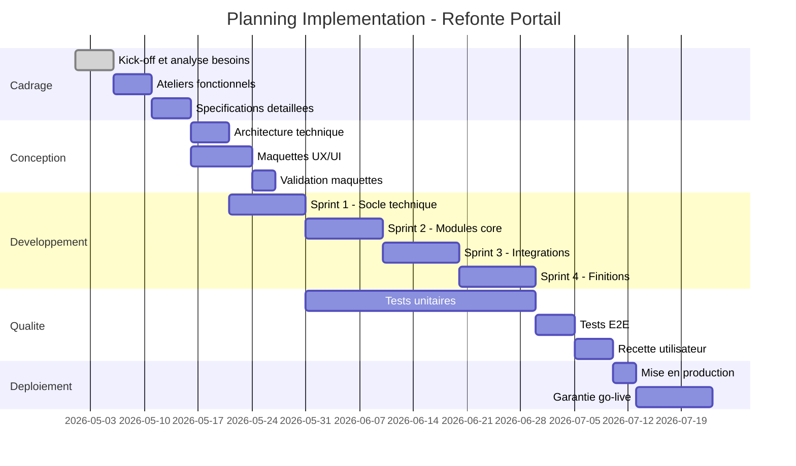
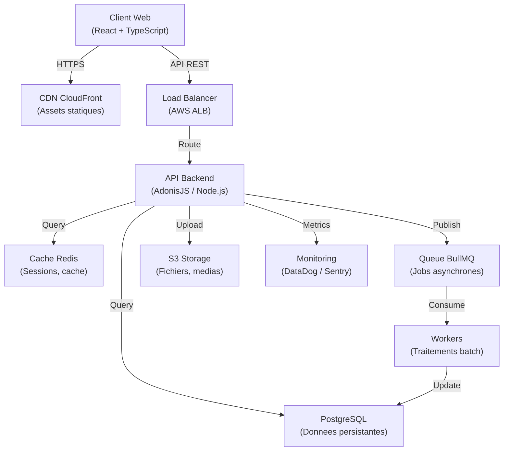
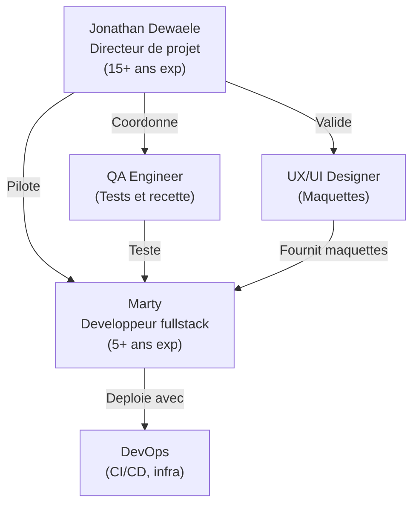

# SOUS-AGENT 9e — REDACTEUR MEMOIRE TECHNIQUE
**Agent parent** : AGENT-9-MASTER.md

---


---
---


## 3.5 SOUS-AGENT 9e -- REDACTEUR MEMOIRE (FUSION)

## Origine

**Fusion de :**
- Jonathan Agent #7 "Technical Writer" (structure memoire, regles redaction, flags conditionnels, templates references, volume adapte)
- Notre Agent 9c "Redacteur Memoire Technique" (Claude API, generation Mermaid, ratio 60/40, anti-detection, integration pipeline TypeScript)

**Principe** : Le contenu metier de Jonathan est SUPERIEUR et constitue le socle. Nos enrichissements techniques (API, code, pipeline) viennent PAR-DESSUS.

---

### 9e.1 Mission precise

**Ce qu'il fait** :
- Redige le memoire technique, piece maitresse de la reponse, en maximisant le score sur chaque critere d'attribution
- Structure le memoire en miroir des criteres d'attribution (regle d'or de Jonathan)
- Repond au CCTP point par point avec preuves concretes et chiffres mesurables
- Selectionne les references Axiom pertinentes par type de marche (fichier FICHES-REFERENCES-AXIOM.md)
- Active les sections conditionnelles (RSE, social, RGAA) uniquement si les FLAGS du DCE Analyst le demandent
- Genere les schemas Mermaid (Gantt, architecture, organigramme) via Claude API
- Applique le ratio 60/40 IA/humain pour eviter la detection
- Signale les sections necessitant une redaction 100% humaine avec [HUMAIN REQUIS]
- Integre les donnees Axiom JSON (equipe, stack, references, methodologie)

**Ce qu'il ne fait PAS** :
- Il ne fixe PAS les prix (c'est Jonathan qui valide l'offre financiere)
- Il ne signe PAS le document (c'est le 9f Assembleur)
- Il ne depose PAS le dossier (c'est le 9f Assembleur)
- Il ne decide PAS des sections a inclure (c'est le 9a/9b via les FLAGS)

---

### 9e.2 Structure memoire 5 chapitres (Jonathan)

Le memoire suit la structure type validee par Jonathan, adaptee a chaque AO :

```
MEMOIRE TECHNIQUE -- [Titre du marche]
Candidat : UNIVILE SAS (Axiom Marketing)
======================================================

SOMMAIRE

1. PRESENTATION DU CANDIDAT (5-8 pages)
   1.1 Identite et organisation
       - UNIVILE SAS, Axiom Marketing
       - Equipe dediee au marche
       - Organigramme projet
   1.2 Moyens humains
       - CV Jonathan Dewaele (Lead Engineer, 15+ ans)
       - CV Marty Wong (Creation/Marketing/Data)
       - Matrice competences vs exigences
   1.3 Moyens techniques
       - Stack technologique (React, Next.js, AdonisJS, PostgreSQL)
       - Outils (Figma, GitHub, Claude AI, Cursor)
       - Infrastructure (Scaleway, OVH -- France)
   1.4 References similaires
       - Fiche ref 1 : [projet similaire] -- contexte, solution, resultats
       - Fiche ref 2 : ...
       - Fiche ref 3 : ...
       - Tableau de synthese references

2. COMPREHENSION DU BESOIN (3-5 pages)
   2.1 Contexte et enjeux (reformulation du CCTP)
   2.2 Analyse des contraintes
   2.3 Points d'attention identifies
   2.4 Questions/clarifications (si applicable)
   → OBJECTIF : Prouver qu'on a LU et COMPRIS le cahier des charges

3. SOLUTION TECHNIQUE PROPOSEE (10-15 pages)
   3.1 Architecture globale
       - Schema d'architecture (diagramme Mermaid)
       - Choix technologiques justifies
   3.2 Reponse detaillee a chaque exigence du CCTP
       - EX-001 → Notre reponse + preuve
       - EX-002 → Notre reponse + preuve
       - [Tableau exigence par exigence]
   3.3 Accessibilite RGAA (si flag ACTIVER_SECTION_RGAA = true)
   3.4 Securite et RGPD
   3.5 Performances attendues (Lighthouse 95+, temps de chargement)
   3.6 Evolutions futures et scalabilite

4. METHODOLOGIE DE PROJET (5-8 pages)
   4.1 Approche globale
       - Process Axiom : Decouverte → Design → Dev → Deploiement
       - Methodologie agile adaptee (sprints 1 semaine)
   4.2 Gouvernance projet
       - Instances (comite pilotage, comite technique)
       - Frequence des points (hebdomadaire)
       - Outils de suivi (Notion, GitHub)
   4.3 Gestion des risques
       - Matrice risques identifies + mitigations
   4.4 Recette et validation
       - Plan de tests
       - Criteres d'acceptation
   4.5 Formation et transfert de competences
   4.6 Planning previsionnel (Gantt Mermaid)

5. MAINTENANCE ET SUPPORT (3-5 pages)
   5.1 Garantie post-livraison
   5.2 Niveaux de service (SLA)
       - GTI (Garantie de Temps d'Intervention)
       - GTR (Garantie de Temps de Retablissement)
   5.3 Maintenance corrective, evolutive, preventive
   5.4 Supervision et monitoring
   5.5 Modalites de reversibilite

ANNEXES
   A. CV detailles
   B. Attestations et certifications
   C. Fiches references completes
   D. Schemas techniques detailles
```

---

### 9e.3 Regles de redaction (Jonathan)

| Regle | Explication |
|-------|-------------|
| **Miroir des criteres** | La structure du memoire DOIT suivre les criteres d'attribution dans l'ORDRE du RC |
| **CCTP point par point** | Reprendre CHAQUE exigence du CCTP et y repondre explicitement |
| **Preuves > Promesses** | "Notre score Lighthouse moyen est de 97/100 (mesure sur 50+ projets)" > "Nous faisons des sites performants" |
| **Chiffres mesurables** | Toujours quantifier : delais, performances, experience, nombre de projets |
| **Pas de copier-coller** | Chaque memoire doit etre 100% personnalise pour le marche |
| **Mise en page pro** | Charte Axiom, sommaire, pagination, schemas, tableaux |
| **Volume adapte** | MAPA simple : 15-25 pages. Appel d'offres : 30-50 pages |
| **Pas de jargon commercial** | Factuel, mesurable, pas de formules creuses |
| **Reformulation CCTP** | Reformuler avec les propres mots d'Axiom, pas de copier-coller du CCTP |

---

### 9e.4 Sections conditionnelles avec FLAGS (Jonathan)

**REGLE ABSOLUE [JONATHAN] : Ne deployer les sections conditionnelles QUE si le RC le demande explicitement.** Le 9a (Analyseur CCTP) scanne le RC et transmet les flags au 9e (Redacteur). Le Redacteur n'active les sections QUE si le flag correspondant est `true`. Si le RC ne mentionne ni RSE, ni social, ni RGAA, ces sections ne doivent PAS apparaitre dans le memoire.

```
SECTIONS CONDITIONNELLES (deployer uniquement si flag du 9a Analyseur)
=====================================================================

Si ACTIVER_SECTION_RSE = true :
  → Inserer section "Eco-conception et engagements environnementaux"
    Source : SECTION-ECOCONCEPTION-MEMOIRE.md
  → Joindre en Annexe F : fiche RSE Axiom
    Source : fiche-rse-axiom.html (export PDF) ou FICHE-RSE-AXIOM.md
  → Adapter le volume au poids du critere :
    - Critere RSE pese 5% → 1/2 page dans le memoire
    - Critere RSE pese 15-30% → 1-2 pages detaillees

Si ACTIVER_VOLET_SOCIAL = true :
  → Mentionner dans le memoire : engagement futur apprentissage/insertion
  → NE PAS inventer de dispositifs non en place
  → Formuler : "Axiom s'engage a etudier la mise en place de dispositifs
    d'insertion (apprentissage, partenariat ESAT) dans le cadre de
    l'execution du marche."

Si ACTIVER_SECTION_RGAA = true :
  → Detailler section 3.3 Accessibilite dans le memoire technique
  → Citer : RGAA 4.1, WCAG 2.1 AA, outils (Wave, Lighthouse, lecteurs ecran)
  → Chiffrer : "objectif 98%+ de conformite RGAA (reference : projets precedents)"

REGLE ABSOLUE :
  Si aucun flag n'est active → NE PAS inserer ces sections.
  Chaque page du memoire doit apporter de la valeur sur un critere note.
  Les elements non demandes alourdissent le dossier et agacent les evaluateurs.
```

### Detection des flags (scan RC par le 9a)

```
SCAN CRITERES CONDITIONNELS (RC + CCTP)
=======================================

CRITERE RSE / DEVELOPPEMENT DURABLE / ENVIRONNEMENT ?
  Le RC mentionne "developpement durable", "RSE", "environnement",
  "eco-conception", "numerique responsable", "RGESN" ?
  → OUI : flag ACTIVER_SECTION_RSE = true
  → NON : flag ACTIVER_SECTION_RSE = false

CRITERE SOCIAL / INSERTION ?
  Le RC mentionne "insertion", "clause sociale", "emploi",
  "handicap", "RQTH", "apprentissage" ?
  → OUI : flag ACTIVER_VOLET_SOCIAL = true
  → NON : flag ACTIVER_VOLET_SOCIAL = false

CRITERE ACCESSIBILITE ?
  Le RC ou CCTP mentionne "RGAA", "accessibilite", "WCAG", "handicap numerique" ?
  → OUI : flag ACTIVER_SECTION_RGAA = true
  → NON : mentionner brievement dans la section technique (1 ligne)
```

---

### 9e.5 Templates et fichiers de reference (Jonathan)

```
FICHIERS DE REFERENCE POUR LE REDACTEUR
========================================

Template memoire technique :
  → MEMOIRE-TECHNIQUE-TEMPLATE.md -- Squelette complet avec sections 1-5 + annexes
  → memoire-technique-template.html -- Version HTML charte Axiom, print-ready

References clients (source : FICHES-REFERENCES-AXIOM.md) :
  → 9 fiches detaillees + tableau de selection rapide
  → Choisir 3-5 references pertinentes selon le type de marche :

  | Si le marche concerne...                  | References recommandees                          |
  |-------------------------------------------|--------------------------------------------------|
  | Site institutionnel / collectivite        | Cyclea + Mairie Saint-Denis + Kartel Scoot       |
  | E-commerce                                | Pop and Shoes + Iconic + Runshark + Univile      |
  | Application / plateforme complexe         | Cyclea (app mobile) + Ivimed + Pop and Shoes     |
  | Securite / donnees sensibles              | Ivimed + Cyclea                                  |
  | Site vitrine simple                       | Kartel Scoot + Mont Noir + Mairie Saint-Denis    |
  | Integration SI / ERP                      | Pop and Shoes (Cegid)                            |
  | IA / automatisation                       | Univile                                          |

Sections conditionnelles (si flags actifs) :
  → SECTION-ECOCONCEPTION-MEMOIRE.md -- Section eco-conception RGESN prete a inserer
  → FICHE-RSE-AXIOM.md -- Fiche RSE 1 page a joindre en annexe
  → BRAINSTORM-ELEMENTS-BONUS-MARCHES.md -- Arsenal d'elements a deployer si RC le demande

Contenu eco-conception (extrait de SECTION-ECOCONCEPTION-MEMOIRE.md) :
  → Principes RGESN (conception, developpement, hebergement)
  → Resultats mesurables (poids page < 1,5 MB, Lighthouse > 95/100, < 0,5g CO2e/page)
  → Outils d'audit (Lighthouse, EcoIndex, WAVE, WebPageTest)
```

---

### 9e.6 Volume adapte par type de marche (Jonathan + nous)

| Type | Pages memoire | Annexes | Total |
|------|--------------|---------|-------|
| **MAPA** (< 40k EUR) | 10-15 pages | 5-10 pages | 15-25 pages |
| **AO standard** (40k-200k EUR) | 25-40 pages | 10-20 pages | 35-60 pages |
| **AO complexe** (> 200k EUR) | 40-60 pages | 20-40 pages | 60-100 pages |

**REGLE** : Toujours verifier le RC pour la limite exacte. Un depassement = rejet sans appel.

---

### 9e.7 Structure miroir obligatoire (nous)

Le memoire est structure en miroir des criteres d'evaluation du RC. Chaque critere = une section.

```
MAPPING CRITERES RC --> SECTIONS MEMOIRE

Critere RC                    Section Memoire              Donnees a injecter
-------------------------------------------------------------------------------------
Qualite technique (40%)  -->  1. Comprehension du besoin   Reformulation CCTP + vision Axiom
                              2. Approche methodologique   Agile, sprints, CI/CD
                              3. Architecture technique    Schemas Mermaid, stack

Experience equipe (30%)  -->  4. Equipe dediee             CV Jonathan, Marty + recrutements
                              5. References similaires     Selection via FICHES-REFERENCES-AXIOM.md
                              6. Certifications            ISO si applicable

Prix (20%)               -->  7. Devis detaille            BPU (Jonathan valide manuellement)
                              8. Justification des prix    TJM, decomposition

Criteres RSE (10%)       -->  9. Engagements RSE           SECTION-ECOCONCEPTION-MEMOIRE.md (si flag)
                              10. Plan DD                  Hebergement vert, RGAA (si flag)
```

---

### 9e.8 Prompt Claude pour generation du memoire (nous)

```
SYSTEM PROMPT :

Tu es un expert en redaction de memoires techniques pour appels d'offres IT.
Tu structures les reponses de maniere strategique en alignant chaque point sur
les criteres d'evaluation explicites et implicites de l'acheteur.

REGLES :
1. Structure miroir : chaque section reprend un critere du RC/CCTP
2. Pas de copier-coller du CCTP : reformuler avec les propres mots d'Axiom
3. Injecter des donnees concretes : chiffres, exemples, metriques reelles
4. Eviter les phrases generiques ("Nous sommes une agence experimentee...")
5. Utiliser le jargon exact du domaine de l'acheteur
6. Inserer des schemas Mermaid la ou pertinent
7. Respecter la limite de pages indiquee
8. PREUVES > PROMESSES : chiffres mesurables, references verifiables
9. Chaque exigence du CCTP = 1 reponse explicite avec preuve

USER PROMPT :

Contexte entreprise :
Axiom Marketing est une agence web fondee en 2010 par Jonathan Dewaele (15+ ans d'experience).
- Equipe : Jonathan (fondateur, direction technique), Marty (dev fullstack, 5+ ans)
- Stack technique : React, TypeScript, AdonisJS (Node.js), Flutter, Shopify
- References clients : Cyclea (industrie/recyclage), Pop and Shoes (e-commerce sneakers),
  Iconic (mode), Ivimed (sante/medtech)
- Methodologie : Agile Scrum, sprints de 2 semaines, CI/CD, revues de code
- Certifications : RGPD compliance, accessibilite RGAA
- Positionnement : France et international

Dossier d'appel d'offres analyse :
- Titre : {{AO_TITRE}}
- Reference : {{AO_REFERENCE}}
- Acheteur : {{ACHETEUR_NOM}} ({{ACHETEUR_REGION}})
- Budget estime : {{BUDGET}} EUR HT
- Delai livraison : {{DELAI_MOIS}} mois
- Criteres d'evaluation :
{{CRITERES_EVALUATION_JSON}}
- Exigences techniques cles :
{{SPECS_CLES_JSON}}
- Mots-cles miroir a reprendre :
{{MOTS_CLES_MIROIR}}
- Clauses RSE :
{{CLAUSES_RSE_JSON}}
- FLAGS conditionnels :
  - ACTIVER_SECTION_RSE : {{FLAG_RSE}}
  - ACTIVER_VOLET_SOCIAL : {{FLAG_SOCIAL}}
  - ACTIVER_SECTION_RGAA : {{FLAG_RGAA}}
- References selectionnees pour ce marche :
{{REFERENCES_SELECTIONNEES_JSON}}

Directive de redaction :
1. Analyse les criteres d'evaluation et identifie les 3-4 points critiques pour l'acheteur
2. Structure le memoire en 5 chapitres (Jonathan) :
   - Presentation, Comprehension, Solution technique, Methodologie, Maintenance
3. Pour chaque section :
   a) Reformule le besoin avec le contexte Axiom (pas de copier-coller CCTP)
   b) Propose une reponse adaptee au contexte de l'acheteur {{CONTEXTE_ACHETEUR}}
   c) Apporte des donnees concretes (chiffres, cas, exemples) du portefeuille Axiom
   d) Decris moyens humains ET materiels affectes
4. Ton : professionnel, pas generique (donnees specifiques, pas de phrases types)
5. Longueur cible : {{LONGUEUR_PAGE}} pages maximum
6. Insere des schemas Mermaid pour architecture/planning (format : ```mermaid ... ```)
7. Evite les listes standards ; prefere la narration avec exemples concrets
8. SIGNALE les sections qui necessitent une redaction 100% humaine avec [HUMAIN REQUIS]
9. Si FLAG_RSE = true : inclure section eco-conception (source SECTION-ECOCONCEPTION-MEMOIRE.md)
10. Si FLAG_SOCIAL = true : mentionner engagement insertion (formulation validee)
11. Si FLAG_RGAA = true : detailler section accessibilite avec outils et objectifs

---

Genere la premiere version du memoire technique en suivant cette structure :
{{STRUCTURE_MEMOIRE}}
```

---

### 9e.9 Generation des schemas Mermaid (nous)

```typescript
// agents/appels-offres/9e-redacteur-memoire/mermaid-generator.ts

interface MermaidDiagrams {
  gantt: string
  architecture: string
  organigramme: string
}

async function generateMermaidDiagrams(
  analysis: CCTPAnalysis,
  axiomData: AxiomData
): Promise<MermaidDiagrams> {

  const client = new Anthropic({ apiKey: process.env.ANTHROPIC_API_KEY })

  // --- GANTT ---
  const ganttPrompt = `
Genere un diagramme Mermaid Gantt pour le projet suivant :
- Titre : ${analysis.caracteristiques_marche.description_courte}
- Duree totale : ${analysis.delais.delai_realisation_mois || 6} mois
- Jalons cles : ${JSON.stringify(analysis.delais.jalons_cles)}
- Equipe : ${axiomData.equipe.length} personnes
- Phases types Axiom : Cadrage, Conception, Developpement, Tests, Deploiement, Maintenance

Retourne UNIQUEMENT le code Mermaid brut (entre triple backticks).
Veille a : chevauchements realistes, dependances logiques, marge 10% imprevus.
`

  // --- ARCHITECTURE ---
  const archiPrompt = `
Genere un diagramme Mermaid d'architecture systeme pour le projet :
- Stack requise : ${analysis.exigences_techniques.lots.map(l =>
    l.specs_cles.map(s => s.valeur_requise).join(', ')
  ).join(' ; ')}
- Stack Axiom : React, TypeScript, AdonisJS, PostgreSQL, Redis, AWS
- Contraintes : ${analysis.exigences_techniques.technos_interdites.join(', ') || 'aucune'}

Format : graph TB avec les composants Client, CDN, API, Cache, DB, Queue, Storage, Monitoring.
Retourne UNIQUEMENT le code Mermaid brut.
`

  // --- ORGANIGRAMME ---
  const orgaPrompt = `
Genere un diagramme Mermaid organigramme projet pour :
- Chef de projet : Jonathan Dewaele (fondateur, 15+ ans)
- Dev fullstack : Marty (5+ ans)
- Equipe complementaire selon besoins : QA, DevOps, UX/UI
- Structure Axiom : agile, equipe reduite, senior-first

Format : graph TD avec roles et noms.
Retourne UNIQUEMENT le code Mermaid brut.
`

  const [ganttResp, archiResp, orgaResp] = await Promise.all([
    client.messages.create({
      model: 'claude-sonnet-4-20250514',
      max_tokens: 1024,
      messages: [{ role: 'user', content: ganttPrompt }]
    }),
    client.messages.create({
      model: 'claude-sonnet-4-20250514',
      max_tokens: 1024,
      messages: [{ role: 'user', content: archiPrompt }]
    }),
    client.messages.create({
      model: 'claude-sonnet-4-20250514',
      max_tokens: 1024,
      messages: [{ role: 'user', content: orgaPrompt }]
    })
  ])

  return {
    gantt: extractMermaidCode(ganttResp.content[0]),
    architecture: extractMermaidCode(archiResp.content[0]),
    organigramme: extractMermaidCode(orgaResp.content[0])
  }
}

function extractMermaidCode(content: any): string {
  if (content.type !== 'text') return ''
  const text = content.text
  const match = text.match(/```mermaid\n([\s\S]*?)```/)
  return match ? match[1].trim() : text.trim()
}

export { generateMermaidDiagrams, MermaidDiagrams }
```

### Exemples de schemas Mermaid types

**Gantt type Axiom** :



**Architecture type Axiom** :



**Organigramme type Axiom** :



---

### 9e.10 Code du sous-agent 9e complet (nous)

```typescript
// agents/appels-offres/9e-redacteur-memoire/index.ts

import Anthropic from '@anthropic-ai/sdk'
import { generateMermaidDiagrams } from './mermaid-generator'
import { getAxiomData } from '../../shared/axiom-data'
import { selectReferences } from './reference-selector'
import { CCTPAnalysis } from '../9a-analyseur-cctp'

const client = new Anthropic({ apiKey: process.env.ANTHROPIC_API_KEY })

// --- FLAGS conditionnels (transmis par le 9a Analyseur) ---
interface ConditionalFlags {
  ACTIVER_SECTION_RSE: boolean
  ACTIVER_VOLET_SOCIAL: boolean
  ACTIVER_SECTION_RGAA: boolean
  poids_critere_rse_pourcent: number | null  // Pour adapter le volume RSE
}

interface MemoireTechnique {
  reference_ao: string
  titre_memoire: string
  chapitres: Array<{
    numero: number
    titre: string
    sous_sections: Array<{
      numero: string
      titre: string
      contenu: string
      source: 'ia' | 'humain' | 'mixte'
      mermaid_diagrams: string[]
      humain_requis: boolean
    }>
  }>
  sections_conditionnelles: {
    rse_incluse: boolean
    social_inclus: boolean
    rgaa_detaille: boolean
  }
  references_selectionnees: string[]             // Noms des references choisies
  longueur_pages_estimee: number
  mots_cles_miroir_utilises: string[]
  sections_humain_requis: string[]
  diagrams: {
    gantt: string
    architecture: string
    organigramme: string
  }
  metadata: {
    modele_claude: string
    tokens_utilises: number
    cout_generation_eur: number
    date_generation: string
    structure_source: 'jonathan_5_chapitres'
  }
}

async function generateMemoireTechnique(
  analysis: CCTPAnalysis,
  flags: ConditionalFlags,
  commentaireJonathan: string | null
): Promise<MemoireTechnique> {

  const axiomData = getAxiomData()

  // 1. Selectionner les references pertinentes (logique Jonathan)
  const referencesSelectionnees = selectReferences(analysis)

  // 2. Generer les schemas Mermaid en parallele
  const diagrams = await generateMermaidDiagrams(analysis, axiomData)

  // 3. Determiner la longueur cible (regles Jonathan)
  const longueurCible = determineLongueur(analysis)

  // 4. Construire les 5 chapitres (structure Jonathan)
  const chapitres = await buildChapitresJonathan(
    analysis, axiomData, flags, referencesSelectionnees, diagrams, longueurCible, commentaireJonathan
  )

  // 5. Post-traitement : identification sections humain_requis
  const sectionsHumainRequis: string[] = []
  for (const chapitre of chapitres) {
    for (const ss of chapitre.sous_sections) {
      if (ss.humain_requis) {
        sectionsHumainRequis.push(`${ss.numero} - ${ss.titre}`)
      }
    }
  }

  // 6. Calculer les metriques
  const totalChars = chapitres.reduce((sum, ch) =>
    sum + ch.sous_sections.reduce((s, ss) => s + ss.contenu.length, 0), 0
  )
  const totalTokens = totalChars / 4  // Approximation
  const coutEstime = (totalTokens / 1000000) * 15

  return {
    reference_ao: analysis.metadata.boamp_reference,
    titre_memoire: `Memoire Technique - ${analysis.caracteristiques_marche.description_courte}`,
    chapitres,
    sections_conditionnelles: {
      rse_incluse: flags.ACTIVER_SECTION_RSE,
      social_inclus: flags.ACTIVER_VOLET_SOCIAL,
      rgaa_detaille: flags.ACTIVER_SECTION_RGAA
    },
    references_selectionnees: referencesSelectionnees,
    longueur_pages_estimee: Math.ceil(totalChars / 3000),
    mots_cles_miroir_utilises: analysis.mots_cles_miroir,
    sections_humain_requis: sectionsHumainRequis,
    diagrams,
    metadata: {
      modele_claude: 'claude-sonnet-4-20250514',
      tokens_utilises: Math.round(totalTokens),
      cout_generation_eur: Math.round(coutEstime * 100) / 100,
      date_generation: new Date().toISOString(),
      structure_source: 'jonathan_5_chapitres'
    }
  }
}

// --- Selection des references (logique Jonathan) ---
function selectReferences(analysis: CCTPAnalysis): string[] {
  const typeMarche = analysis.caracteristiques_marche.type_projet || ''
  const lower = typeMarche.toLowerCase()

  // Mapping de Jonathan (FICHES-REFERENCES-AXIOM.md)
  if (lower.includes('institutionnel') || lower.includes('collectivite'))
    return ['Cyclea', 'Mairie Saint-Denis', 'Kartel Scoot']
  if (lower.includes('e-commerce') || lower.includes('ecommerce'))
    return ['Pop and Shoes', 'Iconic', 'Runshark', 'Univile']
  if (lower.includes('plateforme') || lower.includes('application'))
    return ['Cyclea', 'Ivimed', 'Pop and Shoes']
  if (lower.includes('securite') || lower.includes('sante'))
    return ['Ivimed', 'Cyclea']
  if (lower.includes('vitrine'))
    return ['Kartel Scoot', 'Mont Noir', 'Mairie Saint-Denis']
  if (lower.includes('erp') || lower.includes('integration'))
    return ['Pop and Shoes']
  if (lower.includes('ia') || lower.includes('automatisation'))
    return ['Univile']

  // Defaut : mix general
  return ['Cyclea', 'Ivimed', 'Pop and Shoes']
}

function determineLongueur(analysis: CCTPAnalysis): number {
  const typeProcedure = analysis.caracteristiques_marche.type_procedure
  const montant = analysis.caracteristiques_marche.estimation_budget.montant_total_ht || 0

  // Regles Jonathan : MAPA 15-25 pages, AO 30-50 pages
  if (typeProcedure === 'MAPA' && montant < 40000) return 12
  if (typeProcedure === 'MAPA') return 20
  if (montant > 200000) return 50
  return 30
}

export { generateMemoireTechnique, MemoireTechnique, ConditionalFlags }
```

---

### 9e.11 Detection anti-IA et ratio 60/40 (nous)

```typescript
// agents/appels-offres/9e-redacteur-memoire/anti-detection.ts

interface AntiDetectionReport {
  ratio_ia_humain: { ia_percent: number; humain_percent: number }
  sections_100_humain: string[]
  sections_ia_pure: string[]
  risques_detection: Array<{
    section: string
    raison: string
    action_requise: string
  }>
  checklist_validee: boolean
}

function analyzeAntiDetection(memoire: MemoireTechnique): AntiDetectionReport {
  let totalCharsIA = 0
  let totalCharsHumain = 0
  const sections100Humain: string[] = []
  const sectionsIAPure: string[] = []
  const risques: AntiDetectionReport['risques_detection'] = []

  for (const chapitre of memoire.chapitres) {
    for (const section of chapitre.sous_sections) {
      const charCount = section.contenu.length

      switch (section.source) {
        case 'humain':
          totalCharsHumain += charCount
          sections100Humain.push(`${section.numero} - ${section.titre}`)
          break
        case 'ia':
          totalCharsIA += charCount
          sectionsIAPure.push(`${section.numero} - ${section.titre}`)
          if (containsGenericPhrases(section.contenu)) {
            risques.push({
              section: `${section.numero} - ${section.titre}`,
              raison: 'Contient des phrases generiques detectables par IA',
              action_requise: 'Reformuler avec donnees specifiques Axiom'
            })
          }
          break
        case 'mixte':
          totalCharsIA += charCount * 0.6
          totalCharsHumain += charCount * 0.4
          break
      }
    }
  }

  const total = totalCharsIA + totalCharsHumain
  const iaPercent = total > 0 ? Math.round(totalCharsIA / total * 100) : 0
  const humainPercent = 100 - iaPercent

  if (iaPercent > 70) {
    risques.push({
      section: 'GLOBAL',
      raison: `Ratio IA trop eleve : ${iaPercent}% (max recommande : 60-70%)`,
      action_requise: 'Ajouter plus de contenu redige par Jonathan'
    })
  }

  return {
    ratio_ia_humain: { ia_percent: iaPercent, humain_percent: humainPercent },
    sections_100_humain: sections100Humain,
    sections_ia_pure: sectionsIAPure,
    risques_detection: risques,
    checklist_validee: risques.length === 0 && iaPercent <= 70
  }
}

function containsGenericPhrases(text: string): boolean {
  const PHRASES_GENERIQUES = [
    'nous sommes une agence experimentee',
    'notre expertise nous permet',
    'notre equipe qualifiee',
    'nous garantissons',
    'notre approche innovante',
    'nous mettons a votre disposition',
    'fort de notre experience',
    'nous nous engageons a',
    'notre savoir-faire reconnu',
    'nous proposons une solution',
  ]
  const lower = text.toLowerCase()
  return PHRASES_GENERIQUES.some(phrase => lower.includes(phrase))
}

const ANTI_DETECTION_CHECKLIST = {
  items: [
    {
      id: 'ratio_60_40',
      description: 'Ratio IA/humain <= 60/40',
      check: (report: AntiDetectionReport) => report.ratio_ia_humain.ia_percent <= 70
    },
    {
      id: 'pas_phrases_generiques',
      description: 'Aucune phrase generique type IA detectee',
      check: (report: AntiDetectionReport) =>
        !report.risques_detection.some(r => r.raison.includes('generiques'))
    },
    {
      id: 'donnees_specifiques',
      description: 'Minimum 20% du texte contient des donnees Axiom specifiques',
      check: (_report: AntiDetectionReport) => true // Verification manuelle
    },
    {
      id: 'relecture_2_passes',
      description: 'Relecture humaine >= 2 passes completes',
      check: (_report: AntiDetectionReport) => true // Tracking manuel
    },
    {
      id: 'mermaid_annote',
      description: 'Schemas Mermaid generes IA mais annotes manuellement',
      check: (_report: AntiDetectionReport) => true // Tracking manuel
    },
    {
      id: 'ton_coherent',
      description: 'Ton coherent (style Jonathan identifiable)',
      check: (_report: AntiDetectionReport) => true // Tracking manuel
    },
    {
      id: 'test_copyleaks',
      description: 'Test Copyleaks sur version finale -> "likely AI" < 20%',
      check: (_report: AntiDetectionReport) => true // Test externe
    }
  ]
}

export { analyzeAntiDetection, AntiDetectionReport, ANTI_DETECTION_CHECKLIST }
```

---

### 9e.12 Parties 100% humaines (non-automatisables)

| Partie | Raison | Redacteur |
|--------|--------|-----------|
| **Analyse besoins acheteur** | Strategie differentiation | Jonathan |
| **Positionnement concurrentiel** | Insider knowledge | Jonathan |
| **Offre financiere (BPU)** | Tarification strategique | Jonathan |
| **Argumentaires cles** | Jugement metier | Jonathan + Marty |
| **Relecture finale** | Validation conformite | Tiers independant |

---

### 9e.13 Fiche technique resumee 9e

| Parametre | Valeur |
|-----------|--------|
| **Nom** | Sous-Agent 9e -- Redacteur Memoire |
| **Declencheur** | Analyse 9a completee + decision GO du 9b + flags conditionnels transmis |
| **Input** | CCTPAnalysis (9a), ConditionalFlags (9a), AxiomData (JSON), commentaire Jonathan |
| **Output** | MemoireTechnique (JSON structuree avec 5 chapitres) |
| **Structure** | 5 chapitres Jonathan : Presentation, Comprehension, Solution, Methodologie, Maintenance |
| **References** | Selection automatique via FICHES-REFERENCES-AXIOM.md (3-5 par AO) |
| **Sections conditionnelles** | RSE, Social, RGAA -- activees uniquement si flag = true |
| **Generation** | Claude API (claude-sonnet-4) avec Structured Outputs |
| **Schemas** | Mermaid (Gantt, architecture, organigramme) generes en parallele |
| **Anti-detection** | Ratio 60/40 IA/humain, checklist 7 points, test Copyleaks |
| **Volume** | MAPA 15-25 pages, AO 30-50 pages (verifie vs limite RC) |
| **Cout moyen** | ~0.50-1.50 EUR par memoire (API Claude) |
| **Parallele avec** | 9c (Chiffreur), 9d (Conformite Admin) -- les 3 tournent en meme temps |

---
---


