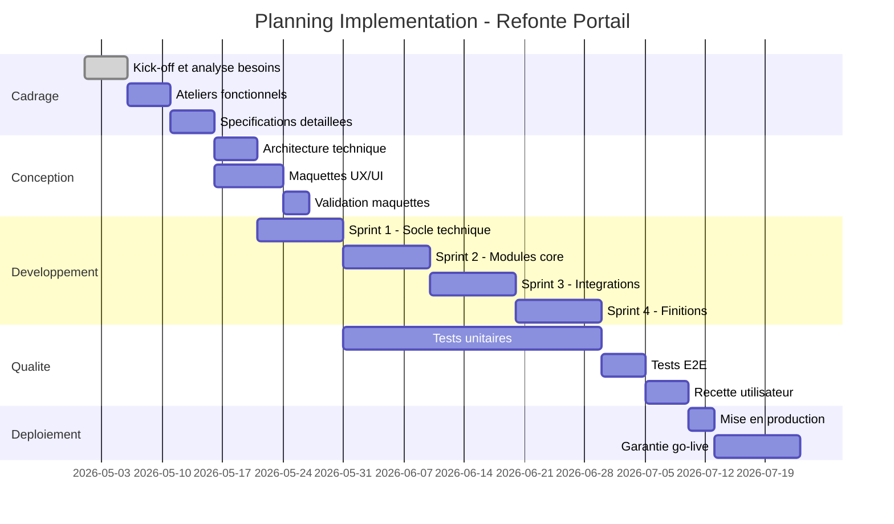
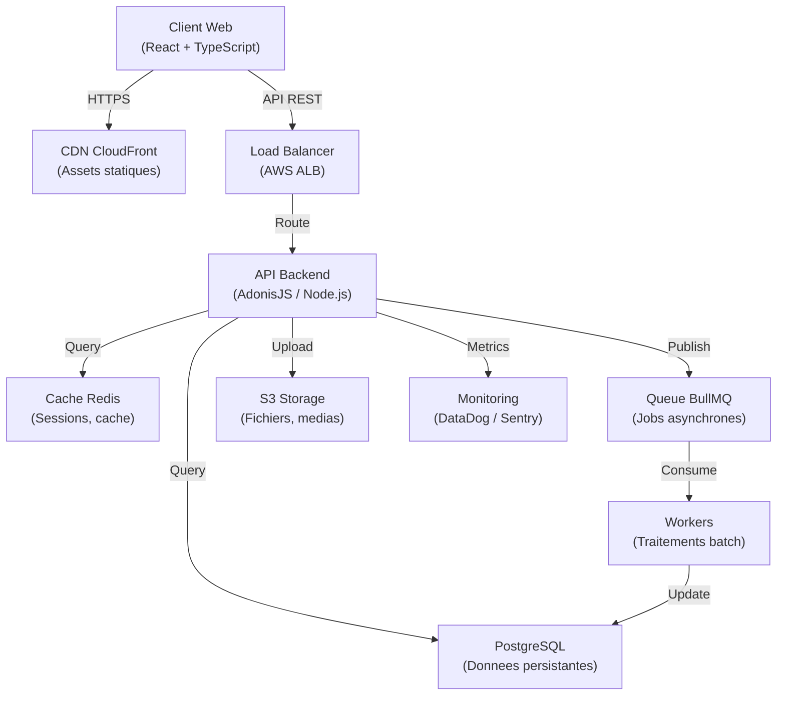
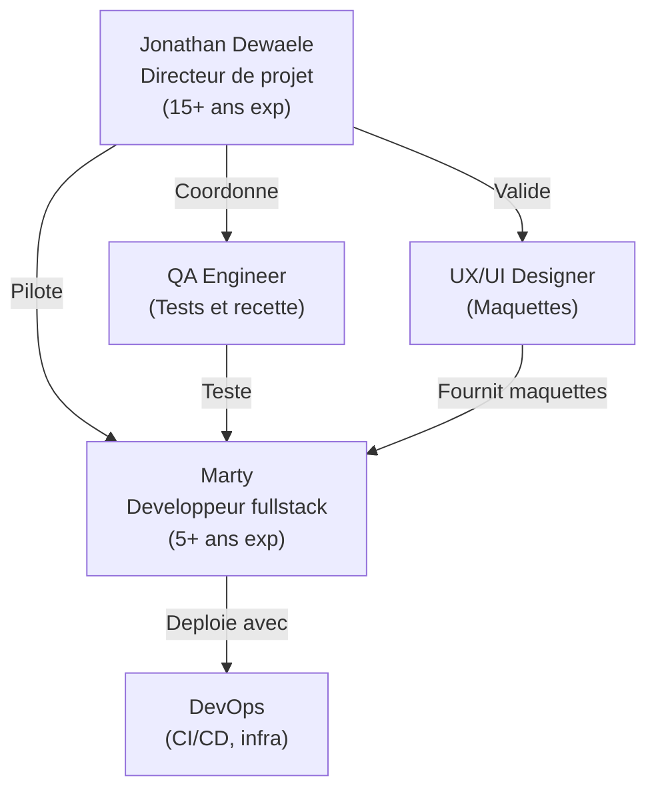

# AGENT 9 -- APPELS D'OFFRES (Version 2 -- Fusionne avec Architecture Jonathan OpenLaw)

**Version** : 2.0 FINALE
**Date** : 19 mars 2026
**Auteur** : Systeme Axiom Marketing (Univile SAS)
**Statut** : Version fusionnee finale (remplace v1)
**Origine** : Fusion de 3 drafts :
- AGENT-9-V2-DRAFT-9a-9b.md (sous-agents 9a + 9b)
- AGENT-9-V2-DRAFT-9c-9d-9f.md (sous-agents 9c + 9d + 9f)
- AGENT-9-V2-DRAFT-9e-9g.md (sous-agents 9e + 9g + vue d'ensemble)
**Confidentialite** : Interne Axiom

---

## LEGENDE DES SOURCES

Tout au long de ce document, chaque element est tague avec sa provenance :

| Tag | Signification |
|-----|---------------|
| **[JONATHAN]** | Element provenant du document de Jonathan (superieur, conserve tel quel) |
| **[NOUS]** | Element provenant de notre Agent 9 v1 (unique, conserve tel quel) |
| **[FUSION]** | Element nouveau cree par la fusion des deux sources |

---

## TABLE DES MATIERES

1. [Mission et position dans le pipeline](#1-mission-et-position-dans-le-pipeline)
2. [Input (de Agent 1b Veilleur Marches)](#2-input-de-agent-1b-veilleur-marches)
3. [Les 7 sous-agents](#3-les-7-sous-agents)
   - 3.1 [Sous-Agent 9a -- Analyseur DCE](#31-sous-agent-9a--analyseur-dce)
   - 3.2 [Sous-Agent 9b -- Qualificateur + Decideur GO/NO-GO](#32-sous-agent-9b--qualificateur--decideur-gono-go)
   - 3.3 [Sous-Agent 9c -- Juriste (Legal Compliance)](#33-sous-agent-9c--juriste-legal-compliance)
   - 3.4 [Sous-Agent 9d -- Chiffreur (Pricing Strategist)](#34-sous-agent-9d--chiffreur-pricing-strategist)
   - 3.5 [Sous-Agent 9e -- Redacteur Memoire](#35-sous-agent-9e--redacteur-memoire)
   - 3.6 [Sous-Agent 9f -- Controleur QA (Quality Assurance)](#36-sous-agent-9f--controleur-qa-quality-assurance)
   - 3.7 [Sous-Agent 9g -- Moniteur Post-Depot](#37-sous-agent-9g--moniteur-post-depot)
4. [Donnees Axiom (profil entreprise, references, stack)](#4-donnees-axiom-profil-entreprise-references-stack)
5. [Workflow complet (J-31 a J+30)](#5-workflow-complet-j-31-a-j30)
6. [Structure dossiers fichiers (de Jonathan)](#6-structure-dossiers-fichiers-de-jonathan)
7. [Ressources et templates (liste de tous les fichiers Jonathan)](#7-ressources-et-templates)
8. [Metriques et KPIs](#8-metriques-et-kpis)
9. [Couts](#9-couts)
10. [Integration Agents 1-10](#10-integration-agents-1-10)
11. [Verification coherence](#11-verification-coherence)

---
---

# 1. MISSION ET POSITION DANS LE PIPELINE

## 1.1 Mission

**Agent 9 -- Appels d'Offres** : Analyser, qualifier, preparer et deposer les reponses aux appels d'offres publics.

L'Agent 9 est le plus complexe du systeme avec 7 sous-agents specialises. Il gere le cycle complet d'un appel d'offres, de la reception du lead (depuis Agent 1b Veilleur Marches) jusqu'au suivi post-depot et capitalisation.

## 1.2 Position dans le pipeline global

| Element | Detail |
|---------|--------|
| **Recoit de** | Agent 1b (Veilleur Marches) -- leads marche_public avec score >= 60 |
| **Alimente** | Agent 7 (Analyste) -- donnees de performance (taux de conversion AO, ROI) |
| **Alimente** | Agent 8 (Dealmaker) -- si marche gagne, passage en phase execution |
| **Alimente** | Agent 10 (CSM) -- si marche gagne, suivi client |

## 1.3 Schema du pipeline interne (7 sous-agents)

```
                    AGENT 1b (Veilleur Marches)
                           |
                    Lead marche_public
                    (score >= 60)
                           |
                           v
              +========================+
              |      AGENT 9 v2        |
              |   APPELS D'OFFRES      |
              |   (7 sous-agents)      |
              +========================+
                           |
                           v
                  +-----------------+
                  |   9a ANALYSEUR  |
                  |   DCE           |
                  +--------+--------+
                           |
                           v
                  +-----------------+
                  |   9b QUALIFICA- |
                  |   TEUR+DECIDEUR|
                  +--------+--------+
                           |
                    Si ECARTE: Archive
                    Si GO/RECOMMANDE:
                           |
          +----------------+----------------+
          |                |                |
          v                v                v
    +-----------+    +-----------+    +-----------+
    |   9c      |    |   9d      |    |   9e      |
    | JURISTE   |    | CHIFFREUR |    | REDACTEUR |
    | (dossier  |    | (offre    |    | (memoire  |
    |  admin)   |    |  financ.) |    |  technique|
    +-----------+    +-----------+    +-----------+
          |                |                |
          +----------------+----------------+
                           |
                           v
                  +-----------------+
                  |   9f CONTROLEUR |
                  |   QA            |
                  +--------+--------+
                           |
                           v
                      DEPOT (J-2)
                    (validation Jonathan)
                           |
                           v
                  +-----------------+
                  |   9g MONITEUR   |
                  |   POST-DEPOT   |
                  +-----------------+
                           |
                  +--------+--------+
                  |                 |
                  v                 v
             SI GAGNE:        SI PERDU:
             Signature AE     Courrier R2181-3
             Pieces laureat   RETEX + capitalisation
```

### Pipeline sequentiel et parallele

```
9a (Analyse DCE)
    |
    v
9b (Score GO/NO-GO)
    |
    v (si GO)
    |
    +-- 9c (Juriste)         ]
    +-- 9d (Chiffreur)       ] EN PARALLELE
    +-- 9e (Redacteur)       ]
    |
    v (quand les 3 termines)
9f (Controleur QA)
    |
    v
DEPOT
    |
    v
9g (Moniteur Post-Depot -- continu)
```

### Flux de donnees inter-sous-agents **[FUSION]**

| Source | Destination | Donnees transmises |
|--------|-------------|-------------------|
| 9a Analyseur | 9b Qualificateur | `DCEAnalysis` complet (scoring preliminaire) |
| 9a Analyseur | 9c Juriste | `flags_conditionnels`, `conditions_participation`, `analyse_rc.pieces_exigees`, `analyse_ccap` |
| 9a Analyseur | 9d Chiffreur | `exigences_techniques`, `criteres_evaluation`, `caracteristiques_marche`, `analyse_rc.strategie_prix_recommandee` |
| 9a Analyseur | 9e Redacteur | `exigences_individuelles`, `flags_conditionnels`, `mots_cles_miroir`, `template_memoire` |
| 9d Chiffreur | 9e Redacteur | `offre_financiere` (le chiffrage influence la section "moyens" du memoire) |
| 9c Juriste | 9f Controleur | `dossier_administratif` (DC1/DC2/DUME, attestations, validites) |
| 9d Chiffreur | 9f Controleur | `offre_financiere` (BPU/DQE/DPGF remplis) |
| 9e Redacteur | 9f Controleur | `memoire_technique` (document final) |
| 9f Controleur | Jonathan | `rapport_controle` (GO / CORRECTIONS REQUISES) |

---
---

# 2. INPUT (de Agent 1b Veilleur Marches)

L'Agent 9 recoit de l'Agent 1b (Veilleur Marches) un lead de type `marche_public` avec un score >= 60.

**Donnees recues :**

| Champ | Description | Exemple |
|-------|-------------|---------|
| `boamp_reference` | Reference BOAMP de l'AO | "BOAMP-26-12345" |
| `source_url` | URL de la plateforme de depot | "https://www.marches-publics.gouv.fr/..." |
| `acheteur` | Nom de l'acheteur public | "Communaute d'Agglomeration CINOR" |
| `objet` | Objet du marche | "Refonte du portail internet" |
| `type_procedure` | Type de procedure | "MAPA" |
| `montant_estime` | Estimation du budget | 60000 |
| `date_publication` | Date de publication | "2026-03-01" |
| `date_deadline` | Date limite de depot | "2026-04-15" |
| `dce_urls` | Liens vers les documents du DCE | ["RC.pdf", "CCTP.pdf", "CCAP.pdf"] |
| `score_lead` | Score de qualification du lead | 75 |
| `mots_cles` | Mots-cles extraits | ["refonte", "portail", "React", "accessibilite"] |

---
---

# 3. LES 7 SOUS-AGENTS

---

## 3.1 SOUS-AGENT 9a -- ANALYSEUR DCE

> Ancien nom : "Analyseur CCTP" -- renomme "Analyseur DCE" car il analyse l'ENSEMBLE du DCE (RC + CCTP + CCAP), pas seulement le CCTP. **[FUSION]**

## 9a.1 Mission precise

**Ce qu'il fait** :
- **[JONATHAN]** Parse le DCE COMPLET : RC (Reglement de la Consultation), CCTP (Cahier des Clauses Techniques Particulieres), CCAP (Cahier des Clauses Administratives Particulieres), AE, BPU
- **[JONATHAN]** Analyse le RC : criteres d'attribution, sous-criteres, ponderations, pieces exigees
- **[JONATHAN]** Analyse le CCAP : penalites, garanties, assurances, delais contractuels
- **[JONATHAN]** Extrait CHAQUE exigence individuellement avec classification (ELIMINATOIRE / OBLIGATOIRE / SOUHAITABLE) et identifiant unique (EX-001, EX-002...)
- **[JONATHAN]** Detecte automatiquement les criteres RSE/DD/RGAA avec FLAGS conditionnels (ACTIVER_SECTION_RSE, ACTIVER_VOLET_SOCIAL, ACTIVER_SECTION_RGAA)
- **[JONATHAN]** Genere des questions pertinentes a poser a l'acheteur
- **[JONATHAN]** Detecte les marches "fausses" (cahier des charges sur-mesure pour un prestataire sortant)
- **[JONATHAN]** Repere les ambiguites et incoherences du cahier des charges
- **[NOUS]** Utilise une approche hybride : PyMuPDF (texte brut) + Claude Vision API (tableaux/mise en page complexe)
- **[NOUS]** Produit un JSON structure via Structured Outputs (schema garanti, pas de deviation)
- **[NOUS]** Identifie les "mots-cles miroir" a reprendre verbatim dans le memoire technique
- **[NOUS]** Detecte automatiquement si le PDF est natif ou scan (pour activer OCR si necessaire)
- **[NOUS]** Gere les CCTP > 100 pages par chunking intelligent

**Ce qu'il ne fait PAS** :
- Il ne prend PAS la decision GO/NO-GO (c'est le 9b)
- Il ne redige PAS le memoire (c'est le 9c)
- Il ne contacte PAS l'acheteur

---

## 9a.2 Architecture technique **[NOUS]**

| Composant | Service | Cout | Notes |
|-----------|---------|------|-------|
| **PyMuPDF (fitz)** | Extraction texte PDF | 0 EUR | Open source, < 1 sec/page |
| **pdfplumber** | Extraction tableaux | 0 EUR | Complement pour tableaux |
| **Claude Vision API** | Analyse visuelle pages complexes | ~0.50-1.50 EUR/CCTP | 1,500-3,000 tokens/page |
| **Tesseract OCR** | OCR pour CCTP scannes | 0 EUR | Fallback si scan ancien |
| **Azure Document Intelligence** | OCR premium (optionnel) | ~0.05-0.10 EUR/page | Si precision critique |

### Comparaison des outils de parsing **[NOUS]**

| Critere | Claude Vision (PDF) | PyMuPDF (fitz) | pdfplumber | Azure Doc Intel | Tesseract OCR |
|---------|-------------------|-----------------|-------------|-----------------|---------------|
| **Tableaux complexes** | Excellent | Faible | Bon | Excellent | Faible |
| **Mise en page dense** | Excellent | Moyen | Moyen | Excellent | Bon |
| **PDF scanne (OCR)** | Moyen | Non supporte | Non supporte | Excellent | Bon |
| **Extraction JSON** | Excellent | Moyen | Bon | Bon | Faible |
| **Cout par page** | 1,500-3,000 tokens | Gratuit | Gratuit | ~0.05-0.10 EUR | Gratuit |
| **Temps reponse** | 2-5 sec | < 1 sec | < 1 sec | 3-10 sec | 5-30 sec |

---

## 9a.3 Approche hybride recommandee **[NOUS]**

```
ETAPE 1 : Detection type PDF
+-- PyMuPDF : extraire texte brut
+-- Si texte > 100 caracteres/page : PDF natif (OK)
+-- Si texte < 100 caracteres/page : PDF scanne (activer OCR)
+-- Stocker metadata : nb_pages, taille, date_creation

ETAPE 2 : Extraction texte + structure (PyMuPDF/pdfplumber)
+-- PyMuPDF : texte brut par page, headers, footers
+-- pdfplumber : extraction tableaux (criteres evaluation, lots, etc.)
+-- Temps : 5-10 secondes pour CCTP 50-100 pages
+-- Resultat : texte_brut + tableaux_json

ETAPE 3 : Analyse IA (Claude Vision API)
+-- Envoyer texte_brut + tableaux a Claude avec Structured Outputs
+-- Si pages complexes detectees : envoyer images (Vision)
+-- Extraction JSON structuree (sections fusionnees RC + CCTP + CCAP)
+-- Temps : 10-30 secondes
+-- Resultat : JSON DCEAnalysis complet

ETAPE 4 : Post-traitement
+-- Validation du JSON (schema validation)
+-- Calcul champs derives (jours_avant_deadline, etc.)
+-- Generation des FLAGS conditionnels [JONATHAN]
+-- Generation de la liste d'exigences EX-001..EX-NNN [JONATHAN]
+-- Detection marche "fausse" [JONATHAN]
+-- Stockage PostgreSQL
+-- Transmission au sous-agent 9b (Qualificateur + Decideur)
```

---

## 9a.4 Schema JSON de sortie FUSIONNE **[FUSION]**

> Ce schema combine nos 12 sections originales + les exigences individuelles de Jonathan (EX-001...) + les FLAGS conditionnels de Jonathan + l'analyse RC/CCAP de Jonathan.

```typescript
// agents/appels-offres/9a-analyseur-dce/types.ts

// ============================================================
// FORMAT D'EXIGENCE INDIVIDUELLE [JONATHAN]
// Chaque exigence du DCE est extraite avec un ID unique
// ============================================================
interface ExigenceIndividuelle {
  id: string                                    // "EX-001", "EX-002", etc.
  classification: 'ELIMINATOIRE' | 'OBLIGATOIRE' | 'SOUHAITABLE'
  source_document: 'RC' | 'CCTP' | 'CCAP' | 'AE' | 'BPU' | 'AUTRE'
  source_article: string                        // "CCTP article 4.2.1"
  libelle: string                               // "Le site doit etre conforme RGAA 4.1 niveau AA"
  type_exigence: 'conformite_reglementaire' | 'technique' | 'fonctionnelle' |
                 'performance' | 'infrastructure' | 'integration' | 'securite' |
                 'accessibilite' | 'formation' | 'maintenance' | 'organisationnelle' |
                 'administrative' | 'financiere'
  impact_axiom: string                          // "Axiom maitrise — reference Cyclea"
  preuve_requise: string | null                 // "Fournir attestation de conformite post-livraison"
  score_axiom: 1 | 2 | 3 | 4 | 5              // Pre-scoring capacite Axiom
  lot_concerne: number | null                   // Numero de lot si multi-lot
}

// ============================================================
// FLAGS CONDITIONNELS [JONATHAN]
// Determinent quelles sections le Redacteur 9c doit activer
// ============================================================
interface FlagsConditionnels {
  ACTIVER_SECTION_RSE: boolean                  // RC mentionne "RSE", "eco-conception", "RGESN", etc.
  ACTIVER_VOLET_SOCIAL: boolean                 // RC mentionne "insertion", "clause sociale", "RQTH", etc.
  ACTIVER_SECTION_RGAA: boolean                 // RC/CCTP mentionne "RGAA", "accessibilite", "WCAG"
  details_rse: string | null                    // Verbatim du critere RSE si active
  details_social: string | null                 // Verbatim du critere social si active
  details_rgaa: string | null                   // Verbatim du critere RGAA si active
  sources_a_utiliser: string[]                  // ["SECTION-ECOCONCEPTION-MEMOIRE.md", "FICHE-RSE-AXIOM.md"]
}

// ============================================================
// ANALYSE DU RC [JONATHAN] — Nouveau par rapport a v1
// Le RC est le document MAITRE : il definit les criteres
// ============================================================
interface AnalyseRC {
  criteres_attribution: Array<{
    nom: string                                 // "Valeur technique"
    ponderation_pourcent: number                 // 60
    sous_criteres: Array<{
      nom: string                               // "Methodologie de projet"
      ponderation_pourcent: number              // 20
      recommandation_axiom: string              // "Mettre en avant : process 4-6 semaines, demos hebdo, Figma"
    }>
  }>
  ordre_importance: string                      // "Technique first (60%) > Prix (30%) > Delai (10%)"
  strategie_prix_recommandee: string | null     // "Se positionner 10-15% sous la moyenne estimee"
  variantes_autorisees: boolean
  pieces_exigees: string[]                      // ["Memoire technique", "BPU", "Planning", "DUME"]
  format_reponse: string | null                 // "PDF signe electroniquement"
  nombre_pages_max: number | null               // Si limite de pages imposee
}

// ============================================================
// ANALYSE DU CCAP [JONATHAN] — Nouveau par rapport a v1
// Clauses administratives : penalites, garanties, assurances
// ============================================================
interface AnalyseCCAP {
  penalites: Array<{
    type: string                                // "Retard de livraison"
    montant_ou_pourcentage: string              // "1/1000eme du montant par jour de retard"
    plafond: string | null                      // "Plafonne a 10% du montant du marche"
    severite: 1 | 2 | 3 | 4 | 5
  }>
  garanties: {
    retenue_garantie_pourcent: number | null     // 5
    garantie_premiere_demande: boolean
    caution_bancaire: boolean
  }
  assurances_requises: string[]                 // ["RC Professionnelle", "Garantie decennale"]
  delais_contractuels: {
    delai_execution_jours: number | null
    delai_maintenance_mois: number | null
    delai_paiement_jours: number | null         // Generalement 30j
    periode_garantie_mois: number | null
  }
  conditions_resiliation: string | null
  clause_revision_prix: boolean
  sous_traitance_autorisee: boolean
  groupement_autorise: boolean
  type_groupement: 'solidaire' | 'conjoint' | null
}

// ============================================================
// DETECTION MARCHE FAUSSE [JONATHAN]
// ============================================================
interface DetectionMarcheFausse {
  est_suspecte: boolean
  score_suspicion: number                       // 0-100
  indicateurs: Array<{
    type: 'specifications_ultra_specifiques' | 'delai_anormalement_court' |
          'criteres_sur_mesure' | 'reference_sortant_dans_cctp' |
          'budget_etrangement_precis' | 'techno_proprietaire_imposee'
    description: string
    severite: 1 | 2 | 3 | 4 | 5
  }>
  recommandation: string                        // "Probable renouvellement sortant — risque eleve"
}

// ============================================================
// QUESTIONS POUR L'ACHETEUR [JONATHAN]
// ============================================================
interface QuestionAcheteur {
  id: string                                    // "Q-001"
  question: string                              // "Pouvez-vous preciser les specs de l'API existante ?"
  source_ambiguite: string                      // "CCTP article 6.3 — pas de documentation API fournie"
  priorite: 'haute' | 'moyenne' | 'basse'
  impact_si_non_resolue: string                 // "Impossible de chiffrer l'integration correctement"
  deadline_question: string | null              // Date limite pour poser la question
}

// ============================================================
// SCHEMA PRINCIPAL DCEAnalysis [FUSION]
// Combine nos 12 sections + ajouts Jonathan
// ============================================================
interface DCEAnalysis {
  // --- SECTION 1 : Metadata [NOUS] ---
  metadata: {
    source_dce_filename: string                 // Renomme de source_cctp_filename
    documents_analyses: string[]                // [JONATHAN] Liste : ["RC", "CCTP", "CCAP", "AE"]
    acheteur: {
      nom: string
      siret: string | null
      contact_email: string | null
      region: string
    }
    marche_public_id: string | null
    boamp_reference: string
    date_publication: string | null
    date_deadline_candidature: string | null
    date_deadline_offre: string
    jours_avant_deadline: number
  }

  // --- SECTION 2 : Caracteristiques du marche [NOUS] ---
  caracteristiques_marche: {
    type_procedure: 'MAPA' | 'AO Ouvert' | 'AO Restreint' | 'Dialogue Competitif'
    estimation_budget: {
      montant_total_ht: number | null
      montant_annuel: number | null
      duree_marche_mois: number | null
      devise: 'EUR'
      inclus_tva: boolean
      fiabilite_estimation: string
    }
    lot_possible: boolean
    description_courte: string
    mots_cles: string[]
  }

  // --- SECTION 3 : Exigences techniques [NOUS] ---
  exigences_techniques: {
    lots: Array<{
      numero_lot: number
      nom: string
      type: 'IT' | 'Non-IT' | 'Infra' | 'Cloud' | 'Maintenance' | 'Support' | 'Formation'
      montant_estime: number | null
      description: string
      specs_cles: Array<{
        exigence: string
        valeur_requise: string
        cardinality: 'OBLIGATOIRE' | 'SOUHAITE' | 'OPTIONNEL'
        score_axiom: number
        raison: string
      }>
    }>
    technos_interdites: string[]
    versions_minimales_exigees: Record<string, string>
  }

  // --- SECTION 4 : Criteres d'evaluation [FUSION] ---
  // Enrichi avec l'analyse RC de Jonathan
  criteres_evaluation: Array<{
    nom: string
    ponderation_pourcent: number
    sous_criteres: Array<{
      nom: string
      ponderation_pourcent: number | null       // [JONATHAN] Ajout ponderation sous-critere
      recommandation_axiom: string | null       // [JONATHAN] Recommandation strategique par critere
    }>
  }>

  // --- SECTION 5 : Conditions de participation [NOUS] ---
  conditions_participation: {
    capacite_financiere: {
      chiffre_affaires_minimum: number | null
      ratio_endettement_max: number | null
      exigences: string
    }
    capacite_technique: string[]
    documents_obligatoires: string[]
    score_axiom_capacite: number
    raison_score: string
  }

  // --- SECTION 6 : Clauses RSE [NOUS] ---
  clauses_rse: Array<{
    type: 'Environnemental' | 'Social' | 'Economique' | 'Gouvernance'
    exigence: string
    poids_evaluation: string
    axiom_capacite: number
  }>

  // --- SECTION 7 : Delais et jalons [NOUS] ---
  delais: {
    delai_reponse: number
    delai_realisation_mois: number | null
    delai_maintenance_mois: number | null
    jalons_cles: Array<{
      nom: string
      mois: number
      deliverable: string | null
    }>
  }

  // --- SECTION 8 : Mots-cles miroir [NOUS] ---
  mots_cles_miroir: string[]

  // --- SECTION 9 : Risques Axiom [NOUS] ---
  risques_axiom: Array<{
    type: 'technique' | 'commercial' | 'delai' | 'rse' | 'juridique'
    description: string
    mitigation: string
    severite: 1 | 2 | 3 | 4 | 5
  }>

  // --- SECTION 10 : Scoring Axiom preliminaire [NOUS] ---
  scoring_axiom: {
    adequation_technique: {
      score: number
      justification: string
      briques_faibles: string[]
    }
    budget_rentabilite: {
      score: number
      estime_tjm_moyen: number | null
      margin_previsionnelle: number | null
      justification: string
    }
    delai_reponse: {
      score: number
      jours_avant_deadline: number
      justification: string
    }
    concurrence: {
      score: number
      estimation_concurrent: number | null
      justification: string
    }
    probabilite_gain: {
      score: number
      justification: string
      actions_augmenter: string[]
    }
    localisation: {
      score: number
      justification: string
    }
    rse_durabilite: {
      score: number
      justification: string
    }
  }

  // --- SECTION 11 : Decision preliminaire [NOUS] ---
  decision_preliminaire: {
    score_final: number
    decision: 'GO' | 'REVIEW' | 'NO-GO'
    reasoning: string
    conditions_go: string[]
  }

  // --- SECTION 12 : Template memoire [NOUS] ---
  template_memoire: {
    section_1_understanding: string
    section_2_expertise: string
    section_3_organisation: string
  }

  // ============================================================
  // SECTIONS AJOUTEES PAR LA FUSION [JONATHAN + FUSION]
  // ============================================================

  // --- SECTION 13 : Analyse RC detaillee [JONATHAN] ---
  analyse_rc: AnalyseRC

  // --- SECTION 14 : Analyse CCAP detaillee [JONATHAN] ---
  analyse_ccap: AnalyseCCAP

  // --- SECTION 15 : Exigences individuelles [JONATHAN] ---
  exigences_individuelles: ExigenceIndividuelle[]

  // --- SECTION 16 : FLAGS conditionnels [JONATHAN] ---
  flags_conditionnels: FlagsConditionnels

  // --- SECTION 17 : Detection marche fausse [JONATHAN] ---
  detection_marche_fausse: DetectionMarcheFausse

  // --- SECTION 18 : Questions pour l'acheteur [JONATHAN] ---
  questions_acheteur: QuestionAcheteur[]
}
```

---

## 9a.5 Extraction PDF avec PyMuPDF **[NOUS]**

```python
# agents/appels-offres/9a-analyseur-dce/extract_pdf.py

import fitz  # PyMuPDF
import pdfplumber
import json
import sys
from pathlib import Path


def extract_dce(pdf_path: str) -> dict:
    """
    Extraction hybride PyMuPDF + pdfplumber.
    Retourne le texte brut + tableaux + metadata.
    Fonctionne pour RC, CCTP, CCAP ou tout document du DCE.
    """
    result = {
        "metadata": {},
        "pages": [],
        "tables": [],
        "is_scanned": False,
        "total_pages": 0,
        "total_chars": 0
    }

    # --- ETAPE 1 : PyMuPDF pour texte brut ---
    doc = fitz.open(pdf_path)
    result["total_pages"] = len(doc)
    result["metadata"] = {
        "title": doc.metadata.get("title", ""),
        "author": doc.metadata.get("author", ""),
        "creation_date": doc.metadata.get("creationDate", ""),
        "page_count": len(doc)
    }

    total_chars = 0
    pages_with_little_text = 0

    for page_num, page in enumerate(doc):
        text = page.get_text("text")
        total_chars += len(text)

        if len(text) < 100:
            pages_with_little_text += 1

        result["pages"].append({
            "page_num": page_num + 1,
            "text": text,
            "char_count": len(text)
        })

    result["total_chars"] = total_chars

    # Detection scan : si > 50% des pages ont peu de texte
    if result["total_pages"] > 0:
        scan_ratio = pages_with_little_text / result["total_pages"]
        result["is_scanned"] = scan_ratio > 0.5

    doc.close()

    # --- ETAPE 2 : pdfplumber pour les tableaux ---
    with pdfplumber.open(pdf_path) as pdf:
        for page_num, page in enumerate(pdf.pages):
            tables = page.extract_tables()
            for table_idx, table in enumerate(tables):
                if table and len(table) > 1:  # Au moins header + 1 ligne
                    result["tables"].append({
                        "page_num": page_num + 1,
                        "table_index": table_idx,
                        "headers": table[0] if table[0] else [],
                        "rows": table[1:],
                        "row_count": len(table) - 1
                    })

    return result


def run_ocr_if_scanned(pdf_path: str) -> str:
    """
    Si le PDF est scanne, lancer Tesseract OCR.
    Retourne le texte OCR.
    """
    import subprocess

    output_text = ""
    doc = fitz.open(pdf_path)

    for page_num in range(len(doc)):
        page = doc[page_num]
        pix = page.get_pixmap(matrix=fitz.Matrix(300/72, 300/72))
        img_path = f"/tmp/dce_page_{page_num}.png"
        pix.save(img_path)

        try:
            result = subprocess.run(
                ["tesseract", img_path, "stdout", "-l", "fra", "--oem", "3"],
                capture_output=True, text=True, timeout=60
            )
            output_text += f"\n--- PAGE {page_num + 1} ---\n"
            output_text += result.stdout
        except Exception as e:
            output_text += f"\n--- PAGE {page_num + 1} : OCR ECHOUE ({e}) ---\n"

    doc.close()
    return output_text


if __name__ == "__main__":
    pdf_path = sys.argv[1]
    result = extract_dce(pdf_path)

    if result["is_scanned"]:
        ocr_text = run_ocr_if_scanned(pdf_path)
        result["ocr_text"] = ocr_text

    print(json.dumps(result, ensure_ascii=False, indent=2))
```

---

## 9a.6 Prompt Claude pour extraction structuree **[FUSION]**

> Ce prompt fusionne notre prompt original (12 sections) avec les exigences de Jonathan (analyse RC, CCAP, exigences individuelles, FLAGS, detection marche fausse, questions acheteur).

```
SYSTEM PROMPT :

Tu es un expert analyste de marches publics francais specialise en appels d'offres IT.
Ta tache : extraire TOUS les elements critiques d'un DCE (Dossier de Consultation des Entreprises)
comprenant le RC, le CCTP et le CCAP, et structurer le resultat en JSON rigoureusement schematise.

REGLES ABSOLUES :
1. Extraction fidele : reprendre verbatim criteres/montants/delais du DCE
2. Pas de hallucination : si info absente, indiquer null ou "NON SPECIFIE" explicitement
3. Reaction seuils critiques : si delai < 10j OU budget < 40k EUR OU techno incompatible, SIGNALER
4. Schema JSON strict : respecter le format fourni, pas de deviation
5. ANALYSER TOUS LES DOCUMENTS : RC + CCTP + CCAP (pas juste le CCTP)
6. CHAQUE exigence = 1 entree EX-NNN avec classification ELIMINATOIRE/OBLIGATOIRE/SOUHAITABLE
7. DETECTER les FLAGS conditionnels (RSE, Social, RGAA)
8. EVALUER si le marche semble "faux" (sur-mesure pour sortant)

CONTEXTE AXIOM MARKETING :
- Agence web/mobile fondee en 2010 par Jonathan Dewaele (15+ ans experience)
- Stack : React, TypeScript, AdonisJS (Node.js), Flutter, Shopify
- Equipe : Jonathan (fondateur, direction), Marty (5+ ans, dev fullstack)
- References : Cyclea, Pop and Shoes, Iconic, Ivimed, collectivites
- Base : France et international (PAS juste La Reunion)
- Sweet spot budget : 5k-300k EUR (optimal 15-80k)
- Forces : accessibilite RGAA, e-commerce, applications metier, sites publics

---

EXTRACTION DEMANDEE :

**SECTION 1 - METADATA (Obligatoire)**
- Acheteur (nom, siret, region, contact email)
- Numero marche public + ref BOAMP
- Dates publication + deadline reponse + deadline offre
- Jours avant deadline (calcule automatiquement)
- LISTE des documents analyses (RC, CCTP, CCAP, etc.) [JONATHAN]

**SECTION 2 - CARACTERISTIQUES MARCHE**
- Type procedure (MAPA / AO Ouvert / AO Restreint)
- Montant estimation total HT + montant annuel + devise
- Duree marche (mois)
- Decomposition en lots (Y/N)
- Description courte (max 200 mots)
- Mots-cles extraits (10-15 mots cles techniques)

**SECTION 3 - EXIGENCES TECHNIQUES**
Pour CHAQUE lot (si multi-lot) :
  - Numero + nom lot
  - Type lot (IT / Non-IT / Infra / Cloud / Maintenance / etc)
  - Montant estime lot
  - Description courte
  - Specifications CLES :
    * Champ exigence, valeur requise, cardinality, score Axiom 1-5, raison score

**SECTION 4 - CRITERES D'EVALUATION (ENRICHI)** [FUSION]
- Listage complet criteres d'attribution (du RC)
- Ponderation chacun (% ou points)
- Sous-criteres avec leur ponderation individuelle [JONATHAN]
- Recommandation strategique Axiom PAR sous-critere [JONATHAN]
- Strategie prix recommandee [JONATHAN]
- Variantes autorisees ? [JONATHAN]
- Order importance (technique first ? prix first ?)

**SECTION 5 - CONDITIONS PARTICIPATION**
- Capacite financiere (CA minimum, ratio endettement, etc)
- Capacite technique (references minimum, equipe, certifications)
- Documents obligatoires
- Score Axiom realisme participation (1-5)

**SECTION 6 - CLAUSES RSE**
Pour chaque clause RSE identifiee :
- Type (Environnemental / Social / Economique / Gouvernance)
- Exigence exacte (verbatim DCE)
- Poids notation (Critere ? Clause d'execution ?)
- Score Axiom capacite (1-5)

**SECTION 7 - DELAIS & JALONS**
- Delai reponse + delai realisation + delai maintenance
- Jalons cles (mois + deliverable)

**SECTION 8 - MOTS-CLES MIROIR**
15-20 mots-cles du DCE a reprendre VERBATIM dans le memoire technique

**SECTION 9 - RISQUES AXIOM**
3-5 risques specifiques avec mitigation proposee

**SECTION 10 - SCORING AXIOM PRELIMINAIRE**
Pre-scorer 7 criteres GO/NO-GO (0-5 chacun)
Calculer SCORE FINAL = Somme(Critere_i x Poids_i)

**SECTION 11 - DECISION PRELIMINAIRE**
DECISION : "GO" / "REVIEW" / "NO-GO" avec reasoning

**SECTION 12 - TEMPLATE MEMOIRE TECHNIQUE**
Sections understanding, expertise, organisation

**SECTION 13 - ANALYSE RC DETAILLEE** [JONATHAN]
- Criteres d'attribution avec sous-criteres ET recommandations par critere
- Pieces exigees, format reponse, limite de pages
- Strategie prix si applicable

**SECTION 14 - ANALYSE CCAP** [JONATHAN]
- Penalites (type, montant, plafond, severite)
- Garanties (retenue garantie, caution bancaire)
- Assurances requises
- Delais contractuels (execution, maintenance, paiement, garantie)
- Sous-traitance/groupement autorise ?

**SECTION 15 - EXIGENCES INDIVIDUELLES** [JONATHAN]
Pour CHAQUE exigence du DCE, creer une entree :
  EX-NNN [ELIMINATOIRE|OBLIGATOIRE|SOUHAITABLE]
  Source  : [Document] article [X.Y.Z]
  Libelle : [Texte exact]
  Type    : [Classification]
  Impact  : [Evaluation capacite Axiom]
  Preuve  : [Ce qui est demande comme preuve]
  Score   : [1-5]

**SECTION 16 - FLAGS CONDITIONNELS** [JONATHAN]
Scanner le RC + CCTP pour detecter :
- RSE / Developpement durable / Eco-conception / RGESN → ACTIVER_SECTION_RSE
- Insertion / Clause sociale / RQTH / Apprentissage → ACTIVER_VOLET_SOCIAL
- RGAA / Accessibilite / WCAG / Handicap numerique → ACTIVER_SECTION_RGAA
REGLE : Ne deployer les sections QUE si le RC les demande

**SECTION 17 - DETECTION MARCHE FAUSSE** [JONATHAN]
Evaluer les indicateurs de suspicion :
- Specifications ultra-specifiques (marque/modele impose)
- Delai anormalement court
- Criteres sur-mesure pour un sortant
- Reference au prestataire sortant dans le CCTP
- Budget etrangement precis
- Techno proprietaire imposee
Score suspicion 0-100 + recommandation

**SECTION 18 - QUESTIONS POUR L'ACHETEUR** [JONATHAN]
Generer les questions pertinentes :
- Q-NNN : Question + source ambiguite + priorite + impact si non resolue + deadline

---

OUTPUT FORMAT : JSON STRICT (Structured Outputs)
Respecter le schema JSON-Schema fourni en annexe, pas de deviation.
Si champ absent du DCE -> null ou "NON SPECIFIE" explicitement.
```

---

## 9a.7 Appel API Claude pour extraction **[FUSION]**

```typescript
// agents/appels-offres/9a-analyseur-dce/claude-extract.ts

import Anthropic from '@anthropic-ai/sdk'
import * as fs from 'fs'
import * as path from 'path'

const client = new Anthropic({ apiKey: process.env.ANTHROPIC_API_KEY })

// ============================================================
// Schema JSON pour Structured Outputs [FUSION]
// Combine notre schema original + champs Jonathan
// ============================================================
const dceExtractionSchema = {
  type: 'object' as const,
  properties: {
    // --- Sections 1-12 : identiques a v1 (voir schema complet ci-dessus) ---
    metadata: {
      type: 'object' as const,
      properties: {
        source_dce_filename: { type: 'string' as const },
        documents_analyses: { type: 'array' as const, items: { type: 'string' as const } },
        acheteur: {
          type: 'object' as const,
          properties: {
            nom: { type: 'string' as const },
            siret: { type: ['string', 'null'] as const },
            contact_email: { type: ['string', 'null'] as const },
            region: { type: 'string' as const }
          },
          required: ['nom', 'region']
        },
        boamp_reference: { type: 'string' as const },
        date_deadline_offre: { type: 'string' as const },
        jours_avant_deadline: { type: 'integer' as const }
      },
      required: ['acheteur', 'date_deadline_offre', 'documents_analyses']
    },
    caracteristiques_marche: {
      type: 'object' as const,
      properties: {
        type_procedure: {
          type: 'string' as const,
          enum: ['MAPA', 'AO Ouvert', 'AO Restreint', 'Dialogue Competitif']
        },
        estimation_budget: {
          type: 'object' as const,
          properties: {
            montant_total_ht: { type: ['integer', 'null'] as const },
            montant_annuel: { type: ['integer', 'null'] as const },
            duree_marche_mois: { type: ['integer', 'null'] as const }
          }
        },
        lot_possible: { type: 'boolean' as const },
        description_courte: { type: 'string' as const },
        mots_cles: { type: 'array' as const, items: { type: 'string' as const } }
      }
    },
    exigences_techniques: {
      type: 'object' as const,
      properties: {
        lots: {
          type: 'array' as const,
          items: {
            type: 'object' as const,
            properties: {
              numero_lot: { type: 'integer' as const },
              nom: { type: 'string' as const },
              type: {
                type: 'string' as const,
                enum: ['IT', 'Non-IT', 'Infra', 'Cloud', 'Maintenance', 'Support', 'Formation']
              },
              montant_estime: { type: ['integer', 'null'] as const },
              specs_cles: {
                type: 'array' as const,
                items: {
                  type: 'object' as const,
                  properties: {
                    exigence: { type: 'string' as const },
                    valeur_requise: { type: 'string' as const },
                    cardinality: {
                      type: 'string' as const,
                      enum: ['OBLIGATOIRE', 'SOUHAITE', 'OPTIONNEL']
                    },
                    score_axiom: { type: 'integer' as const, minimum: 1, maximum: 5 },
                    raison: { type: 'string' as const }
                  }
                }
              }
            }
          }
        },
        technos_interdites: { type: 'array' as const, items: { type: 'string' as const } }
      }
    },
    criteres_evaluation: {
      type: 'array' as const,
      items: {
        type: 'object' as const,
        properties: {
          nom: { type: 'string' as const },
          ponderation_pourcent: { type: 'number' as const },
          sous_criteres: {
            type: 'array' as const,
            items: {
              type: 'object' as const,
              properties: {
                nom: { type: 'string' as const },
                ponderation_pourcent: { type: ['number', 'null'] as const },
                recommandation_axiom: { type: ['string', 'null'] as const }
              }
            }
          }
        }
      }
    },
    conditions_participation: {
      type: 'object' as const,
      properties: {
        capacite_financiere: {
          type: 'object' as const,
          properties: {
            chiffre_affaires_minimum: { type: ['number', 'null'] as const },
            exigences: { type: 'string' as const }
          }
        },
        capacite_technique: { type: 'array' as const, items: { type: 'string' as const } },
        documents_obligatoires: { type: 'array' as const, items: { type: 'string' as const } },
        score_axiom_capacite: { type: 'integer' as const, minimum: 1, maximum: 5 }
      }
    },
    clauses_rse: {
      type: 'array' as const,
      items: {
        type: 'object' as const,
        properties: {
          type: { type: 'string' as const, enum: ['Environnemental', 'Social', 'Economique', 'Gouvernance'] },
          exigence: { type: 'string' as const },
          poids_evaluation: { type: 'string' as const },
          axiom_capacite: { type: 'integer' as const, minimum: 1, maximum: 5 }
        }
      }
    },
    delais: {
      type: 'object' as const,
      properties: {
        delai_reponse: { type: 'integer' as const },
        delai_realisation_mois: { type: ['integer', 'null'] as const },
        delai_maintenance_mois: { type: ['integer', 'null'] as const },
        jalons_cles: {
          type: 'array' as const,
          items: {
            type: 'object' as const,
            properties: {
              nom: { type: 'string' as const },
              mois: { type: 'integer' as const },
              deliverable: { type: ['string', 'null'] as const }
            }
          }
        }
      }
    },
    mots_cles_miroir: { type: 'array' as const, items: { type: 'string' as const } },
    risques_axiom: {
      type: 'array' as const,
      items: {
        type: 'object' as const,
        properties: {
          type: { type: 'string' as const, enum: ['technique', 'commercial', 'delai', 'rse', 'juridique'] },
          description: { type: 'string' as const },
          mitigation: { type: 'string' as const },
          severite: { type: 'integer' as const, minimum: 1, maximum: 5 }
        }
      }
    },
    scoring_axiom: {
      type: 'object' as const,
      properties: {
        adequation_technique: {
          type: 'object' as const,
          properties: {
            score: { type: 'integer' as const, minimum: 0, maximum: 5 },
            justification: { type: 'string' as const },
            briques_faibles: { type: 'array' as const, items: { type: 'string' as const } }
          }
        },
        budget_rentabilite: {
          type: 'object' as const,
          properties: {
            score: { type: 'integer' as const, minimum: 0, maximum: 5 },
            estime_tjm_moyen: { type: ['number', 'null'] as const },
            margin_previsionnelle: { type: ['number', 'null'] as const },
            justification: { type: 'string' as const }
          }
        },
        delai_reponse: {
          type: 'object' as const,
          properties: {
            score: { type: 'integer' as const, minimum: 0, maximum: 5 },
            jours_avant_deadline: { type: 'integer' as const },
            justification: { type: 'string' as const }
          }
        },
        concurrence: {
          type: 'object' as const,
          properties: {
            score: { type: 'integer' as const, minimum: 0, maximum: 5 },
            estimation_concurrent: { type: ['integer', 'null'] as const },
            justification: { type: 'string' as const }
          }
        },
        probabilite_gain: {
          type: 'object' as const,
          properties: {
            score: { type: 'integer' as const, minimum: 0, maximum: 5 },
            justification: { type: 'string' as const },
            actions_augmenter: { type: 'array' as const, items: { type: 'string' as const } }
          }
        },
        localisation: {
          type: 'object' as const,
          properties: {
            score: { type: 'integer' as const, minimum: 0, maximum: 5 },
            justification: { type: 'string' as const }
          }
        },
        rse_durabilite: {
          type: 'object' as const,
          properties: {
            score: { type: 'integer' as const, minimum: 0, maximum: 5 },
            justification: { type: 'string' as const }
          }
        }
      }
    },
    decision_preliminaire: {
      type: 'object' as const,
      properties: {
        score_final: { type: 'number' as const },
        decision: { type: 'string' as const, enum: ['GO', 'REVIEW', 'NO-GO'] },
        reasoning: { type: 'string' as const },
        conditions_go: { type: 'array' as const, items: { type: 'string' as const } }
      },
      required: ['score_final', 'decision', 'reasoning']
    },

    // ============================================================
    // SECTIONS AJOUTEES [JONATHAN]
    // ============================================================
    analyse_rc: {
      type: 'object' as const,
      properties: {
        criteres_attribution: {
          type: 'array' as const,
          items: {
            type: 'object' as const,
            properties: {
              nom: { type: 'string' as const },
              ponderation_pourcent: { type: 'number' as const },
              sous_criteres: {
                type: 'array' as const,
                items: {
                  type: 'object' as const,
                  properties: {
                    nom: { type: 'string' as const },
                    ponderation_pourcent: { type: 'number' as const },
                    recommandation_axiom: { type: 'string' as const }
                  }
                }
              }
            }
          }
        },
        ordre_importance: { type: 'string' as const },
        strategie_prix_recommandee: { type: ['string', 'null'] as const },
        variantes_autorisees: { type: 'boolean' as const },
        pieces_exigees: { type: 'array' as const, items: { type: 'string' as const } },
        format_reponse: { type: ['string', 'null'] as const },
        nombre_pages_max: { type: ['integer', 'null'] as const }
      }
    },
    analyse_ccap: {
      type: 'object' as const,
      properties: {
        penalites: {
          type: 'array' as const,
          items: {
            type: 'object' as const,
            properties: {
              type: { type: 'string' as const },
              montant_ou_pourcentage: { type: 'string' as const },
              plafond: { type: ['string', 'null'] as const },
              severite: { type: 'integer' as const, minimum: 1, maximum: 5 }
            }
          }
        },
        garanties: {
          type: 'object' as const,
          properties: {
            retenue_garantie_pourcent: { type: ['number', 'null'] as const },
            garantie_premiere_demande: { type: 'boolean' as const },
            caution_bancaire: { type: 'boolean' as const }
          }
        },
        assurances_requises: { type: 'array' as const, items: { type: 'string' as const } },
        delais_contractuels: {
          type: 'object' as const,
          properties: {
            delai_execution_jours: { type: ['integer', 'null'] as const },
            delai_maintenance_mois: { type: ['integer', 'null'] as const },
            delai_paiement_jours: { type: ['integer', 'null'] as const },
            periode_garantie_mois: { type: ['integer', 'null'] as const }
          }
        },
        sous_traitance_autorisee: { type: 'boolean' as const },
        groupement_autorise: { type: 'boolean' as const },
        type_groupement: { type: ['string', 'null'] as const, enum: ['solidaire', 'conjoint', null] }
      }
    },
    exigences_individuelles: {
      type: 'array' as const,
      items: {
        type: 'object' as const,
        properties: {
          id: { type: 'string' as const },
          classification: { type: 'string' as const, enum: ['ELIMINATOIRE', 'OBLIGATOIRE', 'SOUHAITABLE'] },
          source_document: { type: 'string' as const, enum: ['RC', 'CCTP', 'CCAP', 'AE', 'BPU', 'AUTRE'] },
          source_article: { type: 'string' as const },
          libelle: { type: 'string' as const },
          type_exigence: { type: 'string' as const },
          impact_axiom: { type: 'string' as const },
          preuve_requise: { type: ['string', 'null'] as const },
          score_axiom: { type: 'integer' as const, minimum: 1, maximum: 5 },
          lot_concerne: { type: ['integer', 'null'] as const }
        }
      }
    },
    flags_conditionnels: {
      type: 'object' as const,
      properties: {
        ACTIVER_SECTION_RSE: { type: 'boolean' as const },
        ACTIVER_VOLET_SOCIAL: { type: 'boolean' as const },
        ACTIVER_SECTION_RGAA: { type: 'boolean' as const },
        details_rse: { type: ['string', 'null'] as const },
        details_social: { type: ['string', 'null'] as const },
        details_rgaa: { type: ['string', 'null'] as const },
        sources_a_utiliser: { type: 'array' as const, items: { type: 'string' as const } }
      }
    },
    detection_marche_fausse: {
      type: 'object' as const,
      properties: {
        est_suspecte: { type: 'boolean' as const },
        score_suspicion: { type: 'integer' as const, minimum: 0, maximum: 100 },
        indicateurs: {
          type: 'array' as const,
          items: {
            type: 'object' as const,
            properties: {
              type: { type: 'string' as const },
              description: { type: 'string' as const },
              severite: { type: 'integer' as const, minimum: 1, maximum: 5 }
            }
          }
        },
        recommandation: { type: 'string' as const }
      }
    },
    questions_acheteur: {
      type: 'array' as const,
      items: {
        type: 'object' as const,
        properties: {
          id: { type: 'string' as const },
          question: { type: 'string' as const },
          source_ambiguite: { type: 'string' as const },
          priorite: { type: 'string' as const, enum: ['haute', 'moyenne', 'basse'] },
          impact_si_non_resolue: { type: 'string' as const },
          deadline_question: { type: ['string', 'null'] as const }
        }
      }
    }
  },
  required: ['metadata', 'caracteristiques_marche', 'decision_preliminaire',
             'analyse_rc', 'exigences_individuelles', 'flags_conditionnels',
             'detection_marche_fausse']
}


// ============================================================
// FONCTION PRINCIPALE [FUSION]
// Analyse multi-documents : RC + CCTP + CCAP
// ============================================================
async function analyzeDCE(
  dceFiles: Array<{ path: string; type: 'RC' | 'CCTP' | 'CCAP' | 'AE' | 'BPU' | 'AUTRE' }>,
  boampReference: string,
  extractedTexts: Record<string, string>,        // { RC: "...", CCTP: "...", CCAP: "..." }
  extractedTables: any[]
): Promise<DCEAnalysis> {

  const userContent: any[] = []

  // [FUSION] Construire le prompt avec TOUS les documents du DCE
  let fullPrompt = `Tu es analyste DCE pour Axiom Marketing (agence web IT, France et international).

Analyse ce DCE COMPLET (tous les documents fournis) et extrais TOUS les champs du schema JSON.

DOCUMENTS FOURNIS :`

  for (const [docType, text] of Object.entries(extractedTexts)) {
    fullPrompt += `\n\n=== ${docType} ===\n${text.substring(0, 60000)}\n=== FIN ${docType} ===`
  }

  if (extractedTables.length > 0) {
    fullPrompt += `\n\n=== TABLEAUX EXTRAITS ===\n${JSON.stringify(extractedTables, null, 2).substring(0, 30000)}\n=== FIN TABLEAUX ===`
  }

  fullPrompt += `\n\nReference BOAMP : ${boampReference}

INSTRUCTIONS CRITIQUES :
1. Analyser le RC en priorite pour les criteres d'attribution et ponderations
2. Pour CHAQUE exigence trouvee, creer une entree EX-NNN
3. Scanner pour les FLAGS conditionnels (RSE, Social, RGAA)
4. Evaluer si le marche semble "faux" (sur-mesure sortant)
5. Generer les questions pertinentes pour l'acheteur
6. Pre-scorer les 7 criteres GO/NO-GO

OUTPUT : JSON STRICT, pas de deviation schema.`

  userContent.push({ type: 'text', text: fullPrompt })

  // [NOUS] Ajouter les PDFs en documents si taille raisonnable
  for (const file of dceFiles) {
    const fileStats = fs.statSync(file.path)
    if (fileStats.size < 30 * 1024 * 1024) {
      const pdfBuffer = fs.readFileSync(file.path)
      userContent.push({
        type: 'document',
        source: {
          type: 'base64',
          media_type: 'application/pdf',
          data: pdfBuffer.toString('base64')
        }
      })
    }
  }

  // [NOUS] Appel Claude API avec Structured Outputs
  const message = await client.messages.create({
    model: 'claude-sonnet-4-20250514',
    max_tokens: 16384,        // Augmente de 8192 a 16384 pour les sections additionnelles
    messages: [
      {
        role: 'user',
        content: userContent
      }
    ],
    // @ts-ignore - Structured Outputs beta
    output_format: {
      type: 'json_schema',
      json_schema: {
        name: 'dce_analysis',
        schema: dceExtractionSchema,
        strict: true
      }
    }
  })

  const resultJson: DCEAnalysis = JSON.parse(
    message.content[0].type === 'text' ? message.content[0].text : '{}'
  )

  // [NOUS] Post-traitement : calculer jours avant deadline
  if (resultJson.metadata?.date_deadline_offre) {
    const deadline = new Date(resultJson.metadata.date_deadline_offre)
    resultJson.metadata.jours_avant_deadline = Math.floor(
      (deadline.getTime() - Date.now()) / (1000 * 60 * 60 * 24)
    )
  }

  return resultJson
}

export { analyzeDCE, DCEAnalysis }
```

---

## 9a.8 Gestion des DCE > 100 pages **[NOUS]**

```typescript
// agents/appels-offres/9a-analyseur-dce/chunking.ts

/**
 * Si le DCE depasse 100 pages, le decouper en segments
 * pour respecter les limites Claude API.
 * [FUSION] Adapte pour gerer multi-documents (RC + CCTP + CCAP)
 */
async function analyzeChunkedDCE(
  extractedPages: Record<string, Array<{ page_num: number; text: string }>>,
  boampReference: string,
  dceFiles: Array<{ path: string; type: string }>
): Promise<DCEAnalysis> {

  const CHUNK_SIZE = 80  // pages par chunk

  // Calculer le total de pages tous documents confondus
  const totalPages = Object.values(extractedPages).reduce(
    (sum, pages) => sum + pages.length, 0
  )

  if (totalPages <= CHUNK_SIZE) {
    // Pas besoin de chunking
    const extractedTexts: Record<string, string> = {}
    for (const [docType, pages] of Object.entries(extractedPages)) {
      extractedTexts[docType] = pages.map(p => p.text).join('\n\n')
    }
    return analyzeDCE(dceFiles, boampReference, extractedTexts, [])
  }

  // [FUSION] Strategie : toujours analyser RC et CCAP en entier (courts),
  // chunker seulement le CCTP (le plus long)
  const extractedTexts: Record<string, string> = {}

  // RC et CCAP : toujours en entier
  if (extractedPages['RC']) {
    extractedTexts['RC'] = extractedPages['RC'].map(p => p.text).join('\n\n')
  }
  if (extractedPages['CCAP']) {
    extractedTexts['CCAP'] = extractedPages['CCAP'].map(p => p.text).join('\n\n')
  }

  // CCTP : chunker si necessaire
  const cctpPages = extractedPages['CCTP'] || []
  if (cctpPages.length <= CHUNK_SIZE) {
    extractedTexts['CCTP'] = cctpPages.map(p => p.text).join('\n\n')
    return analyzeDCE(dceFiles, boampReference, extractedTexts, [])
  }

  // Chunker le CCTP
  const chunks: string[] = []
  for (let i = 0; i < cctpPages.length; i += CHUNK_SIZE) {
    const chunk = cctpPages.slice(i, i + CHUNK_SIZE)
    chunks.push(chunk.map(p => `--- PAGE ${p.page_num} ---\n${p.text}`).join('\n\n'))
  }

  // Analyser chaque chunk avec le RC et CCAP complets
  const partialResults: Partial<DCEAnalysis>[] = []
  for (const [idx, chunk] of chunks.entries()) {
    console.log(`Analyse chunk CCTP ${idx + 1}/${chunks.length}...`)
    const chunkTexts = { ...extractedTexts, CCTP: chunk }
    const partial = await analyzeDCE(dceFiles, boampReference, chunkTexts, [])
    partialResults.push(partial)
  }

  return mergeDCEAnalyses(partialResults)
}

function mergeDCEAnalyses(parts: Partial<DCEAnalysis>[]): DCEAnalysis {
  const base = parts[0] as DCEAnalysis

  // Fusionner les lots de tous les chunks
  const allLots: DCEAnalysis['exigences_techniques']['lots'] = []
  for (const part of parts) {
    if (part.exigences_techniques?.lots) {
      allLots.push(...part.exigences_techniques.lots)
    }
  }
  base.exigences_techniques.lots = deduplicateLots(allLots)

  // Fusionner les criteres d'evaluation (dedup par nom)
  const criteresSeen = new Set<string>()
  const mergedCriteres: DCEAnalysis['criteres_evaluation'] = []
  for (const part of parts) {
    if (part.criteres_evaluation) {
      for (const c of part.criteres_evaluation) {
        if (!criteresSeen.has(c.nom)) {
          criteresSeen.add(c.nom)
          mergedCriteres.push(c)
        }
      }
    }
  }
  base.criteres_evaluation = mergedCriteres

  // Fusionner mots-cles miroir (union)
  const allKeywords = new Set<string>()
  for (const part of parts) {
    if (part.mots_cles_miroir) {
      part.mots_cles_miroir.forEach(k => allKeywords.add(k))
    }
  }
  base.mots_cles_miroir = Array.from(allKeywords).slice(0, 20)

  // [JONATHAN] Fusionner exigences individuelles (union par ID, dedup)
  const exigencesSeen = new Set<string>()
  const mergedExigences: ExigenceIndividuelle[] = []
  for (const part of parts) {
    if (part.exigences_individuelles) {
      for (const ex of part.exigences_individuelles) {
        if (!exigencesSeen.has(ex.id)) {
          exigencesSeen.add(ex.id)
          mergedExigences.push(ex)
        }
      }
    }
  }
  base.exigences_individuelles = mergedExigences

  // [JONATHAN] Fusionner questions acheteur (union)
  const questionsSeen = new Set<string>()
  const mergedQuestions: QuestionAcheteur[] = []
  for (const part of parts) {
    if (part.questions_acheteur) {
      for (const q of part.questions_acheteur) {
        if (!questionsSeen.has(q.id)) {
          questionsSeen.add(q.id)
          mergedQuestions.push(q)
        }
      }
    }
  }
  base.questions_acheteur = mergedQuestions

  // Recalculer scoring avec le dernier chunk (vision la plus complete)
  const lastPart = parts[parts.length - 1]
  if (lastPart.scoring_axiom) {
    base.scoring_axiom = lastPart.scoring_axiom as DCEAnalysis['scoring_axiom']
  }
  if (lastPart.decision_preliminaire) {
    base.decision_preliminaire = lastPart.decision_preliminaire as DCEAnalysis['decision_preliminaire']
  }

  // RC et CCAP : prendre du premier chunk (toujours complets)
  if (parts[0].analyse_rc) base.analyse_rc = parts[0].analyse_rc as AnalyseRC
  if (parts[0].analyse_ccap) base.analyse_ccap = parts[0].analyse_ccap as AnalyseCCAP
  if (parts[0].flags_conditionnels) base.flags_conditionnels = parts[0].flags_conditionnels as FlagsConditionnels
  if (parts[0].detection_marche_fausse) base.detection_marche_fausse = parts[0].detection_marche_fausse as DetectionMarcheFausse

  return base
}

function deduplicateLots(lots: DCEAnalysis['exigences_techniques']['lots']): DCEAnalysis['exigences_techniques']['lots'] {
  const seen = new Map<number, typeof lots[0]>()
  for (const lot of lots) {
    if (!seen.has(lot.numero_lot)) {
      seen.set(lot.numero_lot, lot)
    } else {
      const existing = seen.get(lot.numero_lot)!
      existing.specs_cles = [...existing.specs_cles, ...lot.specs_cles]
    }
  }
  return Array.from(seen.values())
}

export { analyzeChunkedDCE }
```

---

## 9a.9 Stockage PostgreSQL **[FUSION]**

```sql
-- Table pour les analyses DCE (v2 : enrichie avec champs Jonathan)
CREATE TABLE ao_analyses (
  id SERIAL PRIMARY KEY,
  boamp_reference VARCHAR(50) UNIQUE NOT NULL,
  lead_id INTEGER REFERENCES leads_bruts(id),

  -- Metadata
  dce_filenames TEXT[],                          -- [FUSION] Plusieurs fichiers, pas un seul
  documents_analyses TEXT[],                     -- [JONATHAN] ["RC", "CCTP", "CCAP"]
  acheteur_nom VARCHAR(300),
  acheteur_siret VARCHAR(20),
  type_procedure VARCHAR(50),
  montant_estime_ht NUMERIC,
  date_deadline TIMESTAMP WITH TIME ZONE,
  jours_avant_deadline INTEGER,

  -- Extraction complete
  extraction_json JSONB NOT NULL,                -- DCEAnalysis complet (toutes sections)

  -- Scoring et decision
  score_go_no_go NUMERIC,
  decision VARCHAR(15) CHECK (decision IN ('RECOMMANDE', 'POSSIBLE', 'MARGINAL', 'ECARTE')),
  decision_finale VARCHAR(15),                   -- [FUSION] 4 niveaux au lieu de 3
  validated_by VARCHAR(100),
  validated_at TIMESTAMP WITH TIME ZONE,

  -- Champs Jonathan
  nb_exigences_eliminatoires INTEGER DEFAULT 0,  -- [JONATHAN] Compteur auto
  nb_exigences_total INTEGER DEFAULT 0,          -- [JONATHAN]
  est_marche_fausse BOOLEAN DEFAULT FALSE,       -- [JONATHAN]
  score_suspicion INTEGER DEFAULT 0,             -- [JONATHAN] 0-100
  flags_rse BOOLEAN DEFAULT FALSE,               -- [JONATHAN]
  flags_social BOOLEAN DEFAULT FALSE,            -- [JONATHAN]
  flags_rgaa BOOLEAN DEFAULT FALSE,              -- [JONATHAN]

  -- Statut
  status VARCHAR(20) DEFAULT 'draft'
    CHECK (status IN ('draft', 'validated', 'in_progress', 'submitted', 'won', 'lost', 'abandoned')),
  created_at TIMESTAMP WITH TIME ZONE DEFAULT NOW(),
  updated_at TIMESTAMP WITH TIME ZONE DEFAULT NOW()
);

CREATE INDEX idx_ao_analyses_decision ON ao_analyses(decision);
CREATE INDEX idx_ao_analyses_status ON ao_analyses(status);
CREATE INDEX idx_ao_analyses_deadline ON ao_analyses(date_deadline);
CREATE INDEX idx_ao_analyses_marche_fausse ON ao_analyses(est_marche_fausse);

-- [JONATHAN] Table pour les exigences individuelles (EX-001...)
CREATE TABLE ao_exigences (
  id SERIAL PRIMARY KEY,
  ao_analysis_id INTEGER REFERENCES ao_analyses(id) ON DELETE CASCADE,
  exigence_id VARCHAR(10) NOT NULL,              -- "EX-001"
  classification VARCHAR(15) NOT NULL
    CHECK (classification IN ('ELIMINATOIRE', 'OBLIGATOIRE', 'SOUHAITABLE')),
  source_document VARCHAR(10),
  source_article VARCHAR(100),
  libelle TEXT NOT NULL,
  type_exigence VARCHAR(50),
  impact_axiom TEXT,
  preuve_requise TEXT,
  score_axiom INTEGER CHECK (score_axiom BETWEEN 1 AND 5),
  lot_concerne INTEGER,
  created_at TIMESTAMP WITH TIME ZONE DEFAULT NOW()
);

CREATE INDEX idx_ao_exigences_ao_id ON ao_exigences(ao_analysis_id);
CREATE INDEX idx_ao_exigences_classification ON ao_exigences(classification);

-- [JONATHAN] Table pour les questions a poser a l'acheteur
CREATE TABLE ao_questions_acheteur (
  id SERIAL PRIMARY KEY,
  ao_analysis_id INTEGER REFERENCES ao_analyses(id) ON DELETE CASCADE,
  question_id VARCHAR(10) NOT NULL,              -- "Q-001"
  question TEXT NOT NULL,
  source_ambiguite TEXT,
  priorite VARCHAR(10) CHECK (priorite IN ('haute', 'moyenne', 'basse')),
  impact_si_non_resolue TEXT,
  deadline_question DATE,
  statut VARCHAR(20) DEFAULT 'a_poser'
    CHECK (statut IN ('a_poser', 'posee', 'repondue', 'non_posee')),
  reponse_acheteur TEXT,
  created_at TIMESTAMP WITH TIME ZONE DEFAULT NOW()
);
```

---

---


---
---


## 3.2 SOUS-AGENT 9b -- QUALIFICATEUR + DECIDEUR GO/NO-GO

> Ancien nom : "Scoreur GO/NO-GO" -- renomme "Qualificateur + Decideur" car il combine les roles des Agents 2 (Qualifier) et 3 (Decision Gate) de Jonathan. **[FUSION]**

## 9b.1 Mission precise **[FUSION]**

**Ce qu'il fait** :
- **[NOUS]** Recoit le JSON DCEAnalysis du sous-agent 9a
- **[JONATHAN]** Applique un scoring multi-criteres a 7 criteres avec sous-criteres detailles (sur 100 points)
- **[JONATHAN]** Produit une decision a 4 niveaux : RECOMMANDE (>= 70) / POSSIBLE (50-69) / MARGINAL (30-49) / ECARTE (< 30)
- **[JONATHAN]** Detecte et penalise les marches ou la capacite financiere est un critere fort (procedure collective)
- **[JONATHAN]** Genere un Brief Decision format Jonathan (template 1 page)
- **[JONATHAN]** Produit un retroplanning automatique (J-31 a J-0 avec jalons)
- **[JONATHAN]** Verifie la charge de travail en cours (conflits calendrier)
- **[NOUS]** Calcule l'Expected Value (EV = montant x marge x proba - cout)
- **[NOUS]** Estime le taux de succes par type de marche
- **[NOUS]** Notifie Jonathan via Slack pour les cas POSSIBLE et MARGINAL
- **[NOUS]** Journalise la decision avec justification detaillee

**Ce qu'il ne fait PAS** :
- Il ne modifie PAS l'analyse DCE
- Il ne genere PAS le memoire technique
- Il ne prend PAS de decision autonome sur les cas POSSIBLE (decision humaine requise)

---

## 9b.2 Les 7 criteres ponderes **[JONATHAN]**

> Matrice de scoring de Jonathan avec poids sur 100 points (superieure a notre ancienne matrice 0-5 x poids).

| # | Critere | Poids | Sous-criteres | Echelle |
|---|---------|-------|---------------|---------|
| 1 | **Adequation technique** | 30 pts | Technologies demandees vs stack Axiom, complexite, expertise requise | 0-30 |
| 2 | **Taille du marche** | 15 pts | Sweet spot 15-80K = max, < 5K ou > 200K = penalite | 0-15 |
| 3 | **Modalites d'execution** | 15 pts | Full remote=15, presence ponctuelle=10, presence reguliere=5 (si 974 sinon 0), presence permanente=0 | 0-15 |
| 4 | **Chances de succes** | 15 pts | Nb concurrents estimes, barrieres a l'entree, historique acheteur | 0-15 |
| 5 | **Delai de reponse** | 10 pts | > 30j=10, 20-30j=7, 10-20j=4, < 10j=1 | 0-10 |
| 6 | **Potentiel strategique** | 10 pts | Renouvellement possible, client de reference, accord-cadre | 0-10 |
| 7 | **Effort de reponse** | 5 pts | Complexite du dossier, nombre de pieces demandees | 0-5 |

### Comparaison avec l'ancienne matrice

| Aspect | v1 (nous) | v2 (fusion) |
|--------|-----------|-------------|
| Echelle | 0-5 par critere x poids => 0-100 | 0-N par critere (total direct = 100) |
| Nb niveaux decision | 3 (GO/REVIEW/NO-GO) | 4 (RECOMMANDE/POSSIBLE/MARGINAL/ECARTE) **[JONATHAN]** |
| Critere "Modalites execution" | Absent | **[JONATHAN]** 15 pts (critique pour Axiom remote) |
| Critere "Potentiel strategique" | Absent | **[JONATHAN]** 10 pts (reconduction, accord-cadre) |
| Critere "Effort reponse" | Absent | **[JONATHAN]** 5 pts |
| Budget vs Rentabilite | 20% (fusionne) | Separe : Taille marche 15 pts **[JONATHAN]** |
| RSE | 5% | Integre dans adequation technique si FLAG actif |

### Mapping explicite entre les deux formats de scoring **[FUSION]**

| # | Critere | Points Jonathan (v2) | Ancien format v1 (0-5 x poids) | Conversion |
|---|---------|---------------------|-------------------------------|------------|
| 1 | Adequation technique | **30 pts** (0-30) | score 0-5 x poids 6 | score_v1 x 6 = score_v2 |
| 2 | Taille du marche | **15 pts** (0-15) | score 0-5 x poids 3 | score_v1 x 3 = score_v2 |
| 3 | Modalites d'execution | **15 pts** (0-15) | ABSENT en v1 | Nouveau critere Jonathan |
| 4 | Chances de succes | **15 pts** (0-15) | score 0-5 x poids 3 | score_v1 x 3 = score_v2 |
| 5 | Delai de reponse | **10 pts** (0-10) | score 0-5 x poids 2 | score_v1 x 2 = score_v2 |
| 6 | Potentiel strategique | **10 pts** (0-10) | ABSENT en v1 | Nouveau critere Jonathan |
| 7 | Effort de reponse | **5 pts** (0-5) | ABSENT en v1 | Nouveau critere Jonathan |
| | **TOTAL** | **100 pts** | | |

**Seuils de decision (Jonathan) :**

| Decision | Seuil | Action |
|----------|-------|--------|
| **RECOMMANDE** | >= 70/100 | Lancement auto pipeline, traiter en priorite |
| **POSSIBLE** | 50-69/100 | Decision humaine Jonathan requise |
| **MARGINAL** | 30-49/100 | Basse priorite, archive auto si pas de reponse 48h |
| **ECARTE** | < 30/100 | Archive auto, aucune action humaine |

---

## 9b.3 Filtre procedure collective **[JONATHAN]**

```
DETECTION PROCEDURE COLLECTIVE
═══════════════════════════════

Le Qualificateur DOIT detecter et penaliser les marches ou la capacite
financiere est un critere fort :

1. RC exige un CA minimum → verifier si Axiom est eligible
   → Si CA demande > CA Axiom : ECARTE automatique

2. Critere "solidite financiere" pondere > 10% → penalite -15 pts
   → Score ajuste = Score brut - 15

3. Marche > 90K EUR et exigence de garantie financiere → alerte
   → Flag warning dans le brief decision

REGLE : Ces verifications sont AUTOMATIQUES et non overridables.
```

---

## 9b.4 Les 4 seuils de decision **[JONATHAN]**

```
SEUILS DE DECISION (4 niveaux)
═══════════════════════════════

  RECOMMANDE  : Score >= 70/100
    → Forte adequation, traiter en priorite
    → Lancement automatique du pipeline 9c (redaction)
    → Notification Slack #ao-go (vert)

  POSSIBLE    : Score 50-69/100
    → Adequation partielle, decision humaine REQUISE
    → Brief decision genere et envoye a Jonathan
    → Notification Slack #ao-reviews (orange)
    → Jonathan repond GO / NO-GO

  MARGINAL    : Score 30-49/100
    → Faible adequation, seulement si charge le permet
    → Brief decision genere mais marque comme "basse priorite"
    → Notification Slack #ao-reviews (jaune)
    → Archive automatique si pas de reponse Jonathan sous 48h

  ECARTE      : Score < 30/100
    → Pas pertinent, archive automatique
    → Lecon apprise capitalisee
    → Notification Slack #ao-archive (gris)
    → Aucune action humaine requise
```

---

## 9b.5 Formule de scoring **[FUSION]**

```typescript
// agents/appels-offres/9b-qualificateur-decideur/scoring.ts

// ============================================================
// INTERFACE DE SCORING [FUSION]
// Combine la matrice 7 criteres de Jonathan + nos calculs ROI
// ============================================================
interface QualificationScore {
  // --- Scoring Jonathan (7 criteres sur 100) ---
  criteres: {
    adequation_technique: {
      score: number             // 0-30
      max: 30
      sous_scores: {
        technologies_match: number        // 0-15
        complexite_compatible: number     // 0-10
        expertise_equipe: number          // 0-5
      }
      justification: string
    }
    taille_marche: {
      score: number             // 0-15
      max: 15
      montant_ht: number | null
      zone: 'sweet_spot' | 'acceptable' | 'hors_cible'
      justification: string
    }
    modalites_execution: {
      score: number             // 0-15
      max: 15
      mode: 'full_remote' | 'presence_ponctuelle' | 'presence_reguliere' | 'presence_permanente'
      localisation_acheteur: string
      justification: string
    }
    chances_succes: {
      score: number             // 0-15
      max: 15
      nb_concurrents_estimes: number | null
      barriere_entree: 'haute' | 'moyenne' | 'basse'
      acheteur_connu: boolean
      justification: string
    }
    delai_reponse: {
      score: number             // 0-10
      max: 10
      jours_restants: number
      justification: string
    }
    potentiel_strategique: {
      score: number             // 0-10
      max: 10
      renouvellement_possible: boolean
      client_reference: boolean
      accord_cadre: boolean
      justification: string
    }
    effort_reponse: {
      score: number             // 0-5
      max: 5
      complexite_dossier: 'simple' | 'moyen' | 'complexe'
      nb_pieces_demandees: number
      justification: string
    }
  }

  // --- Score agrege ---
  score_brut: number              // 0-100 (somme directe)
  penalite_procedure_collective: number  // [JONATHAN] 0 ou -15
  score_ajuste: number            // score_brut + penalite
  score_final: number             // = score_ajuste, borne a 0-100

  // --- Decision [JONATHAN] (4 niveaux) ---
  decision: 'RECOMMANDE' | 'POSSIBLE' | 'MARGINAL' | 'ECARTE'
  reasoning: string

  // --- Calculs ROI [NOUS] ---
  effort_estimation_heures: number
  cout_reponse_estime: number     // heures x TJM interne
  revenue_estime: number          // montant HT du marche
  marge_previsionnelle_pct: number
  roi_simple: number              // revenue / cout_reponse
  probabilite_gagner_percent: number
  expected_value: number          // montant x marge x proba - cout_reponse
  taux_succes_type_marche: number // [NOUS] Taux historique par type

  // --- Recommandations ---
  conditions_go: string[]
  risques_identifies: string[]    // [JONATHAN]
  avantages_axiom: string[]       // [JONATHAN]
  entite_candidate: 'AXIOM' | 'MAFATE' | 'GROUPEMENT'  // [JONATHAN]
  lots_cibles: number[]           // [JONATHAN]

  // --- Retroplanning [JONATHAN] ---
  retroplanning: RetroPlanningJalon[]

  // --- Brief decision [JONATHAN] ---
  brief_decision: string          // Texte formate 1 page

  // --- Charge de travail [JONATHAN] ---
  conflit_calendrier: boolean
  ao_en_cours: number             // Nb de reponses en parallele
  charge_dispo_pct: number        // % disponibilite equipe
}

// [JONATHAN] Jalons du retroplanning
interface RetroPlanningJalon {
  jour: string                    // "J-31", "J-28", "J-20", etc.
  date_estimee: string            // ISO 8601
  action: string                  // "GO confirme -> lancement analyse DCE"
  responsable: 'IA' | 'Jonathan' | 'Marty' | 'Equipe'
  statut: 'a_faire' | 'en_cours' | 'fait'
}
```

---

## 9b.6 Code TypeScript du Qualificateur + Decideur **[FUSION]**

```typescript
// agents/appels-offres/9b-qualificateur-decideur/index.ts

// ============================================================
// FONCTION PRINCIPALE DE SCORING [FUSION]
// Matrice Jonathan + Calculs ROI de nous
// ============================================================
function calculateQualification(analysis: DCEAnalysis): QualificationScore {

  // ========================================
  // CRITERE 1 : Adequation technique (30 pts) [JONATHAN]
  // ========================================
  const techScore = scoreTechnique(analysis)

  // ========================================
  // CRITERE 2 : Taille du marche (15 pts) [JONATHAN]
  // ========================================
  const tailleScore = scoreTailleMarche(analysis)

  // ========================================
  // CRITERE 3 : Modalites d'execution (15 pts) [JONATHAN]
  // ========================================
  const modalitesScore = scoreModalites(analysis)

  // ========================================
  // CRITERE 4 : Chances de succes (15 pts) [JONATHAN]
  // ========================================
  const chancesScore = scoreChancesSucces(analysis)

  // ========================================
  // CRITERE 5 : Delai de reponse (10 pts) [JONATHAN]
  // ========================================
  const delaiScore = scoreDelai(analysis)

  // ========================================
  // CRITERE 6 : Potentiel strategique (10 pts) [JONATHAN]
  // ========================================
  const strategiqueScore = scorePotentielStrategique(analysis)

  // ========================================
  // CRITERE 7 : Effort de reponse (5 pts) [JONATHAN]
  // ========================================
  const effortScore = scoreEffortReponse(analysis)

  // ========================================
  // AGREGATION
  // ========================================
  const scoreBrut = techScore.score + tailleScore.score + modalitesScore.score +
                    chancesScore.score + delaiScore.score + strategiqueScore.score +
                    effortScore.score

  // [JONATHAN] Penalite procedure collective
  const penalite = detecterPenaliteProcedureCollective(analysis)
  const scoreAjuste = Math.max(0, Math.min(100, scoreBrut + penalite))

  // [JONATHAN] Decision 4 niveaux
  let decision: 'RECOMMANDE' | 'POSSIBLE' | 'MARGINAL' | 'ECARTE'
  if (scoreAjuste >= 70) decision = 'RECOMMANDE'
  else if (scoreAjuste >= 50) decision = 'POSSIBLE'
  else if (scoreAjuste >= 30) decision = 'MARGINAL'
  else decision = 'ECARTE'

  // [JONATHAN] Verification si marche fausse detectee par 9a
  if (analysis.detection_marche_fausse?.est_suspecte &&
      analysis.detection_marche_fausse.score_suspicion >= 70) {
    decision = 'ECARTE'
  }

  // [NOUS] Calculs ROI
  const montantEstime = analysis.caracteristiques_marche.estimation_budget.montant_total_ht || 0
  const effortHeures = estimerEffortReponse(analysis)
  const coutReponse = effortHeures * 80  // TJM moyen interne 80 EUR/h
  const margePrevue = analysis.scoring_axiom?.budget_rentabilite?.margin_previsionnelle || 30
  const revenueNet = montantEstime * (margePrevue / 100)
  const probaGagner = estimerProbabiliteGain(analysis, scoreAjuste)
  const expectedValue = revenueNet * (probaGagner / 100) - coutReponse

  // [JONATHAN] Retroplanning
  const retroplanning = genererRetroplanning(analysis)

  // [JONATHAN] Brief decision
  const briefDecision = genererBriefDecision(analysis, scoreAjuste, decision, {
    techScore, tailleScore, modalitesScore, chancesScore,
    delaiScore, strategiqueScore, effortScore
  })

  // [JONATHAN] Charge de travail
  const chargeInfo = verifierChargeTravail()

  return {
    criteres: {
      adequation_technique: techScore,
      taille_marche: tailleScore,
      modalites_execution: modalitesScore,
      chances_succes: chancesScore,
      delai_reponse: delaiScore,
      potentiel_strategique: strategiqueScore,
      effort_reponse: effortScore
    },
    score_brut: scoreBrut,
    penalite_procedure_collective: penalite,
    score_ajuste: scoreAjuste,
    score_final: scoreAjuste,
    decision,
    reasoning: generateReasoning(scoreAjuste, decision, analysis),
    effort_estimation_heures: effortHeures,
    cout_reponse_estime: coutReponse,
    revenue_estime: montantEstime,
    marge_previsionnelle_pct: margePrevue,
    roi_simple: coutReponse > 0 ? Math.round(montantEstime / coutReponse * 100) / 100 : 0,
    probabilite_gagner_percent: probaGagner,
    expected_value: Math.round(expectedValue),
    taux_succes_type_marche: getTauxSuccesParType(analysis.caracteristiques_marche.type_procedure),
    conditions_go: analysis.decision_preliminaire?.conditions_go || [],
    risques_identifies: extractRisques(analysis),
    avantages_axiom: extractAvantages(analysis),
    entite_candidate: determinerEntiteCandidate(analysis),
    lots_cibles: determinerLotsCibles(analysis),
    retroplanning,
    brief_decision: briefDecision,
    conflit_calendrier: chargeInfo.conflit,
    ao_en_cours: chargeInfo.nbEnCours,
    charge_dispo_pct: chargeInfo.dispoPct
  }
}

// ============================================================
// FONCTIONS DE SCORING PAR CRITERE
// ============================================================

function scoreTechnique(analysis: DCEAnalysis): QualificationScore['criteres']['adequation_technique'] {
  const scoring = analysis.scoring_axiom
  const techScore = scoring?.adequation_technique?.score || 0

  // [JONATHAN] Convertir notre echelle 0-5 en 0-30
  // + sous-scoring detaille
  const technologiesMatch = Math.round((techScore / 5) * 15)
  const complexiteCompatible = estimerComplexiteCompatible(analysis)
  const expertiseEquipe = estimerExpertiseEquipe(analysis)

  return {
    score: Math.min(30, technologiesMatch + complexiteCompatible + expertiseEquipe),
    max: 30,
    sous_scores: {
      technologies_match: technologiesMatch,
      complexite_compatible: complexiteCompatible,
      expertise_equipe: expertiseEquipe
    },
    justification: scoring?.adequation_technique?.justification || 'Non evalue'
  }
}

function scoreTailleMarche(analysis: DCEAnalysis): QualificationScore['criteres']['taille_marche'] {
  const montant = analysis.caracteristiques_marche.estimation_budget.montant_total_ht

  // [JONATHAN] Sweet spot 15-80K = max, < 5K ou > 200K = penalite
  let score: number
  let zone: 'sweet_spot' | 'acceptable' | 'hors_cible'

  if (montant === null) {
    score = 8  // Par defaut si non specifie
    zone = 'acceptable'
  } else if (montant >= 15000 && montant <= 80000) {
    score = 15  // Sweet spot
    zone = 'sweet_spot'
  } else if (montant >= 5000 && montant < 15000) {
    score = 8  // Petit mais faisable
    zone = 'acceptable'
  } else if (montant > 80000 && montant <= 200000) {
    score = 10  // Grand mais faisable
    zone = 'acceptable'
  } else if (montant > 200000 && montant <= 300000) {
    score = 5  // Limite haute
    zone = 'hors_cible'
  } else if (montant < 5000) {
    score = 2  // Trop petit
    zone = 'hors_cible'
  } else {
    score = 0  // > 300K, trop grand
    zone = 'hors_cible'
  }

  return {
    score,
    max: 15,
    montant_ht: montant,
    zone,
    justification: montant
      ? `Montant ${montant} EUR HT — zone ${zone}`
      : 'Montant non specifie dans le DCE'
  }
}

function scoreModalites(analysis: DCEAnalysis): QualificationScore['criteres']['modalites_execution'] {
  // [JONATHAN] Full remote = 15, presence ponctuelle = 10,
  // presence reguliere = 5 si 974 sinon 0, presence permanente = 0
  // Heuristique : detecter dans les exigences et le CCTP
  const exigences = analysis.exigences_individuelles || []
  const localisation = analysis.metadata?.acheteur?.region || ''

  let mode: 'full_remote' | 'presence_ponctuelle' | 'presence_reguliere' | 'presence_permanente'
  let score: number

  // Detecter dans les exigences
  const presenceExigences = exigences.filter(ex =>
    ex.libelle.toLowerCase().includes('presence') ||
    ex.libelle.toLowerCase().includes('sur site') ||
    ex.libelle.toLowerCase().includes('in situ') ||
    ex.libelle.toLowerCase().includes('reunions') ||
    ex.libelle.toLowerCase().includes('comite')
  )

  if (presenceExigences.length === 0) {
    mode = 'full_remote'
    score = 15
  } else {
    const hasPresencePermanente = presenceExigences.some(ex =>
      ex.libelle.toLowerCase().includes('permanent') ||
      ex.libelle.toLowerCase().includes('quotidien')
    )
    const hasPresenceReguliere = presenceExigences.some(ex =>
      ex.libelle.toLowerCase().includes('regulier') ||
      ex.libelle.toLowerCase().includes('hebdomadaire')
    )

    if (hasPresencePermanente) {
      mode = 'presence_permanente'
      score = 0
    } else if (hasPresenceReguliere) {
      mode = 'presence_reguliere'
      // [JONATHAN] 5 si 974, sinon 0
      score = localisation.toLowerCase().includes('reunion') ||
              localisation.toLowerCase().includes('974') ? 5 : 0
    } else {
      mode = 'presence_ponctuelle'
      score = 10
    }
  }

  return {
    score,
    max: 15,
    mode,
    localisation_acheteur: localisation,
    justification: `Mode ${mode}, acheteur ${localisation}`
  }
}

function scoreChancesSucces(analysis: DCEAnalysis): QualificationScore['criteres']['chances_succes'] {
  const scoring = analysis.scoring_axiom
  const concurrenceEstimee = scoring?.concurrence?.estimation_concurrent || null
  const probaScore = scoring?.probabilite_gain?.score || 3

  // [JONATHAN] Combiner estimation concurrence + historique
  let score: number
  let barriere: 'haute' | 'moyenne' | 'basse'

  if (concurrenceEstimee !== null) {
    if (concurrenceEstimee <= 3) { score = 15; barriere = 'haute' }
    else if (concurrenceEstimee <= 8) { score = 10; barriere = 'moyenne' }
    else if (concurrenceEstimee <= 15) { score = 5; barriere = 'basse' }
    else { score = 2; barriere = 'basse' }
  } else {
    // Estimation par type de procedure [NOUS]
    const type = analysis.caracteristiques_marche.type_procedure
    switch (type) {
      case 'MAPA': score = 10; barriere = 'moyenne'; break
      case 'AO Ouvert': score = 5; barriere = 'basse'; break
      case 'AO Restreint': score = 12; barriere = 'haute'; break
      default: score = 7; barriere = 'moyenne'
    }
  }

  // Bonus si acheteur connu
  const acheteurConnu = false  // A enrichir via historique DB
  if (acheteurConnu) score = Math.min(15, score + 3)

  return {
    score,
    max: 15,
    nb_concurrents_estimes: concurrenceEstimee,
    barriere_entree: barriere,
    acheteur_connu: acheteurConnu,
    justification: scoring?.concurrence?.justification || `Estimation ${concurrenceEstimee || 'inconnue'}`
  }
}

function scoreDelai(analysis: DCEAnalysis): QualificationScore['criteres']['delai_reponse'] {
  const jours = analysis.metadata?.jours_avant_deadline || 0

  // [JONATHAN] > 30j = 10, 20-30j = 7, 10-20j = 4, < 10j = 1
  let score: number
  if (jours > 30) score = 10
  else if (jours >= 20) score = 7
  else if (jours >= 10) score = 4
  else score = 1

  return {
    score,
    max: 10,
    jours_restants: jours,
    justification: `${jours} jours avant deadline`
  }
}

function scorePotentielStrategique(analysis: DCEAnalysis): QualificationScore['criteres']['potentiel_strategique'] {
  // [JONATHAN] Renouvellement possible, client de reference, accord-cadre
  let score = 0
  let renouvellement = false
  let clientRef = false
  let accordCadre = false

  // Detecter dans les exigences et le texte
  const description = analysis.caracteristiques_marche.description_courte.toLowerCase()
  const exigences = analysis.exigences_individuelles || []

  if (description.includes('reconduction') || description.includes('renouvellement') ||
      description.includes('accord-cadre')) {
    renouvellement = true
    score += 4
  }
  if (description.includes('accord-cadre')) {
    accordCadre = true
    score += 3
  }

  // Client de reference potentiel (collectivite, ministere)
  const acheteur = analysis.metadata?.acheteur?.nom?.toLowerCase() || ''
  if (acheteur.includes('ministere') || acheteur.includes('region') ||
      acheteur.includes('departement') || acheteur.includes('metropole')) {
    clientRef = true
    score += 3
  }

  return {
    score: Math.min(10, score),
    max: 10,
    renouvellement_possible: renouvellement,
    client_reference: clientRef,
    accord_cadre: accordCadre,
    justification: `Renouvellement: ${renouvellement}, Reference: ${clientRef}, Accord-cadre: ${accordCadre}`
  }
}

function scoreEffortReponse(analysis: DCEAnalysis): QualificationScore['criteres']['effort_reponse'] {
  // [JONATHAN] Complexite du dossier, nombre de pieces demandees
  const piecesExigees = analysis.analyse_rc?.pieces_exigees?.length || 0
  const nbExigences = analysis.exigences_individuelles?.length || 0
  const nbLots = analysis.exigences_techniques?.lots?.length || 1

  let complexite: 'simple' | 'moyen' | 'complexe'
  let score: number

  if (piecesExigees <= 5 && nbExigences <= 10 && nbLots <= 1) {
    complexite = 'simple'
    score = 5
  } else if (piecesExigees <= 10 && nbExigences <= 25 && nbLots <= 3) {
    complexite = 'moyen'
    score = 3
  } else {
    complexite = 'complexe'
    score = 1
  }

  return {
    score,
    max: 5,
    complexite_dossier: complexite,
    nb_pieces_demandees: piecesExigees,
    justification: `Dossier ${complexite} : ${piecesExigees} pieces, ${nbExigences} exigences, ${nbLots} lot(s)`
  }
}

// ============================================================
// PENALITE PROCEDURE COLLECTIVE [JONATHAN]
// ============================================================
function detecterPenaliteProcedureCollective(analysis: DCEAnalysis): number {
  let penalite = 0

  // Verifier si critere solidite financiere > 10%
  const criteres = analysis.criteres_evaluation || []
  for (const critere of criteres) {
    if ((critere.nom.toLowerCase().includes('financier') ||
         critere.nom.toLowerCase().includes('capacite economique')) &&
        critere.ponderation_pourcent > 10) {
      penalite = -15
    }
  }

  // Verifier CA minimum exige
  const caMin = analysis.conditions_participation?.capacite_financiere?.chiffre_affaires_minimum
  if (caMin && caMin > 500000) {  // A ajuster selon CA reel Axiom
    penalite = Math.min(penalite, -15)
  }

  return penalite
}

// ============================================================
// TAUX DE SUCCES PAR TYPE DE MARCHE [NOUS]
// ============================================================
function getTauxSuccesParType(type: string): number {
  switch (type) {
    case 'MAPA': return 40            // 35-50% typique
    case 'AO Ouvert': return 20       // 15-25% typique
    case 'AO Restreint': return 50    // 40-60% typique
    default: return 25
  }
}

// ============================================================
// ESTIMATION PROBABILITE DE GAIN [NOUS]
// ============================================================
function estimerProbabiliteGain(analysis: DCEAnalysis, score: number): number {
  const baseProbabilite = getTauxSuccesParType(analysis.caracteristiques_marche.type_procedure)

  // Ajustement par score
  let adjusted: number
  if (score >= 80) adjusted = baseProbabilite * 1.5
  else if (score >= 70) adjusted = baseProbabilite * 1.2
  else if (score >= 60) adjusted = baseProbabilite * 1.0
  else adjusted = baseProbabilite * 0.5

  // [JONATHAN] Penalite si marche fausse detectee
  if (analysis.detection_marche_fausse?.est_suspecte) {
    adjusted *= 0.3  // Reduire de 70%
  }

  return Math.min(80, Math.round(adjusted))
}

// ============================================================
// ESTIMATION EFFORT REPONSE [NOUS]
// ============================================================
function estimerEffortReponse(analysis: DCEAnalysis): number {
  const typeProcedure = analysis.caracteristiques_marche.type_procedure
  const montant = analysis.caracteristiques_marche.estimation_budget.montant_total_ht || 0

  let baseHeures: number
  switch (typeProcedure) {
    case 'MAPA':
      baseHeures = montant < 40000 ? 20 : 40
      break
    case 'AO Ouvert':
      baseHeures = montant < 200000 ? 60 : 120
      break
    case 'AO Restreint':
      baseHeures = 80
      break
    default:
      baseHeures = 60
  }

  // Ajustements
  const nbLots = analysis.exigences_techniques?.lots?.length || 1
  if (nbLots > 3) baseHeures *= 1.3
  if ((analysis.clauses_rse?.length || 0) > 2) baseHeures *= 1.1
  if ((analysis.exigences_individuelles?.length || 0) > 20) baseHeures *= 1.2

  return Math.round(baseHeures)
}

// ============================================================
// RETROPLANNING AUTOMATIQUE [JONATHAN]
// ============================================================
function genererRetroplanning(analysis: DCEAnalysis): RetroPlanningJalon[] {
  const deadline = new Date(analysis.metadata.date_deadline_offre)
  const jours = analysis.metadata.jours_avant_deadline

  function dateJ(joursAvant: number): string {
    const d = new Date(deadline)
    d.setDate(d.getDate() - joursAvant)
    return d.toISOString().split('T')[0]
  }

  // [JONATHAN] Template retroplanning adapte au delai disponible
  if (jours >= 31) {
    return [
      { jour: 'J-31', date_estimee: dateJ(31), action: 'GO confirme — lancement analyse DCE', responsable: 'IA', statut: 'a_faire' },
      { jour: 'J-28', date_estimee: dateJ(28), action: 'Analyse DCE complete — brief strategie', responsable: 'IA', statut: 'a_faire' },
      { jour: 'J-25', date_estimee: dateJ(25), action: 'Questions a poser a l\'acheteur (si necessaire)', responsable: 'Jonathan', statut: 'a_faire' },
      { jour: 'J-20', date_estimee: dateJ(20), action: 'Strategie technique validee — lancement redaction', responsable: 'Jonathan', statut: 'a_faire' },
      { jour: 'J-15', date_estimee: dateJ(15), action: 'Premier jet memoire technique', responsable: 'IA', statut: 'a_faire' },
      { jour: 'J-10', date_estimee: dateJ(10), action: 'Chiffrage finalise (BPU/DQE/DPGF)', responsable: 'Jonathan', statut: 'a_faire' },
      { jour: 'J-7',  date_estimee: dateJ(7),  action: 'Relecture complete + controle conformite', responsable: 'Jonathan', statut: 'a_faire' },
      { jour: 'J-3',  date_estimee: dateJ(3),  action: 'Dossier finalise, signature electronique', responsable: 'IA', statut: 'a_faire' },
      { jour: 'J-1',  date_estimee: dateJ(1),  action: 'Depot sur la plateforme', responsable: 'IA', statut: 'a_faire' },
      { jour: 'J-0',  date_estimee: dateJ(0),  action: 'DEADLINE', responsable: 'Equipe', statut: 'a_faire' }
    ]
  } else if (jours >= 15) {
    // Planning compresse
    return [
      { jour: `J-${jours}`, date_estimee: dateJ(jours), action: 'GO confirme — lancement URGENT', responsable: 'IA', statut: 'a_faire' },
      { jour: `J-${jours - 2}`, date_estimee: dateJ(jours - 2), action: 'Analyse DCE + questions acheteur', responsable: 'IA', statut: 'a_faire' },
      { jour: `J-${Math.floor(jours / 2)}`, date_estimee: dateJ(Math.floor(jours / 2)), action: 'Premier jet memoire + chiffrage', responsable: 'IA', statut: 'a_faire' },
      { jour: 'J-5', date_estimee: dateJ(5), action: 'Relecture Jonathan + corrections', responsable: 'Jonathan', statut: 'a_faire' },
      { jour: 'J-2', date_estimee: dateJ(2), action: 'Dossier final + signature + depot', responsable: 'IA', statut: 'a_faire' },
      { jour: 'J-0', date_estimee: dateJ(0), action: 'DEADLINE', responsable: 'Equipe', statut: 'a_faire' }
    ]
  } else {
    // Ultra-urgent
    return [
      { jour: `J-${jours}`, date_estimee: dateJ(jours), action: 'GO confirme — mode SPRINT', responsable: 'IA', statut: 'a_faire' },
      { jour: `J-${jours - 1}`, date_estimee: dateJ(jours - 1), action: 'Analyse + redaction simultanées', responsable: 'IA', statut: 'a_faire' },
      { jour: 'J-2', date_estimee: dateJ(2), action: 'Relecture eclair + depot', responsable: 'Jonathan', statut: 'a_faire' },
      { jour: 'J-0', date_estimee: dateJ(0), action: 'DEADLINE', responsable: 'Equipe', statut: 'a_faire' }
    ]
  }
}

// ============================================================
// BRIEF DECISION FORMAT JONATHAN [JONATHAN]
// ============================================================
function genererBriefDecision(
  analysis: DCEAnalysis,
  score: number,
  decision: string,
  scores: Record<string, any>
): string {
  const montant = analysis.caracteristiques_marche.estimation_budget.montant_total_ht
  const jours = analysis.metadata.jours_avant_deadline
  const acheteur = analysis.metadata.acheteur.nom
  const titre = analysis.caracteristiques_marche.description_courte.substring(0, 60)
  const type = analysis.caracteristiques_marche.type_procedure

  // [JONATHAN] Extraire avantages et risques
  const avantages = extractAvantages(analysis)
  const risques = extractRisques(analysis)

  // [JONATHAN] Charge de travail
  const charge = verifierChargeTravail()

  return `${'='.repeat(50)}
DECISION MARCHE -- ${titre}
${'='.repeat(50)}

SCORE : ${score}/100 -- ${decision}
ENTITE : Axiom Marketing (UNIVILE SAS)
ACHETEUR : ${acheteur}
MONTANT ESTIME : ${montant ? montant.toLocaleString('fr-FR') : 'Non specifie'} EUR HT
TYPE : ${type}
DEADLINE : ${analysis.metadata.date_deadline_offre} (${jours} jours restants)

EN BREF :
${analysis.caracteristiques_marche.description_courte.substring(0, 200)}

SCORING DETAILLE :
  Adequation technique : ${scores.techScore.score}/30
  Taille marche        : ${scores.tailleScore.score}/15
  Modalites execution  : ${scores.modalitesScore.score}/15
  Chances succes       : ${scores.chancesScore.score}/15
  Delai reponse        : ${scores.delaiScore.score}/10
  Potentiel strategique: ${scores.strategiqueScore.score}/10
  Effort reponse       : ${scores.effortScore.score}/5
  ${scores.penalite ? `Penalite proc. coll.: ${scores.penalite}` : ''}

POURQUOI Y ALLER :
${avantages.map(a => `+ ${a}`).join('\n')}

RISQUES :
${risques.map(r => `- ${r}`).join('\n')}

EFFORT ESTIME : ${Math.ceil(estimerEffortReponse(analysis) / 8)} jour(s) de redaction
CHARGE ACTUELLE : ${charge.nbEnCours} autre(s) reponse(s) en cours
DISPONIBILITE EQUIPE : ${charge.dispoPct}%
${analysis.detection_marche_fausse?.est_suspecte ? '\n*** ALERTE : MARCHE POTENTIELLEMENT FAUSSE (score suspicion: ' + analysis.detection_marche_fausse.score_suspicion + '/100) ***\n' : ''}
[ ] GO  [ ] NO-GO  [ ] A DISCUTER
${'='.repeat(50)}`
}

// ============================================================
// VERIFICATION CHARGE DE TRAVAIL [JONATHAN]
// ============================================================
function verifierChargeTravail(): { conflit: boolean; nbEnCours: number; dispoPct: number } {
  // A connecter a la base PostgreSQL pour verifier les AO en cours
  // Placeholder : a implementer avec requete DB
  // SELECT COUNT(*) FROM ao_analyses WHERE status = 'in_progress'
  return {
    conflit: false,
    nbEnCours: 0,
    dispoPct: 100
  }
}

// ============================================================
// HELPERS
// ============================================================
function extractAvantages(analysis: DCEAnalysis): string[] {
  const avantages: string[] = []
  const scoring = analysis.scoring_axiom

  if (scoring?.adequation_technique?.score >= 4) {
    avantages.push(`Technologies dans notre stack (${scoring.adequation_technique.justification})`)
  }
  if (scoring?.probabilite_gain?.score >= 4) {
    avantages.push(`Forte probabilite de gain`)
  }
  if (analysis.flags_conditionnels?.ACTIVER_SECTION_RGAA) {
    avantages.push('Expertise RGAA/accessibilite = avantage competitif')
  }

  // Detecter reconduction / accord-cadre
  const desc = analysis.caracteristiques_marche.description_courte.toLowerCase()
  if (desc.includes('reconduction')) {
    avantages.push('Potentiel reconduction = revenus recurrents')
  }

  if (avantages.length === 0) avantages.push('A evaluer')
  return avantages
}

function extractRisques(analysis: DCEAnalysis): string[] {
  const risques: string[] = []

  if (analysis.risques_axiom) {
    for (const r of analysis.risques_axiom) {
      if (r.severite >= 3) {
        risques.push(`${r.description} (${r.mitigation})`)
      }
    }
  }

  if (analysis.detection_marche_fausse?.est_suspecte) {
    risques.push(`MARCHE SUSPECTE : ${analysis.detection_marche_fausse.recommandation}`)
  }

  if (risques.length === 0) risques.push('Aucun risque majeur identifie')
  return risques
}

function estimerComplexiteCompatible(analysis: DCEAnalysis): number {
  // Score 0-10 : complexite du projet vs capacite Axiom
  const nbLots = analysis.exigences_techniques?.lots?.length || 1
  const nbExigences = analysis.exigences_individuelles?.length || 0

  if (nbLots <= 1 && nbExigences <= 10) return 10
  if (nbLots <= 2 && nbExigences <= 20) return 7
  if (nbLots <= 3 && nbExigences <= 30) return 5
  return 3
}

function estimerExpertiseEquipe(analysis: DCEAnalysis): number {
  // Score 0-5 : expertise equipe pour ce type de projet
  const refs = analysis.scoring_axiom?.probabilite_gain?.actions_augmenter || []
  if (refs.length === 0) return 3
  return Math.min(5, 3 + (refs.length > 2 ? 2 : refs.length))
}

function determinerEntiteCandidate(analysis: DCEAnalysis): 'AXIOM' | 'MAFATE' | 'GROUPEMENT' {
  // Par defaut AXIOM, a enrichir selon les regles metier
  return 'AXIOM'
}

function determinerLotsCibles(analysis: DCEAnalysis): number[] {
  const lots = analysis.exigences_techniques?.lots || []
  if (lots.length === 0) return [1]

  // Cibler les lots IT avec score Axiom >= 3
  return lots
    .filter(lot => lot.type === 'IT' && lot.specs_cles.some(s => s.score_axiom >= 3))
    .map(lot => lot.numero_lot)
}

function generateReasoning(score: number, decision: string, analysis: DCEAnalysis): string {
  const points_forts: string[] = []
  const points_faibles: string[] = []
  const scoring = analysis.scoring_axiom

  if (scoring) {
    if (scoring.adequation_technique?.score >= 4) points_forts.push('Stack technique compatible')
    if (scoring.budget_rentabilite?.score >= 4) points_forts.push('Budget dans le sweet spot')
    if (scoring.adequation_technique?.score <= 2) points_faibles.push('Stack technique incompatible')
    if (scoring.delai_reponse?.score <= 2) points_faibles.push('Delai de reponse tres court')
  }

  if (analysis.detection_marche_fausse?.est_suspecte) {
    points_faibles.push('Suspicion marche fausse')
  }

  return `Score ${score}/100 -> ${decision}. ` +
    `Points forts: ${points_forts.join('; ') || 'aucun notable'}. ` +
    `Points faibles: ${points_faibles.join('; ') || 'aucun notable'}.`
}

export { calculateQualification, QualificationScore }
```

---

## 9b.7 Exemples concrets de scoring **[FUSION]**

### Scenario A : AO ATTRACTIVE (ministere, 60k EUR, React + Node.js, 35j delai)

```
Adequation technique  : 27/30  (React/Node full match, complexite OK, equipe competente)
Taille du marche      : 15/15  (60K EUR = sweet spot 15-80K)
Modalites execution   : 15/15  (full remote)
Chances de succes     : 10/15  (MAPA, ~5 concurrents estimes)
Delai de reponse      : 10/10  (35j > 30j = max)
Potentiel strategique :  6/10  (ministere = reference, pas d'accord-cadre)
Effort de reponse     :  3/5   (dossier moyen, 8 pieces)
──────────────────────────────────────────────────
Score brut           : 86/100
Penalite proc. coll. :   0
Score final          : 86/100  --> RECOMMANDE

Expected Value [NOUS] :
  Montant = 60 000 EUR | Marge = 35% | Proba gain = 60%
  EV = 60000 x 0.35 x 0.60 - (40h x 80 EUR) = 12 600 - 3 200 = +9 400 EUR
```

### Scenario B : AO FAIBLE (commune, 8k EUR, jQuery/PHP legacy, 8j delai)

```
Adequation technique  :  5/30  (jQuery != stack Axiom, expertise inexistante)
Taille du marche      :  8/15  (8K EUR = petit, < sweet spot)
Modalites execution   :  0/15  (presence reguliere exigee, hors 974)
Chances de succes     : 10/15  (MAPA, concurrence locale faible)
Delai de reponse      :  1/10  (8j < 10j = penalise)
Potentiel strategique :  0/10  (commune, pas de renouvellement)
Effort de reponse     :  5/5   (dossier simple)
──────────────────────────────────────────────────
Score brut           : 29/100
Penalite proc. coll. :   0
Score final          : 29/100  --> ECARTE

Expected Value [NOUS] :
  EV = 8000 x 0.25 x 0.20 - (20h x 80) = 400 - 1 600 = -1 200 EUR (negatif)
```

### Scenario C : AO POSSIBLE (collectivite Reunion, 45k EUR, React/PHP, 25j delai)

```
Adequation technique  : 18/30  (React OK, PHP partiel, complexite moyenne)
Taille du marche      : 15/15  (45K EUR = sweet spot)
Modalites execution   : 10/15  (presence ponctuelle acceptable)
Chances de succes     : 12/15  (MAPA local, concurrence reduite, acheteur stable)
Delai de reponse      :  7/10  (25j = confortable)
Potentiel strategique :  7/10  (collectivite = reference locale, reconduction possible)
Effort de reponse     :  3/5   (dossier moyen)
──────────────────────────────────────────────────
Score brut           : 72/100  --> RECOMMANDE (>= 70)

Mais si adequation technique = 12/30 (PHP plus important) :
Score brut           : 66/100  --> POSSIBLE (50-69, decision Jonathan requise)

Expected Value [NOUS] :
  EV = 45000 x 0.30 x 0.55 - (40h x 80) = 7 425 - 3 200 = +4 225 EUR
```

---

## 9b.8 Taux de succes par type de marche **[NOUS]**

| Type | Taux de succes typique | Concurrence moyenne | Temps reponse recommande |
|------|------------------------|---------------------|--------------------------|
| **MAPA** (< 90k EUR) | 35-50% | 3-8 soumissions | 5-10 jours |
| **AO Ouvert** (> 90k EUR) | 15-25% | 15-30 soumissions | 20-40 jours |
| **AO Restreint** | 40-60% | 5-12 candidats | 15-30 jours |
| **Marche reconduction** | 60-80% | 2-4 concurrents | 10-20 jours |

**Implications pour Axiom** :
- Privilegier AO Restreint et reconductions (meilleur ROI)
- MAPA : repondre si budget > 15k EUR ET score >= 70 (RECOMMANDE)
- AO Ouvert : ultra-selectif (repondre seulement si SCORE >= 80)

---

## 9b.9 Estimation de la concurrence **[NOUS]**

**Heuristique empirique** :

| Type acheteur | Multiplicateur concurrence |
|---------------|---------------------------|
| Ministeres (Etat) | x1.5 |
| Grandes villes | x1.2 |
| Petites communes / MAPA | x0.8 |
| DOM-TOM | x0.6 |

**Sources pour estimer** :
1. Historique avis d'attribution (DECP via data.gouv.fr)
2. Nombre de telechargements DCE (si disponible sur plateforme)
3. Analyse sectorielle : ministere vs. petite commune

---

## 9b.10 Notifications Jonathan **[FUSION]**

```typescript
// agents/appels-offres/9b-qualificateur-decideur/notifications.ts

interface QualificationNotification {
  type: 'ao_qualification_result'
  priority: 'high' | 'medium' | 'low'
  reference: string
  titre: string
  acheteur: string
  score: number
  decision: 'RECOMMANDE' | 'POSSIBLE' | 'MARGINAL' | 'ECARTE'
  deadline: string
  jours_restants: number
  brief_decision: string         // [JONATHAN] Brief complet 1 page
  retroplanning: RetroPlanningJalon[]  // [JONATHAN]
  expected_value: number         // [NOUS]
  action_requise: string
}

async function notifyQualificationResult(
  analysis: DCEAnalysis,
  qualScore: QualificationScore
): Promise<void> {

  // [FUSION] Determiner le canal et la priorite selon la decision
  const config = {
    RECOMMANDE: { channel: '#ao-go', color: '#2ecc71', priority: 'medium' as const, emoji: ':white_check_mark:' },
    POSSIBLE:   { channel: '#ao-reviews', color: '#f39c12', priority: 'high' as const, emoji: ':warning:' },
    MARGINAL:   { channel: '#ao-reviews', color: '#f1c40f', priority: 'medium' as const, emoji: ':question:' },
    ECARTE:     { channel: '#ao-archive', color: '#95a5a6', priority: 'low' as const, emoji: ':no_entry_sign:' }
  }

  const cfg = config[qualScore.decision]

  // [NOUS] Slack notification
  await sendSlackNotification({
    channel: cfg.channel,
    text: `${cfg.emoji} *AO ${qualScore.decision}* - ${analysis.metadata.boamp_reference}\n` +
      `*${analysis.caracteristiques_marche.description_courte.substring(0, 100)}*\n` +
      `Acheteur: ${analysis.metadata.acheteur.nom}\n` +
      `Score: ${qualScore.score_final}/100\n` +
      `Montant: ${qualScore.revenue_estime.toLocaleString('fr-FR')} EUR HT\n` +
      `Deadline: ${analysis.metadata.date_deadline_offre} (${analysis.metadata.jours_avant_deadline}j)\n` +
      `EV: ${qualScore.expected_value > 0 ? '+' : ''}${qualScore.expected_value.toLocaleString('fr-FR')} EUR\n` +
      `${qualScore.decision === 'POSSIBLE' || qualScore.decision === 'MARGINAL'
        ? 'Action requise : decision Jonathan GO/NO-GO' : ''}`,
    attachments: [
      {
        color: cfg.color,
        fields: [
          { title: 'Score', value: `${qualScore.score_final}/100`, short: true },
          { title: 'Decision', value: qualScore.decision, short: true },
          { title: 'Jours restants', value: `${analysis.metadata.jours_avant_deadline}j`, short: true },
          { title: 'Expected Value', value: `${qualScore.expected_value} EUR`, short: true }
        ],
        // [JONATHAN] Boutons seulement pour POSSIBLE et MARGINAL
        ...(qualScore.decision === 'POSSIBLE' || qualScore.decision === 'MARGINAL' ? {
          actions: [
            { type: 'button', text: 'GO', value: 'go', style: 'primary' },
            { type: 'button', text: 'NO-GO', value: 'nogo', style: 'danger' },
            { type: 'button', text: 'Voir Brief', value: 'brief' }
          ]
        } : {})
      }
    ]
  })

  // [NOUS] Email pour POSSIBLE (decision requise)
  if (qualScore.decision === 'POSSIBLE') {
    await sendEmail({
      to: 'jonathan@axiom-marketing.com',
      subject: `[AO POSSIBLE] ${analysis.metadata.boamp_reference} - Score ${qualScore.score_final}/100`,
      body: qualScore.brief_decision
    })
  }

  // [NOUS] Stockage notification DB
  await db.query(
    `INSERT INTO notifications (type, priority, agent, data, read_at)
     VALUES ('ao_qualification', $1, 'agent_9b', $2, NULL)`,
    [cfg.priority, JSON.stringify({
      reference: analysis.metadata.boamp_reference,
      score: qualScore.score_final,
      decision: qualScore.decision,
      brief: qualScore.brief_decision,
      retroplanning: qualScore.retroplanning,
      expected_value: qualScore.expected_value
    })]
  )
}

export { notifyQualificationResult }
```

---

## 9b.11 Gestion des reponses Jonathan **[FUSION]**

```typescript
// agents/appels-offres/9b-qualificateur-decideur/review-response.ts

async function processJonathanReview(
  boampReference: string,
  decision: 'GO' | 'NO-GO',
  commentaire: string | null
): Promise<void> {

  // [FUSION] Mapper la decision Jonathan vers les 4 niveaux
  const decisionFinale = decision === 'GO' ? 'RECOMMANDE' : 'ECARTE'

  await db.query(
    `UPDATE ao_analyses
     SET decision_finale = $1, validated_by = 'jonathan', validated_at = NOW(),
         status = CASE WHEN $1 IN ('RECOMMANDE', 'POSSIBLE') THEN 'validated' ELSE 'abandoned' END
     WHERE boamp_reference = $2`,
    [decisionFinale, boampReference]
  )

  if (decision === 'GO') {
    // Lancer le pipeline 9c (redaction memoire)
    const analysis = await db.query(
      'SELECT extraction_json FROM ao_analyses WHERE boamp_reference = $1',
      [boampReference]
    )
    await agent9cQueue.add('generate-memoire', {
      boamp_reference: boampReference,
      analysis: analysis.rows[0].extraction_json,
      commentaire_jonathan: commentaire
    })

    // [NOUS] Notification Slack confirmation GO
    await sendSlackNotification({
      channel: '#ao-go',
      text: `:rocket: *GO CONFIRME* - ${boampReference}\nJonathan a valide. Lancement redaction memoire technique.`
    })
  } else {
    // Archiver et capitaliser
    await capitaliserDecisionNoGo(boampReference, commentaire)

    // [JONATHAN] Auto-archive MARGINAL non repondu sous 48h
    // (gere par un cron job separe)
  }
}

// [JONATHAN] Auto-archivage des MARGINAL non repondus
async function autoArchiveMarginal(): Promise<void> {
  const result = await db.query(
    `UPDATE ao_analyses
     SET decision_finale = 'ECARTE', status = 'abandoned',
         validated_by = 'auto_archive', validated_at = NOW()
     WHERE decision = 'MARGINAL'
       AND decision_finale IS NULL
       AND created_at < NOW() - INTERVAL '48 hours'
     RETURNING boamp_reference`
  )

  for (const row of result.rows) {
    await capitaliserDecisionNoGo(row.boamp_reference, 'Auto-archive : MARGINAL non repondu sous 48h')
  }
}

export { processJonathanReview, autoArchiveMarginal }
```

---


---
---


## 3.3 SOUS-AGENT 9c -- JURISTE (Legal Compliance)

> Source : Jonathan Agent #5 "LE JURISTE" (EQUIPE-MARCHES-PUBLICS-OPENLAW.md, lignes 394-518) + integration pipeline V2

---

## 9c.1 Mission precise

**[JONATHAN]** Garantir la conformite administrative et juridique du dossier de reponse.

**Ce qu'il fait** :
- **[JONATHAN]** Preparer le DUME (option A recommandee) ou remplir DC1/DC2 (fallback)
- **[JONATHAN]** Preparer le DC4 si sous-traitance
- **[JONATHAN]** Verifier l'eligibilite (pas d'interdiction de soumissionner, art. L2141-1 a L2141-11)
- **[JONATHAN]** Constituer le dossier de candidature conforme
- **[JONATHAN]** Gerer les habilitations et attestations requises
- **[JONATHAN]** Verifier les validites : Kbis < 3 mois, URSSAF < 6 mois, fiscale annee en cours, RC Pro en cours
- **[JONATHAN]** Verifier les assurances (RC Pro, decennale si applicable)
- **[JONATHAN]** Gerer le cas procedure collective (redressement judiciaire) :
  - Declarer la situation dans le DUME (section procedures collectives) ou DC1
  - Joindre la copie du jugement d'ouverture (art. R2143-9)
  - Verifier que l'administrateur judiciaire autorise la candidature
  - Obtenir la co-signature de l'AJ si mission d'assistance
  - RAPPEL : seule la liquidation judiciaire interdit de soumissionner (art. L2141-3)
- **[NOUS]** Automatiser le remplissage des formulaires a partir des templates pre-remplis
- **[NOUS]** Generer les PDF print-ready via export HTML
- **[FUSION]** Produire un JSON structure du dossier admin pour le 9f Controleur

**Ce qu'il ne fait PAS** :
- Il ne redige PAS le memoire technique (c'est le 9e Redacteur)
- Il ne chiffre PAS l'offre financiere (c'est le 9d Chiffreur)
- Il ne depose PAS le dossier sur la plateforme
- Il ne prend PAS la decision GO/NO-GO (c'est le 9b)

---

## 9c.2 Ce qu'il recoit (inputs) **[FUSION]**

| Source | Donnees recues | Usage |
|--------|---------------|-------|
| **9a Analyseur DCE** | `flags_conditionnels` | Determine si RSE, Social, RGAA sont actives |
| **9a Analyseur DCE** | `conditions_participation.documents_obligatoires` | Liste des pieces exigees par le RC |
| **9a Analyseur DCE** | `analyse_rc.pieces_exigees` | Liste exhaustive des pieces demandees |
| **9a Analyseur DCE** | `analyse_ccap` | Assurances requises, sous-traitance autorisee, groupement |
| **9a Analyseur DCE** | `metadata` | Reference marche, acheteur, dates |
| **9a Analyseur DCE** | `caracteristiques_marche` | Type de procedure, montant estime |
| **Base documentaire** | Templates DC1, DC2, DUME pre-remplis | Remplissage automatique |
| **Base documentaire** | Attestations en stock (Kbis, URSSAF, fiscale, RC Pro) | Verification validites |

---

## 9c.3 Ce qu'il produit (outputs) **[FUSION]**

| Destination | Donnees produites | Format |
|-------------|------------------|--------|
| **9f Controleur QA** | `dossier_administratif` complet | JSON DossierAdministratif |
| **9f Controleur QA** | Fichiers PDF generes (DC1, DC2 ou DUME) | PDF |
| **9f Controleur QA** | Rapport de validite des pieces | JSON ValiditesPieces |
| **Jonathan** | Alertes si pieces manquantes ou expirees | Notification |

---

## 9c.4 Competences detaillees **[JONATHAN]**

### 9c.4.1 Checklist documents administratifs **[JONATHAN]**

```
DOSSIER DE CANDIDATURE
=======================

OPTION A -- DUME (recommande, a privilegier)
[x] DUME -- Document Unique de Marche Europeen
    -> Remplace DC1 + DC2 + attestation sur l'honneur en 1 seul document
    -> Import XML pre-rempli, juste MAJ ref marche
    -> Auto-declaration : preuves demandees seulement au laureat
    -> L'acheteur est OBLIGE de l'accepter (Code commande publique 2019)
[ ] Pouvoir de la personne habilitee a engager le candidat

OPTION B -- DC1/DC2 (fallback si fournis dans le DCE)
[x] DC1 -- Lettre de candidature (formulaire CERFA)
[x] DC2 -- Declaration du candidat individuel
[ ] Pouvoir de la personne habilitee a engager le candidat
[x] Attestation sur l'honneur (art. R2143-3)

PIECES COMPLEMENTAIRES (selon RC, avec DUME ou DC1/DC2)
[ ] Attestation d'assurance RC Professionnelle en cours
[x] Liste des principales references (3 dernieres annees)
[ ] RIB

PIECES AU STADE DE L'ATTRIBUTION UNIQUEMENT (demandees au laureat)
[ ] ATTRI1 -- Acte d'engagement signe electroniquement
[ ] Kbis -- validite < 3 mois (renouveler 4x/an)
[ ] Attestation URSSAF de vigilance -- validite 6 mois (art. D8222-5 Code du travail)
[ ] Attestation fiscale -- validite annee civile en cours (couvre N-1)
[ ] Bilans ou extraits de bilans (3 derniers exercices)
```

### 9c.4.2 Regle de choix DUME vs DC1/DC2 **[JONATHAN]**

```
RC fournit DC1/DC2 dans le DCE        -> utiliser DC1/DC2
RC mentionne le DUME ou pas de formulaire -> utiliser DUME
Marche > 221K EUR                      -> DUME quasi-obligatoire
Dans le doute                          -> DUME (c'est le droit du candidat)
```

### 9c.4.3 Gestion procedure collective / redressement judiciaire **[JONATHAN]**

```
PROCEDURE COLLECTIVE -- REGLES
==============================

Liquidation judiciaire (art. L640-1 Code de commerce) :
  -> INTERDIT de soumissionner (art. L2141-3 CCP)
  -> Pas de candidature possible

Redressement judiciaire (art. L631-1 Code de commerce) :
  -> AUTORISE a soumissionner SI habilitation a poursuivre l'activite
  -> Obligations :
     1. Declarer dans le DUME (Partie III, section C "insolvabilite")
        OU dans le DC1 (section F1, cocher la ligne redressement)
     2. Joindre la copie du jugement d'ouverture (art. R2143-9 CCP)
     3. L'administrateur judiciaire doit etre informe
     4. Co-signature AJ sur le DC1 si mission d'assistance
     5. Si mission de representation : l'AJ signe SEUL

Sauvegarde (art. L620-1 Code de commerce) :
  -> AUTORISE a soumissionner
  -> Joindre copie du jugement d'ouverture
  -> Moins de contraintes que le redressement

Conciliation (art. L611-4 Code de commerce) :
  -> AUTORISE a soumissionner
  -> Pas d'obligation de declaration
  -> La conciliation est CONFIDENTIELLE
```

### 9c.4.4 Regles juridiques cles **[JONATHAN]**

| Regle | Reference | Application |
|-------|-----------|-------------|
| Seuils MAPA | Art. R2123-1 | < 40 000 EUR : publicite non obligatoire. < 221 000 EUR : MAPA possible |
| Interdictions de soumissionner | Art. L2141-1 a L2141-11 | Verifier pour Axiom/UNIVILE avant chaque candidature |
| Sous-traitance | Art. L2193-1 et suivants | DC4 obligatoire, declaration a la signature du marche |
| Groupement | Art. R2142-19 a R2142-27 | Conjoint ou solidaire, mandataire designe dans DC1 |
| Delai de validite des offres | Art. R2151-5 | Generalement 90-120 jours -- verifier dans le RC |
| Dematerialisation | Art. R2132-7 | Obligatoire au-dessus de 40 000 EUR depuis 2019 |
| Signature electronique | RGS** | Certificat qualifie eIDAS obligatoire pour l'AE |

### 9c.4.5 Verification validites automatique **[JONATHAN]**

```
VALIDITES DES PIECES (l'agent doit verifier avant depot)
========================================================

Kbis                -> < 3 mois depuis date de delivrance
Attestation URSSAF  -> 6 mois depuis date de delivrance
Attestation fiscale -> annee civile en cours (demander en janvier)
RC Pro              -> en cours de validite (date fin contrat)
```

### 9c.4.6 Calendrier de renouvellement des pieces **[FUSION]**

```
CALENDRIER RENOUVELLEMENT PIECES ADMINISTRATIVES
=================================================

KBIS (validite 3 mois)
  -> Renouveler 4x/an : 1er janvier, 1er avril, 1er juillet, 1er octobre
  -> Source : infogreffe.fr (SIRET 891 146 490)
  -> Cout : ~4 EUR/exemplaire
  -> Format : PDF
  -> Nommage : "KBIS_UNIVILE_[YYYY-MM].pdf"
  -> ALERTE : lancer le renouvellement 5 jours AVANT expiration

ATTESTATION URSSAF (validite 6 mois)
  -> Renouveler 2x/an : 1er janvier, 1er juillet
  -> Source : urssaf.fr -- espace employeur
  -> Cout : gratuit
  -> Format : PDF
  -> Nommage : "URSSAF_UNIVILE_[YYYY-MM].pdf"
  -> ALERTE : lancer le renouvellement 10 jours AVANT expiration
  -> Prerequis : etre a jour de TOUTES les cotisations

ATTESTATION FISCALE (validite annee civile)
  -> Renouveler 1x/an : janvier (des que disponible)
  -> Source : impots.gouv.fr -- espace professionnel
  -> Cout : gratuit
  -> Format : PDF
  -> Nommage : "FISCALE_UNIVILE_[YYYY].pdf"
  -> Couvre l'annee N-1
  -> ALERTE : rappel le 15 janvier chaque annee

RC PRO (validite contrat annuel)
  -> Renouveler a l'echeance du contrat (variable selon assureur)
  -> Source : votre assureur
  -> Format : PDF attestation en cours de validite
  -> Nommage : "RCPRO_UNIVILE_[YYYY-MM].pdf"
  -> ALERTE : rappel 30 jours AVANT expiration
  -> Verifier que les activites couvertes incluent :
     - Developpement web
     - Conseil IT
     - Design graphique (si applicable)
```

---

## 9c.5 Templates et fichiers de reference **[JONATHAN]**

```
FICHIERS DE REFERENCE POUR LE JURISTE
======================================

DC1 (Lettre de candidature) :
  -> dc1-univile.html    -- Version HTML print-ready (export PDF via Cmd+P)
  -> DC1-UNIVILE-PRE-REMPLI.md -- Version markdown de reference
  Chemin : /Source IA/DC1-UNIVILE-PRE-REMPLI.md

DC2 (Declaration du candidat) :
  -> dc2-univile.html    -- Version HTML print-ready (export PDF via Cmd+P)
  -> DC2-UNIVILE-PRE-REMPLI.md -- Version markdown de reference
  Chemin : /Source IA/DC2-UNIVILE-PRE-REMPLI.md

DUME :
  -> GUIDE-DUME-UNIVILE.md -- Guide pas-a-pas pour remplir sur chorus-pro.gouv.fr
  -> Importer le XML pre-rempli, MAJ ref marche, exporter PDF
  Chemin : /Source IA/GUIDE-DUME-UNIVILE.md

RSE :
  -> FICHE-RSE-AXIOM.md -- Engagements RSE a integrer si critere RSE
  Chemin : /Source IA/FICHE-RSE-AXIOM.md

References clients :
  -> FICHES-REFERENCES-AXIOM.md -- 9 fiches avec tableau de selection rapide

REGLES IMPORTANTES POUR LE JURISTE :
  1. Les cases a cocher dans le DC1 (section F3 "Pieces jointes") sont DYNAMIQUES
     -> Cocher UNIQUEMENT les pieces demandees par le RC ET presentes dans le dossier
     -> Ne JAMAIS cocher une case si la piece n'est pas jointe
  2. La forme de candidature (D2) est DYNAMIQUE
     -> Par defaut : candidat individuel
     -> Cocher groupement uniquement si groupement constitue
  3. Les rappels internes (signature electronique, redressement judiciaire)
     sont en commentaires HTML <!-- --> et n'apparaissent PAS dans le PDF final
  4. En cas de redressement judiciaire :
     -> Declarer dans le DUME ou DC1
     -> Joindre copie jugement d'ouverture (art. R2143-9)
     -> Co-signature administrateur judiciaire
```

### Contenu du DC1 pre-rempli (resume des sections) **[JONATHAN]**

Le DC1 pre-rempli (`DC1-UNIVILE-PRE-REMPLI.md`) contient :

| Section | Contenu | Status |
|---------|---------|--------|
| **A -- Identification acheteur** | `[A_REMPLIR]` pour chaque marche | Dynamique |
| **B -- Objet consultation** | `[A_REMPLIR]` objet, reference, procedure | Dynamique |
| **C -- Candidature** | Globalite ou lots (cases dynamiques) | Dynamique |
| **D -- Presentation candidat** | UNIVILE SAS, SIRET 891 146 490 00042, Jonathan Dewaele President | Pre-rempli |
| **D2 -- Groupement** | Candidat individuel par defaut | Pre-rempli |
| **E -- Groupement** | NON APPLICABLE (candidat individuel) | Pre-rempli |
| **F1 -- Declaration honneur** | Toutes cases cochees (sauf si redressement) | Pre-rempli |
| **F2 -- Documents en ligne** | Kbis infogreffe, URSSAF, fiscale | Pre-rempli |
| **F3 -- Pieces jointes** | DYNAMIQUE -- cocher selon RC | Dynamique |
| **G -- Signature** | Jonathan Dewaele, President, `[A_REMPLIR]` date | Semi-rempli |

### Contenu du DC2 pre-rempli (resume des sections) **[JONATHAN]**

Le DC2 pre-rempli (`DC2-UNIVILE-PRE-REMPLI.md`) contient :

| Section | Contenu | Status |
|---------|---------|--------|
| **A -- Identification acheteur** | `[A_REMPLIR]` | Dynamique |
| **B -- Objet consultation** | `[A_REMPLIR]` | Dynamique |
| **C -- Identification candidat** | UNIVILE SAS complet (SIRET, TVA, APE, capital, adresse) | Pre-rempli |
| **C2 -- Statut entreprise** | PME, micro-entreprise | Pre-rempli |
| **C3 -- Effectifs** | 2-4 personnes, `[A_REMPLIR]` CDI/CDD | Semi-rempli |
| **D -- Conditions participation** | RCS Saint-Denis, certifications | Pre-rempli |
| **E -- Aptitude professionnelle** | 6201Z, pas d'autorisation requise | Pre-rempli |
| **F -- Capacite economique** | CA `[A_REMPLIR]`, RC Pro `[A_REMPLIR]` | Dynamique |
| **G -- Capacite technique** | Moyens humains + techniques + references | Pre-rempli |
| **H -- Sous-traitance** | `[A_REMPLIR]` si applicable | Dynamique |

### Contenu du guide DUME (resume) **[JONATHAN]**

Le DUME (`GUIDE-DUME-UNIVILE.md`) couvre :

```
DUME -- 6 PARTIES
=================

Partie I   : Informations sur la procedure (pre-rempli ou A_REMPLIR)
Partie II  : Informations operateur economique (pre-rempli UNIVILE)
Partie III : Motifs d'exclusion (toutes cases NON, sauf si redressement)
Partie IV  : Criteres de selection (RCS, CA, RC Pro, references)
Partie V   : Reduction du nombre de candidats (NON APPLICABLE pour MAPA)
Partie VI  : Declarations finales (toutes cases OUI)

AVANTAGE DUME :
  DC1 + DC2 + Attestation sur l'honneur = 3 documents = 45 minutes
  DUME = 1 document = 10 minutes (apres la 1ere fois)
  Le DUME est une auto-declaration. Les preuves ne sont demandees qu'au LAUREAT.
  L'acheteur est OBLIGE de l'accepter (Code de la commande publique, 2019).
```

---

## 9c.6 Code TypeScript **[FUSION]**

```typescript
// agents/appels-offres/9c-juriste/index.ts

import { DCEAnalysis } from '../9a-analyseur-dce/types';

// ============================================================
// DONNEES STABLES UNIVILE (pre-remplies dans tous les formulaires)
// Source : DC1-UNIVILE-PRE-REMPLI.md + DC2-UNIVILE-PRE-REMPLI.md
// ============================================================
const UNIVILE_DATA = {
  denomination: 'UNIVILE SAS',
  nom_commercial: 'Axiom Marketing',
  siret: '891 146 490 00042',
  tva: 'FR75891146490',
  ape: '6201Z',
  forme_juridique: 'SAS (Societe par Actions Simplifiee)',
  capital: 1670,
  adresse: '62 Rue Pente Nicole',
  code_postal: '97421',
  ville: 'Saint-Louis, La Reunion',
  pays: 'France',
  telephone: '0693 46 88 84',
  email: 'contact@axiom-marketing.io',
  site: 'https://www.axiom-marketing.io',
  representant: 'Jonathan Dewaele',
  qualite_representant: 'President',
  rcs: 'Saint-Denis de la Reunion',
  rcs_numero: '891 146 490',
  pme: true,
  micro_entreprise: true,
  date_creation: '2020-11',
} as const;

// ============================================================
// INTERFACES
// ============================================================

interface PieceAdministrative {
  nom: string;
  type: 'DUME' | 'DC1' | 'DC2' | 'DC4' | 'ATTESTATION' | 'KBIS' | 'URSSAF' | 'FISCALE' | 'RCPRO' | 'RIB' | 'BILAN' | 'AUTRE';
  obligatoire: boolean;
  source_exigence: string;             // "RC article 5.2"
  present_dans_dossier: boolean;
  fichier_path: string | null;
  date_document: string | null;        // ISO date
  date_expiration: string | null;      // ISO date
  validite_ok: boolean;
  commentaire: string | null;
}

interface ValiditePiece {
  type: 'KBIS' | 'URSSAF' | 'FISCALE' | 'RCPRO';
  date_document: string;               // ISO date de delivrance
  date_expiration: string;             // ISO date d'expiration calculee
  jours_restants: number;
  valide: boolean;
  alerte: string | null;               // null si ok, message si probleme
  action_requise: string | null;       // "Renouveler sur infogreffe.fr"
}

interface CalendrierRenouvellement {
  piece: string;
  prochaine_date_renouvellement: string;  // ISO date
  source: string;                          // URL ou instruction
  cout: string;
  format: string;
  nommage: string;                         // Pattern de nommage
}

interface FormulaireChoix {
  choix: 'DUME' | 'DC1_DC2';
  raison: string;
  documents_a_generer: string[];
}

interface ProcedureCollective {
  en_redressement: boolean;
  en_sauvegarde: boolean;
  en_conciliation: boolean;
  en_liquidation: boolean;               // Si true -> INTERDIT de candidater
  jugement_date: string | null;
  jugement_fichier: string | null;
  administrateur_judiciaire: string | null;
  co_signature_requise: boolean;
  declaration_dume: string | null;        // Texte a mettre dans le DUME
  declaration_dc1: string | null;         // Texte pour le DC1
}

// ============================================================
// SORTIE PRINCIPALE DU SOUS-AGENT 9c
// ============================================================
interface DossierAdministratif {
  // --- Metadata ---
  reference_marche: string;
  acheteur: string;
  date_generation: string;               // ISO datetime
  sous_agent: '9c-juriste';

  // --- Choix formulaire ---
  formulaire_choix: FormulaireChoix;

  // --- Procedure collective ---
  procedure_collective: ProcedureCollective;

  // --- Pieces du dossier ---
  pieces: PieceAdministrative[];

  // --- Validites ---
  validites: ValiditePiece[];

  // --- Calendrier de renouvellement ---
  calendrier_renouvellement: CalendrierRenouvellement[];

  // --- Champs dynamiques remplis ---
  champs_remplis: Record<string, string>;   // "[A_REMPLIR]" -> valeur

  // --- Fichiers generes ---
  fichiers_generes: Array<{
    nom: string;                           // "01_DC1_UNIVILE_26-12345.pdf"
    type: 'DC1' | 'DC2' | 'DUME' | 'DC4' | 'ATTESTATION' | 'AUTRE';
    path: string;
    taille_octets: number;
    format: 'PDF' | 'XML';
    signe: boolean;
  }>;

  // --- Controle interne ---
  controle: {
    toutes_pieces_presentes: boolean;
    toutes_validites_ok: boolean;
    procedure_collective_ok: boolean;      // false si liquidation
    alertes: string[];
    erreurs_bloquantes: string[];
  };

  // --- Statut ---
  statut: 'COMPLET' | 'INCOMPLET' | 'ERREUR_BLOQUANTE';
}

// ============================================================
// LOGIQUE DE CHOIX DUME vs DC1/DC2 [JONATHAN]
// ============================================================
function choisirFormulaire(dceAnalysis: DCEAnalysis): FormulaireChoix {
  const rc = dceAnalysis.analyse_rc;
  const montant = dceAnalysis.caracteristiques_marche.estimation_budget.montant_total_ht;
  const piecesExigees = rc.pieces_exigees;

  // Regle 1 : Marche > 221K EUR -> DUME quasi-obligatoire
  if (montant && montant > 221000) {
    return {
      choix: 'DUME',
      raison: 'Marche > 221 000 EUR HT : DUME quasi-obligatoire (seuil europeen)',
      documents_a_generer: ['DUME_PDF', 'DUME_XML'],
    };
  }

  // Regle 2 : RC fournit DC1/DC2 dans le DCE -> utiliser DC1/DC2
  const dc1FourniDansDCE = piecesExigees.some(p =>
    p.toLowerCase().includes('dc1') || p.toLowerCase().includes('lettre de candidature')
  );
  const dc2FourniDansDCE = piecesExigees.some(p =>
    p.toLowerCase().includes('dc2') || p.toLowerCase().includes('declaration du candidat')
  );

  if (dc1FourniDansDCE && dc2FourniDansDCE) {
    return {
      choix: 'DC1_DC2',
      raison: 'RC fournit DC1 et DC2 dans le DCE : utilisation des formulaires fournis',
      documents_a_generer: ['DC1_PDF', 'DC2_PDF'],
    };
  }

  // Regle 3 : RC mentionne le DUME -> utiliser DUME
  const dumeMentionne = piecesExigees.some(p =>
    p.toLowerCase().includes('dume') || p.toLowerCase().includes('document unique')
  );

  if (dumeMentionne) {
    return {
      choix: 'DUME',
      raison: 'RC mentionne le DUME : utilisation du DUME',
      documents_a_generer: ['DUME_PDF', 'DUME_XML'],
    };
  }

  // Regle 4 : Dans le doute -> DUME (c'est le droit du candidat)
  return {
    choix: 'DUME',
    raison: 'Aucun formulaire specifie dans le RC : DUME par defaut (droit legal du candidat, CCP 2019)',
    documents_a_generer: ['DUME_PDF', 'DUME_XML'],
  };
}

// ============================================================
// VERIFICATION VALIDITES AUTOMATIQUE [JONATHAN]
// ============================================================
function verifierValidites(pieces: {
  kbis_date?: string;
  urssaf_date?: string;
  fiscale_annee?: number;
  rcpro_date_fin?: string;
}, dateDepot: string): ValiditePiece[] {
  const depot = new Date(dateDepot);
  const validites: ValiditePiece[] = [];

  // --- KBIS : < 3 mois depuis date de delivrance ---
  if (pieces.kbis_date) {
    const dateKbis = new Date(pieces.kbis_date);
    const expirationKbis = new Date(dateKbis);
    expirationKbis.setMonth(expirationKbis.getMonth() + 3);
    const joursRestants = Math.floor((expirationKbis.getTime() - depot.getTime()) / (1000 * 60 * 60 * 24));

    validites.push({
      type: 'KBIS',
      date_document: pieces.kbis_date,
      date_expiration: expirationKbis.toISOString().split('T')[0],
      jours_restants: joursRestants,
      valide: joursRestants > 0,
      alerte: joursRestants <= 0
        ? `EXPIRE : Kbis expire depuis ${Math.abs(joursRestants)} jours`
        : joursRestants <= 10
        ? `URGENT : Kbis expire dans ${joursRestants} jours`
        : null,
      action_requise: joursRestants <= 10
        ? 'Renouveler sur infogreffe.fr (SIRET 891 146 490, ~4 EUR)'
        : null,
    });
  }

  // --- URSSAF : 6 mois depuis date de delivrance ---
  if (pieces.urssaf_date) {
    const dateUrssaf = new Date(pieces.urssaf_date);
    const expirationUrssaf = new Date(dateUrssaf);
    expirationUrssaf.setMonth(expirationUrssaf.getMonth() + 6);
    const joursRestants = Math.floor((expirationUrssaf.getTime() - depot.getTime()) / (1000 * 60 * 60 * 24));

    validites.push({
      type: 'URSSAF',
      date_document: pieces.urssaf_date,
      date_expiration: expirationUrssaf.toISOString().split('T')[0],
      jours_restants: joursRestants,
      valide: joursRestants > 0,
      alerte: joursRestants <= 0
        ? `EXPIRE : URSSAF expire depuis ${Math.abs(joursRestants)} jours`
        : joursRestants <= 15
        ? `URGENT : URSSAF expire dans ${joursRestants} jours`
        : null,
      action_requise: joursRestants <= 15
        ? 'Renouveler sur urssaf.fr -- espace employeur (gratuit, prerequis: cotisations a jour)'
        : null,
    });
  }

  // --- FISCALE : annee civile en cours ---
  if (pieces.fiscale_annee) {
    const anneeDepot = depot.getFullYear();
    const valide = pieces.fiscale_annee === anneeDepot;

    validites.push({
      type: 'FISCALE',
      date_document: `${pieces.fiscale_annee}-01-01`,
      date_expiration: `${pieces.fiscale_annee}-12-31`,
      jours_restants: valide
        ? Math.floor((new Date(`${pieces.fiscale_annee}-12-31`).getTime() - depot.getTime()) / (1000 * 60 * 60 * 24))
        : 0,
      valide,
      alerte: !valide
        ? `EXPIRE : Attestation fiscale de ${pieces.fiscale_annee}, il faut celle de ${anneeDepot}`
        : null,
      action_requise: !valide
        ? `Telecharger sur impots.gouv.fr -- espace professionnel (attestation ${anneeDepot})`
        : null,
    });
  }

  // --- RC PRO : en cours de validite (date fin contrat) ---
  if (pieces.rcpro_date_fin) {
    const dateFinRcpro = new Date(pieces.rcpro_date_fin);
    const joursRestants = Math.floor((dateFinRcpro.getTime() - depot.getTime()) / (1000 * 60 * 60 * 24));

    validites.push({
      type: 'RCPRO',
      date_document: pieces.rcpro_date_fin,  // On utilise la date de fin comme reference
      date_expiration: pieces.rcpro_date_fin,
      jours_restants: joursRestants,
      valide: joursRestants > 0,
      alerte: joursRestants <= 0
        ? `EXPIRE : RC Pro expiree depuis ${Math.abs(joursRestants)} jours`
        : joursRestants <= 30
        ? `ATTENTION : RC Pro expire dans ${joursRestants} jours`
        : null,
      action_requise: joursRestants <= 30
        ? 'Contacter votre assureur pour renouvellement RC Pro. Verifier couverture : dev web + conseil IT'
        : null,
    });
  }

  return validites;
}

// ============================================================
// VERIFICATION PROCEDURE COLLECTIVE [JONATHAN]
// ============================================================
function verifierProcedureCollective(situation: {
  redressement?: boolean;
  sauvegarde?: boolean;
  conciliation?: boolean;
  liquidation?: boolean;
  jugement_date?: string;
  jugement_fichier?: string;
  administrateur_judiciaire?: string;
}): ProcedureCollective {
  // REGLE ABSOLUE : liquidation judiciaire = INTERDIT
  if (situation.liquidation) {
    return {
      en_redressement: false,
      en_sauvegarde: false,
      en_conciliation: false,
      en_liquidation: true,
      jugement_date: null,
      jugement_fichier: null,
      administrateur_judiciaire: null,
      co_signature_requise: false,
      declaration_dume: null,
      declaration_dc1: null,
    };
  }

  const result: ProcedureCollective = {
    en_redressement: situation.redressement || false,
    en_sauvegarde: situation.sauvegarde || false,
    en_conciliation: situation.conciliation || false,
    en_liquidation: false,
    jugement_date: situation.jugement_date || null,
    jugement_fichier: situation.jugement_fichier || null,
    administrateur_judiciaire: situation.administrateur_judiciaire || null,
    co_signature_requise: false,
    declaration_dume: null,
    declaration_dc1: null,
  };

  if (situation.redressement) {
    result.co_signature_requise = true;
    result.declaration_dume = `Jugement d'ouverture du ${situation.jugement_date} -- L'entreprise est autorisee a poursuivre son activite`;
    result.declaration_dc1 = 'Cocher la ligne redressement judiciaire dans la section F1';
  }

  if (situation.sauvegarde) {
    result.declaration_dume = `Jugement de sauvegarde du ${situation.jugement_date}`;
    result.declaration_dc1 = 'Joindre copie du jugement de sauvegarde';
  }

  // Conciliation : confidentielle, pas de declaration obligatoire

  return result;
}

// ============================================================
// REMPLISSAGE AUTOMATIQUE DC1 [FUSION]
// ============================================================
function remplirDC1(dceAnalysis: DCEAnalysis, procedureCollective: ProcedureCollective): Record<string, string> {
  const champs: Record<string, string> = {};
  const meta = dceAnalysis.metadata;

  // Section A -- Identification acheteur
  champs['A_designation_acheteur'] = meta.acheteur.nom;
  champs['A_adresse_acheteur'] = meta.acheteur.region || '[A_REMPLIR]';
  champs['A_courriel_acheteur'] = meta.acheteur.contact_email || '[A_REMPLIR]';

  // Section B -- Objet consultation
  champs['B_objet_marche'] = dceAnalysis.caracteristiques_marche.description_courte;
  champs['B_reference'] = meta.boamp_reference || meta.marche_public_id || '[A_REMPLIR]';
  champs['B_procedure'] = dceAnalysis.caracteristiques_marche.type_procedure;

  // Section C -- Lots
  if (dceAnalysis.caracteristiques_marche.lot_possible) {
    champs['C_candidature_type'] = 'LOTS';
    dceAnalysis.exigences_techniques.lots.forEach((lot, i) => {
      champs[`C_lot_${i + 1}_numero`] = String(lot.numero_lot);
      champs[`C_lot_${i + 1}_intitule`] = lot.nom;
    });
  } else {
    champs['C_candidature_type'] = 'GLOBALITE';
  }

  // Section D -- Pre-rempli (UNIVILE_DATA)
  // Pas besoin de remplir, deja dans le template

  // Section F1 -- Redressement judiciaire
  if (procedureCollective.en_redressement) {
    champs['F1_redressement'] = 'OUI';
    champs['F1_redressement_detail'] = procedureCollective.declaration_dc1 || '';
  }

  // Section G -- Signature
  champs['G_date_signature'] = new Date().toISOString().split('T')[0];

  return champs;
}

// ============================================================
// GENERATION CALENDRIER RENOUVELLEMENT [FUSION]
// ============================================================
function genererCalendrierRenouvellement(): CalendrierRenouvellement[] {
  const now = new Date();
  const annee = now.getFullYear();

  return [
    {
      piece: 'Kbis',
      prochaine_date_renouvellement: calculerProchaineDate([
        `${annee}-01-01`, `${annee}-04-01`, `${annee}-07-01`, `${annee}-10-01`,
        `${annee + 1}-01-01`,
      ]),
      source: 'https://www.infogreffe.fr (SIRET 891 146 490)',
      cout: '~4 EUR/exemplaire',
      format: 'PDF',
      nommage: `KBIS_UNIVILE_[YYYY-MM].pdf`,
    },
    {
      piece: 'Attestation URSSAF',
      prochaine_date_renouvellement: calculerProchaineDate([
        `${annee}-01-01`, `${annee}-07-01`, `${annee + 1}-01-01`,
      ]),
      source: 'https://www.urssaf.fr -- espace employeur',
      cout: 'Gratuit',
      format: 'PDF',
      nommage: `URSSAF_UNIVILE_[YYYY-MM].pdf`,
    },
    {
      piece: 'Attestation fiscale',
      prochaine_date_renouvellement: `${annee + 1}-01-15`,
      source: 'https://www.impots.gouv.fr -- espace professionnel',
      cout: 'Gratuit',
      format: 'PDF',
      nommage: `FISCALE_UNIVILE_[YYYY].pdf`,
    },
    {
      piece: 'RC Pro',
      prochaine_date_renouvellement: '[A_REMPLIR selon date echeance contrat]',
      source: 'Votre assureur',
      cout: 'Variable',
      format: 'PDF attestation',
      nommage: `RCPRO_UNIVILE_[YYYY-MM].pdf`,
    },
  ];
}

function calculerProchaineDate(dates: string[]): string {
  const now = new Date();
  for (const d of dates) {
    if (new Date(d) > now) return d;
  }
  return dates[dates.length - 1];
}

// ============================================================
// FONCTION PRINCIPALE DU SOUS-AGENT 9c [FUSION]
// ============================================================
async function executerJuriste(
  dceAnalysis: DCEAnalysis,
  piecesEnStock: {
    kbis_date?: string;
    urssaf_date?: string;
    fiscale_annee?: number;
    rcpro_date_fin?: string;
  },
  situationCollective: {
    redressement?: boolean;
    sauvegarde?: boolean;
    conciliation?: boolean;
    liquidation?: boolean;
    jugement_date?: string;
    jugement_fichier?: string;
    administrateur_judiciaire?: string;
  }
): Promise<DossierAdministratif> {
  const dateDepot = dceAnalysis.metadata.date_deadline_offre;
  const refMarche = dceAnalysis.metadata.boamp_reference || dceAnalysis.metadata.marche_public_id || 'REF-INCONNUE';

  // 1. Verification procedure collective
  const procCollective = verifierProcedureCollective(situationCollective);
  if (procCollective.en_liquidation) {
    return {
      reference_marche: refMarche,
      acheteur: dceAnalysis.metadata.acheteur.nom,
      date_generation: new Date().toISOString(),
      sous_agent: '9c-juriste',
      formulaire_choix: { choix: 'DUME', raison: '', documents_a_generer: [] },
      procedure_collective: procCollective,
      pieces: [],
      validites: [],
      calendrier_renouvellement: [],
      champs_remplis: {},
      fichiers_generes: [],
      controle: {
        toutes_pieces_presentes: false,
        toutes_validites_ok: false,
        procedure_collective_ok: false,
        alertes: [],
        erreurs_bloquantes: ['LIQUIDATION JUDICIAIRE : INTERDIT DE CANDIDATER (art. L2141-3 CCP)'],
      },
      statut: 'ERREUR_BLOQUANTE',
    };
  }

  // 2. Choix formulaire DUME vs DC1/DC2
  const formulaireChoix = choisirFormulaire(dceAnalysis);

  // 3. Verification validites
  const validites = verifierValidites(piecesEnStock, dateDepot);

  // 4. Remplissage champs dynamiques
  const champsRemplis = remplirDC1(dceAnalysis, procCollective);

  // 5. Construction liste des pieces
  const piecesExigees = dceAnalysis.analyse_rc.pieces_exigees;
  const pieces: PieceAdministrative[] = construirePieces(piecesExigees, dceAnalysis, validites);

  // 6. Calendrier de renouvellement
  const calendrier = genererCalendrierRenouvellement();

  // 7. Controle interne
  const toutesPresentes = pieces.every(p => !p.obligatoire || p.present_dans_dossier);
  const toutesValiditesOk = validites.every(v => v.valide);
  const alertes: string[] = [];
  const erreurs: string[] = [];

  validites.filter(v => v.alerte).forEach(v => alertes.push(v.alerte!));
  pieces.filter(p => p.obligatoire && !p.present_dans_dossier).forEach(p =>
    erreurs.push(`PIECE MANQUANTE : ${p.nom} (exige par ${p.source_exigence})`)
  );

  if (procCollective.en_redressement && !procCollective.jugement_fichier) {
    erreurs.push('REDRESSEMENT JUDICIAIRE : copie du jugement d\'ouverture manquante (art. R2143-9)');
  }

  const statut: DossierAdministratif['statut'] = erreurs.length > 0
    ? 'ERREUR_BLOQUANTE'
    : toutesPresentes && toutesValiditesOk
    ? 'COMPLET'
    : 'INCOMPLET';

  return {
    reference_marche: refMarche,
    acheteur: dceAnalysis.metadata.acheteur.nom,
    date_generation: new Date().toISOString(),
    sous_agent: '9c-juriste',
    formulaire_choix: formulaireChoix,
    procedure_collective: procCollective,
    pieces,
    validites,
    calendrier_renouvellement: calendrier,
    champs_remplis: champsRemplis,
    fichiers_generes: [],  // Rempli apres generation effective des PDF
    controle: {
      toutes_pieces_presentes: toutesPresentes,
      toutes_validites_ok: toutesValiditesOk,
      procedure_collective_ok: !procCollective.en_liquidation,
      alertes,
      erreurs_bloquantes: erreurs,
    },
    statut,
  };
}

// ============================================================
// CONSTRUCTION LISTE DES PIECES [FUSION]
// ============================================================
function construirePieces(
  piecesExigees: string[],
  dceAnalysis: DCEAnalysis,
  validites: ValiditePiece[]
): PieceAdministrative[] {
  const pieces: PieceAdministrative[] = [];

  // Mapping des pieces standard
  const mappingPieces: Array<{
    pattern: RegExp;
    nom: string;
    type: PieceAdministrative['type'];
  }> = [
    { pattern: /dume/i, nom: 'DUME', type: 'DUME' },
    { pattern: /dc1|lettre.+candidature/i, nom: 'DC1 -- Lettre de candidature', type: 'DC1' },
    { pattern: /dc2|declaration.+candidat/i, nom: 'DC2 -- Declaration du candidat', type: 'DC2' },
    { pattern: /dc4|sous.?traitance/i, nom: 'DC4 -- Sous-traitance', type: 'DC4' },
    { pattern: /kbis|extrait.+rcs/i, nom: 'Extrait Kbis < 3 mois', type: 'KBIS' },
    { pattern: /urssaf|vigilance|social/i, nom: 'Attestation URSSAF de vigilance', type: 'URSSAF' },
    { pattern: /fiscal/i, nom: 'Attestation fiscale', type: 'FISCALE' },
    { pattern: /rc.?pro|assurance|responsabilite/i, nom: 'Attestation RC Professionnelle', type: 'RCPRO' },
    { pattern: /rib|bancaire/i, nom: 'RIB', type: 'RIB' },
    { pattern: /bilan|compte|liasse/i, nom: 'Bilans 3 derniers exercices', type: 'BILAN' },
    { pattern: /memoire|technique/i, nom: 'Memoire technique', type: 'AUTRE' },
    { pattern: /bpu|bordereau|prix/i, nom: 'BPU -- Bordereau des Prix Unitaires', type: 'AUTRE' },
    { pattern: /cv|curriculum/i, nom: 'CV des personnes affectees', type: 'AUTRE' },
    { pattern: /reference/i, nom: 'Fiches references', type: 'AUTRE' },
  ];

  for (const pieceExigee of piecesExigees) {
    const mapping = mappingPieces.find(m => m.pattern.test(pieceExigee));
    const validite = mapping
      ? validites.find(v => v.type === mapping.type)
      : null;

    pieces.push({
      nom: mapping?.nom || pieceExigee,
      type: mapping?.type || 'AUTRE',
      obligatoire: true,  // Par defaut, tout ce que le RC exige est obligatoire
      source_exigence: 'RC -- Pieces de candidature',
      present_dans_dossier: false,  // A mettre a jour apres verification
      fichier_path: null,
      date_document: validite?.date_document || null,
      date_expiration: validite?.date_expiration || null,
      validite_ok: validite?.valide ?? true,
      commentaire: validite?.alerte || null,
    });
  }

  return pieces;
}
```

---

## 9c.7 Schema JSON de sortie **[FUSION]**

```json
{
  "$schema": "http://json-schema.org/draft-07/schema#",
  "title": "DossierAdministratif",
  "description": "Sortie du sous-agent 9c Juriste -- Dossier administratif complet",
  "type": "object",
  "required": [
    "reference_marche", "acheteur", "date_generation", "sous_agent",
    "formulaire_choix", "procedure_collective", "pieces", "validites",
    "calendrier_renouvellement", "champs_remplis", "fichiers_generes",
    "controle", "statut"
  ],
  "properties": {
    "reference_marche": { "type": "string" },
    "acheteur": { "type": "string" },
    "date_generation": { "type": "string", "format": "date-time" },
    "sous_agent": { "const": "9c-juriste" },
    "formulaire_choix": {
      "type": "object",
      "properties": {
        "choix": { "enum": ["DUME", "DC1_DC2"] },
        "raison": { "type": "string" },
        "documents_a_generer": { "type": "array", "items": { "type": "string" } }
      }
    },
    "procedure_collective": {
      "type": "object",
      "properties": {
        "en_redressement": { "type": "boolean" },
        "en_sauvegarde": { "type": "boolean" },
        "en_conciliation": { "type": "boolean" },
        "en_liquidation": { "type": "boolean" },
        "jugement_date": { "type": ["string", "null"] },
        "jugement_fichier": { "type": ["string", "null"] },
        "administrateur_judiciaire": { "type": ["string", "null"] },
        "co_signature_requise": { "type": "boolean" },
        "declaration_dume": { "type": ["string", "null"] },
        "declaration_dc1": { "type": ["string", "null"] }
      }
    },
    "pieces": {
      "type": "array",
      "items": {
        "type": "object",
        "properties": {
          "nom": { "type": "string" },
          "type": { "enum": ["DUME", "DC1", "DC2", "DC4", "ATTESTATION", "KBIS", "URSSAF", "FISCALE", "RCPRO", "RIB", "BILAN", "AUTRE"] },
          "obligatoire": { "type": "boolean" },
          "source_exigence": { "type": "string" },
          "present_dans_dossier": { "type": "boolean" },
          "fichier_path": { "type": ["string", "null"] },
          "date_document": { "type": ["string", "null"] },
          "date_expiration": { "type": ["string", "null"] },
          "validite_ok": { "type": "boolean" },
          "commentaire": { "type": ["string", "null"] }
        }
      }
    },
    "validites": {
      "type": "array",
      "items": {
        "type": "object",
        "properties": {
          "type": { "enum": ["KBIS", "URSSAF", "FISCALE", "RCPRO"] },
          "date_document": { "type": "string" },
          "date_expiration": { "type": "string" },
          "jours_restants": { "type": "number" },
          "valide": { "type": "boolean" },
          "alerte": { "type": ["string", "null"] },
          "action_requise": { "type": ["string", "null"] }
        }
      }
    },
    "calendrier_renouvellement": {
      "type": "array",
      "items": {
        "type": "object",
        "properties": {
          "piece": { "type": "string" },
          "prochaine_date_renouvellement": { "type": "string" },
          "source": { "type": "string" },
          "cout": { "type": "string" },
          "format": { "type": "string" },
          "nommage": { "type": "string" }
        }
      }
    },
    "champs_remplis": {
      "type": "object",
      "additionalProperties": { "type": "string" }
    },
    "fichiers_generes": {
      "type": "array",
      "items": {
        "type": "object",
        "properties": {
          "nom": { "type": "string" },
          "type": { "enum": ["DC1", "DC2", "DUME", "DC4", "ATTESTATION", "AUTRE"] },
          "path": { "type": "string" },
          "taille_octets": { "type": "number" },
          "format": { "enum": ["PDF", "XML"] },
          "signe": { "type": "boolean" }
        }
      }
    },
    "controle": {
      "type": "object",
      "properties": {
        "toutes_pieces_presentes": { "type": "boolean" },
        "toutes_validites_ok": { "type": "boolean" },
        "procedure_collective_ok": { "type": "boolean" },
        "alertes": { "type": "array", "items": { "type": "string" } },
        "erreurs_bloquantes": { "type": "array", "items": { "type": "string" } }
      }
    },
    "statut": { "enum": ["COMPLET", "INCOMPLET", "ERREUR_BLOQUANTE"] }
  }
}
```

---

## 9c.8 Gestion des erreurs **[FUSION]**

| Erreur | Severite | Action automatique | Escalade |
|--------|----------|-------------------|----------|
| Liquidation judiciaire | BLOQUANTE | STOP immediat, statut `ERREUR_BLOQUANTE` | Jonathan : candidature impossible |
| Piece obligatoire manquante | BLOQUANTE | Lister dans `erreurs_bloquantes` | Jonathan : fournir la piece |
| Kbis expire | HAUTE | Alerte + action requise (infogreffe.fr) | Jonathan : commander nouveau Kbis |
| URSSAF expiree | HAUTE | Alerte + action requise (urssaf.fr) | Jonathan : telecharger attestation |
| Attestation fiscale perimee | HAUTE | Alerte + action requise (impots.gouv.fr) | Jonathan : telecharger attestation |
| RC Pro expiree | HAUTE | Alerte + action requise (contacter assureur) | Jonathan : renouveler RC Pro |
| Kbis expire dans < 10 jours | MOYENNE | Alerte preemptive | Jonathan : anticiper renouvellement |
| URSSAF expire dans < 15 jours | MOYENNE | Alerte preemptive | Jonathan : anticiper renouvellement |
| RC Pro expire dans < 30 jours | MOYENNE | Alerte preemptive | Jonathan : contacter assureur |
| Redressement sans jugement joint | BLOQUANTE | `ERREUR_BLOQUANTE` | Jonathan : fournir jugement d'ouverture |
| Redressement sans co-signature AJ | HAUTE | Alerte | Jonathan : obtenir co-signature |
| Format PDF non conforme | MOYENNE | Tenter re-export | Si echec : alerte Jonathan |
| Template DC1/DC2 introuvable | BLOQUANTE | Utiliser DUME en fallback | Log + alerte |

---

---


---
---


## 3.4 SOUS-AGENT 9d -- CHIFFREUR (Pricing Strategist)

> Source : Jonathan Agent #6 "LE CHIFFREUR" (EQUIPE-MARCHES-PUBLICS-OPENLAW.md, lignes 520-593) + integration pipeline V2

---

## 9d.1 Mission precise

**[JONATHAN]** Elaborer la strategie tarifaire et remplir les bordereaux de prix pour maximiser les chances tout en preservant la marge.

**Ce qu'il fait** :
- **[JONATHAN]** Estimer la charge de travail (jours/homme) pour chaque prestation
- **[JONATHAN]** Definir les TJM (Taux Journaliers Moyens) adaptes au contexte (public vs prive, local vs national)
- **[JONATHAN]** Remplir le BPU (Bordereau des Prix Unitaires) si fourni
- **[JONATHAN]** Remplir le DQE (Detail Quantitatif Estimatif) -- estimation de la depense
- **[JONATHAN]** Remplir la DPGF (Decomposition du Prix Global et Forfaitaire) si forfait
- **[JONATHAN]** Analyser la ponderation du critere prix dans les criteres d'attribution
- **[JONATHAN]** Optimiser le positionnement prix (agressif, median, premium)
- **[JONATHAN]** Calculer le point mort et la marge minimale
- **[NOUS]** Exploiter l'avantage LODEOM pour etre plus competitif
- **[NOUS]** Produire un JSON structure de l'offre financiere pour le 9e Redacteur et 9f Controleur
- **[FUSION]** Integrer le retour d'experience des marches perdus (prix laureat) pour calibrer

**Ce qu'il ne fait PAS** :
- Il ne redige PAS le memoire technique (c'est le 9e Redacteur)
- Il ne constitue PAS le dossier administratif (c'est le 9c Juriste)
- Il ne depose PAS le dossier sur la plateforme
- Il ne prend PAS la decision GO/NO-GO (c'est le 9b)

---

## 9d.2 Ce qu'il recoit (inputs) **[FUSION]**

| Source | Donnees recues | Usage |
|--------|---------------|-------|
| **9a Analyseur DCE** | `exigences_techniques` | Estimer la charge pour chaque lot/prestation |
| **9a Analyseur DCE** | `criteres_evaluation` | Identifier la ponderation du critere prix |
| **9a Analyseur DCE** | `caracteristiques_marche` | Montant estime, duree, lots |
| **9a Analyseur DCE** | `analyse_rc.strategie_prix_recommandee` | Recommandation du 9a sur le positionnement |
| **9a Analyseur DCE** | `analyse_ccap` | Penalites, garanties, revision prix |
| **9a Analyseur DCE** | `exigences_individuelles` | Exigences detaillees pour chiffrage precis |
| **Base RETEX** | Prix des marches perdus/gagnes | Calibrage des TJM |
| **Base RETEX** | Scores concurrents | Ajustement strategie |

---

## 9d.3 Ce qu'il produit (outputs) **[FUSION]**

| Destination | Donnees produites | Format |
|-------------|------------------|--------|
| **9e Redacteur** | `offre_financiere` (le chiffrage influence la section "moyens" du memoire) | JSON OffreFinanciere |
| **9f Controleur QA** | `offre_financiere` (BPU/DQE/DPGF remplis pour verification) | JSON OffreFinanciere |
| **9f Controleur QA** | Fichiers BPU/DQE/DPGF remplis | PDF/Excel |
| **Jonathan** | Synthese prix + marge pour validation | Notification |

---

## 9d.4 Competences detaillees **[JONATHAN]**

### 9d.4.1 Matrice de positionnement prix **[JONATHAN]**

```
MATRICE DE POSITIONNEMENT PRIX
==============================

Ponderation prix dans les criteres d'attribution :

Prix <= 30% -> Strategie QUALITE
  TJM Lead (Jonathan) : 650-750 EUR/j
  TJM Dev/Design (Marty) : 450-550 EUR/j
  Marge cible : 35-45%
  Rationale : Le prix compte peu, maximiser la valeur technique

Prix 30-50% -> Strategie EQUILIBREE
  TJM Lead : 550-650 EUR/j
  TJM Dev/Design : 400-480 EUR/j
  Marge cible : 25-35%
  Rationale : Equilibre qualite/prix, rester competitif

Prix >= 50% -> Strategie AGRESSIVE
  TJM Lead : 450-550 EUR/j
  TJM Dev/Design : 350-420 EUR/j
  Marge cible : 15-25%
  Rationale : Le prix est decisif, minimiser sans casser le marche

AVANTAGE REUNION (LODEOM) :
  Exoneration cotisations patronales = ~20-30% d'economie sur la masse salariale
  -> Permet d'etre plus agressif sur le prix tout en maintenant la marge
```

### 9d.4.2 TJM par role et strategie **[JONATHAN]**

| Role | Strategie QUALITE | Strategie EQUILIBREE | Strategie AGRESSIVE |
|------|-------------------|---------------------|---------------------|
| **Lead / Chef de projet** (Jonathan) | 650-750 EUR/j | 550-650 EUR/j | 450-550 EUR/j |
| **Dev / Design** (Marty) | 450-550 EUR/j | 400-480 EUR/j | 350-420 EUR/j |
| **Audit RGAA** (specialiste) | 700 EUR/j | 600 EUR/j | 500 EUR/j |
| **Formation utilisateurs** | 450 EUR/j | 400 EUR/j | 350 EUR/j |

### 9d.4.3 Avantage LODEOM chiffre **[JONATHAN + FUSION]**

```
AVANTAGE LODEOM -- CALCUL DETAILLE
===================================

LODEOM = Loi pour le Developpement Economique des Outre-Mer
Applicable a UNIVILE SAS (siege a La Reunion, 97421 Saint-Louis)

EXONERATION COTISATIONS PATRONALES :
  - Pour les entreprises < 11 salaries en zone DOM
  - Exoneration TOTALE jusqu'a 1,3 SMIC
  - Exoneration DEGRESSIVE de 1,3 a 2,2 SMIC
  - Au-dela de 2,2 SMIC : cotisations normales

IMPACT SUR LE COUT REEL :
  Cout employeur metropolitain pour un dev a 3 000 EUR brut/mois :
    3 000 + 42% charges patronales = 4 260 EUR/mois
    TJM minimum rentable = 4 260 / 18 jours utiles = 237 EUR/j

  Cout employeur LODEOM pour un dev a 3 000 EUR brut/mois :
    3 000 + 15-20% charges patronales = 3 450-3 600 EUR/mois
    TJM minimum rentable = 3 525 / 18 jours utiles = 196 EUR/j

  ECONOMIE : 20-30% sur la masse salariale
  -> Permet de proposer des TJM 15-20% sous la concurrence metropolitaine
     TOUT EN MAINTENANT la meme marge

STRATEGIE :
  - Ne PAS afficher l'avantage LODEOM dans le memoire technique
  - Simplement proposer des prix competitifs
  - L'avantage LODEOM est un levier INTERNE de competitivite
  - En cas de question sur les prix bas : "structure legere + teletravail + optimisation"
```

### 9d.4.4 Formats BPU / DQE / DPGF -- quand utiliser lequel **[FUSION]**

```
FORMATS DE BORDEREAU DE PRIX
==============================

BPU -- Bordereau des Prix Unitaires
  QUAND : Marches a bons de commande, accords-cadres
  CONTENU : Liste des prestations avec prix unitaires (EUR HT)
  ENGAGEMENT : Prix unitaires fixes pendant la duree du marche
  QUANTITES : Pas de quantites (fixees par les bons de commande)
  EXEMPLE : "1.3 Developpement front-end | jour | 500,00 EUR HT"

DQE -- Detail Quantitatif Estimatif
  QUAND : En complement du BPU (acheteur estime les quantites)
  CONTENU : BPU + quantites estimatives + montant total previsionnel
  ENGAGEMENT : Prix unitaires uniquement (pas les quantites)
  QUANTITES : Estimatives (fournies par l'acheteur dans le DCE)
  EXEMPLE : "1.3 Dev front-end | jour | 500,00 | 20 j | 10 000,00 EUR HT"

DPGF -- Decomposition du Prix Global et Forfaitaire
  QUAND : Marches a prix forfaitaire (montant global)
  CONTENU : Decomposition du forfait en postes detailles
  ENGAGEMENT : Montant total forfaitaire
  QUANTITES : Definies par le candidat (incluses dans le forfait)
  EXEMPLE : "Phase 1 Design UX/UI | 8 j Lead + 12 j Design | 10 600,00 EUR HT"

REGLE DE DECISION :
  Le format est IMPOSE par l'acheteur dans le DCE.
  - Si BPU vierge dans le DCE -> remplir le BPU
  - Si DQE dans le DCE -> remplir le DQE (BPU + quantites + totaux)
  - Si DPGF dans le DCE -> remplir la DPGF
  - Si rien dans le DCE (rare) -> proposer un BPU + DQE
```

### 9d.4.5 Exemple BPU complet **[JONATHAN]**

```
+---------+-------------------------------+---------+-----------+
| N       | Designation                   | Unite   | PU HT     |
+---------+-------------------------------+---------+-----------+
| 1.1     | Direction de projet           | jour    | 650,00    |
| 1.2     | Conception UX/UI (Figma)      | jour    | 550,00    |
| 1.3     | Developpement front-end       | jour    | 500,00    |
| 1.4     | Developpement back-end        | jour    | 550,00    |
| 1.5     | Integration / recette         | jour    | 450,00    |
| 1.6     | Audit accessibilite RGAA      | jour    | 700,00    |
| 1.7     | Formation utilisateurs        | jour    | 450,00    |
| 2.1     | Hebergement (mensuel)         | mois    | 89,00     |
| 2.2     | Maintenance corrective        | jour    | 500,00    |
| 2.3     | Maintenance evolutive         | jour    | 550,00    |
| 2.4     | Support / assistance          | heure   | 75,00     |
+---------+-------------------------------+---------+-----------+
```

---

## 9d.5 Templates et fichiers de reference **[FUSION]**

```
FICHIERS DE REFERENCE POUR LE CHIFFREUR
=========================================

BPU template :
  -> Le BPU est fourni par l'acheteur dans le DCE (a remplir)
  -> Si pas de BPU fourni : utiliser le BPU type ci-dessus comme base

RETEX prix :
  -> Base de donnees des marches precedents (gagnes et perdus)
  -> Prix laureat quand disponible (demande post-rejet art. R2181-3)
  -> Permet de calibrer les TJM pour chaque type de marche

LODEOM :
  -> Grille de calcul interne (confidentielle)
  -> Ne PAS inclure dans le dossier de reponse

RSE (si critere prix/RSE couple) :
  -> FICHE-RSE-AXIOM.md
  Chemin : /Source IA/FICHE-RSE-AXIOM.md
```

---

## 9d.6 Code TypeScript **[FUSION]**

```typescript
// agents/appels-offres/9d-chiffreur/index.ts

import { DCEAnalysis } from '../9a-analyseur-dce/types';

// ============================================================
// CONSTANTES STRATEGIQUES [JONATHAN]
// ============================================================

type StrategiePrix = 'QUALITE' | 'EQUILIBREE' | 'AGRESSIVE';

interface GrilleTJM {
  lead_min: number;
  lead_max: number;
  dev_min: number;
  dev_max: number;
  audit_rgaa: number;
  formation: number;
  marge_cible_min: number;    // pourcentage
  marge_cible_max: number;    // pourcentage
}

const GRILLES_TJM: Record<StrategiePrix, GrilleTJM> = {
  QUALITE: {
    lead_min: 650, lead_max: 750,
    dev_min: 450, dev_max: 550,
    audit_rgaa: 700,
    formation: 450,
    marge_cible_min: 35,
    marge_cible_max: 45,
  },
  EQUILIBREE: {
    lead_min: 550, lead_max: 650,
    dev_min: 400, dev_max: 480,
    audit_rgaa: 600,
    formation: 400,
    marge_cible_min: 25,
    marge_cible_max: 35,
  },
  AGRESSIVE: {
    lead_min: 450, lead_max: 550,
    dev_min: 350, dev_max: 420,
    audit_rgaa: 500,
    formation: 350,
    marge_cible_min: 15,
    marge_cible_max: 25,
  },
};

// Avantage LODEOM [JONATHAN]
const LODEOM = {
  economie_charges_patronales_pourcent_min: 20,
  economie_charges_patronales_pourcent_max: 30,
  applicable: true,  // UNIVILE est basee a La Reunion
  description: 'Exoneration cotisations patronales DOM < 11 salaries',
};

// Prestations standard du BPU [JONATHAN]
const BPU_STANDARD = [
  { numero: '1.1', designation: 'Direction de projet', unite: 'jour', role: 'lead' as const },
  { numero: '1.2', designation: 'Conception UX/UI (Figma)', unite: 'jour', role: 'dev' as const },
  { numero: '1.3', designation: 'Developpement front-end', unite: 'jour', role: 'dev' as const },
  { numero: '1.4', designation: 'Developpement back-end', unite: 'jour', role: 'lead' as const },
  { numero: '1.5', designation: 'Integration / recette', unite: 'jour', role: 'dev' as const },
  { numero: '1.6', designation: 'Audit accessibilite RGAA', unite: 'jour', role: 'audit' as const },
  { numero: '1.7', designation: 'Formation utilisateurs', unite: 'jour', role: 'formation' as const },
  { numero: '2.1', designation: 'Hebergement (mensuel)', unite: 'mois', role: 'hebergement' as const },
  { numero: '2.2', designation: 'Maintenance corrective', unite: 'jour', role: 'dev' as const },
  { numero: '2.3', designation: 'Maintenance evolutive', unite: 'jour', role: 'lead' as const },
  { numero: '2.4', designation: 'Support / assistance', unite: 'heure', role: 'support' as const },
];

// ============================================================
// INTERFACES DE SORTIE
// ============================================================

interface LigneBPU {
  numero: string;
  designation: string;
  unite: string;
  prix_unitaire_ht: number;
  quantite_estimee: number | null;       // null si BPU seul (pas de DQE)
  montant_total_ht: number | null;       // null si BPU seul
}

interface EstimationCharge {
  lot_numero: number | null;
  phase: string;
  description: string;
  role: string;
  jours_estimes: number;
  tjm_applique: number;
  montant_ht: number;
  hypotheses: string;
}

interface AnalyseMarge {
  cout_reel_total: number;               // Cout Axiom reel (avec LODEOM)
  prix_propose_ht: number;               // Prix propose au client
  marge_brute: number;                   // prix - cout
  marge_pourcent: number;                // marge / prix * 100
  marge_sans_lodeom: number;             // Marge si on etait en metropole
  economie_lodeom: number;               // Gain grace a LODEOM
  point_mort_jours: number;              // Nombre de jours facturable pour couvrir les couts
  viable: boolean;                       // marge >= marge_cible_min
}

interface OffreFinanciere {
  // --- Metadata ---
  reference_marche: string;
  acheteur: string;
  date_generation: string;
  sous_agent: '9d-chiffreur';

  // --- Strategie ---
  strategie: StrategiePrix;
  raison_strategie: string;
  ponderation_prix_pourcent: number;
  grille_tjm_utilisee: GrilleTJM;

  // --- BPU ---
  bpu: LigneBPU[];
  format_utilise: 'BPU' | 'DQE' | 'DPGF';

  // --- Estimation charge ---
  estimation_charge: EstimationCharge[];
  total_jours_homme: number;

  // --- Montants ---
  montant_total_ht: number;
  tva_pourcent: number;
  montant_total_ttc: number;
  montant_par_lot: Array<{
    lot_numero: number;
    montant_ht: number;
  }> | null;

  // --- Analyse marge ---
  analyse_marge: AnalyseMarge;

  // --- Avantage LODEOM ---
  lodeom: {
    applicable: boolean;
    economie_estimee_pourcent: number;
    economie_estimee_euros: number;
    impact_sur_competitivite: string;
  };

  // --- Positionnement concurrentiel ---
  positionnement: {
    estimation_prix_marche: number | null;     // Si info disponible (RETEX)
    ecart_vs_marche_pourcent: number | null;
    estimation_prix_concurrent_median: number | null;
    recommandation: string;
  };

  // --- Controle interne ---
  controle: {
    bpu_complet: boolean;
    tous_postes_chiffres: boolean;
    marge_suffisante: boolean;
    prix_coherent_avec_memoire: boolean;
    alertes: string[];
    erreurs_bloquantes: string[];
  };

  // --- Statut ---
  statut: 'COMPLET' | 'INCOMPLET' | 'ERREUR_BLOQUANTE';
}

// ============================================================
// DETERMINATION STRATEGIE PRIX [JONATHAN]
// ============================================================
function determinerStrategie(dceAnalysis: DCEAnalysis): {
  strategie: StrategiePrix;
  raison: string;
  ponderation_prix: number;
} {
  const criteres = dceAnalysis.criteres_evaluation;
  const criterePrix = criteres.find(c =>
    c.nom.toLowerCase().includes('prix') ||
    c.nom.toLowerCase().includes('financ') ||
    c.nom.toLowerCase().includes('cout')
  );

  const ponderationPrix = criterePrix?.ponderation_pourcent || 30;  // Defaut 30% si non specifie

  if (ponderationPrix <= 30) {
    return {
      strategie: 'QUALITE',
      raison: `Prix pondere a ${ponderationPrix}% (<= 30%) : le prix compte peu, maximiser la valeur technique`,
      ponderation_prix: ponderationPrix,
    };
  }

  if (ponderationPrix >= 50) {
    return {
      strategie: 'AGRESSIVE',
      raison: `Prix pondere a ${ponderationPrix}% (>= 50%) : le prix est decisif, minimiser sans casser le marche`,
      ponderation_prix: ponderationPrix,
    };
  }

  return {
    strategie: 'EQUILIBREE',
    raison: `Prix pondere a ${ponderationPrix}% (30-50%) : equilibre qualite/prix, rester competitif`,
    ponderation_prix: ponderationPrix,
  };
}

// ============================================================
// ESTIMATION CHARGE DE TRAVAIL [FUSION]
// ============================================================
function estimerCharge(
  dceAnalysis: DCEAnalysis,
  grille: GrilleTJM
): EstimationCharge[] {
  const estimations: EstimationCharge[] = [];
  const lots = dceAnalysis.exigences_techniques.lots;

  for (const lot of lots) {
    // Phase 1 : Direction de projet (10-15% du total)
    const complexite = lot.specs_cles.length;
    const joursDirection = Math.max(2, Math.ceil(complexite * 0.5));

    estimations.push({
      lot_numero: lot.numero_lot,
      phase: 'Direction de projet',
      description: `Pilotage et coordination du lot ${lot.numero_lot} (${lot.nom})`,
      role: 'Lead (Jonathan)',
      jours_estimes: joursDirection,
      tjm_applique: Math.round((grille.lead_min + grille.lead_max) / 2),
      montant_ht: joursDirection * Math.round((grille.lead_min + grille.lead_max) / 2),
      hypotheses: `Base sur ${complexite} specifications. 10-15% du temps total.`,
    });

    // Phase 2 : Conception UX/UI
    const specsUI = lot.specs_cles.filter(s =>
      s.exigence.toLowerCase().includes('design') ||
      s.exigence.toLowerCase().includes('ux') ||
      s.exigence.toLowerCase().includes('ui') ||
      s.exigence.toLowerCase().includes('maquette') ||
      s.exigence.toLowerCase().includes('ergonomie')
    );
    const joursDesign = Math.max(3, specsUI.length * 2);

    estimations.push({
      lot_numero: lot.numero_lot,
      phase: 'Conception UX/UI',
      description: `Design interfaces et maquettes Figma`,
      role: 'Dev/Design (Marty)',
      jours_estimes: joursDesign,
      tjm_applique: Math.round((grille.dev_min + grille.dev_max) / 2),
      montant_ht: joursDesign * Math.round((grille.dev_min + grille.dev_max) / 2),
      hypotheses: `${specsUI.length} specs UX/UI identifiees. 2j/spec en moyenne.`,
    });

    // Phase 3 : Developpement
    const specsDev = lot.specs_cles.filter(s =>
      s.exigence.toLowerCase().includes('develop') ||
      s.exigence.toLowerCase().includes('integration') ||
      s.exigence.toLowerCase().includes('api') ||
      s.exigence.toLowerCase().includes('fonctionnalit')
    );
    const joursDev = Math.max(5, specsDev.length * 3);

    estimations.push({
      lot_numero: lot.numero_lot,
      phase: 'Developpement',
      description: `Developpement front-end + back-end`,
      role: 'Lead (Jonathan) + Dev (Marty)',
      jours_estimes: joursDev,
      tjm_applique: Math.round((grille.lead_min + grille.dev_max) / 2),  // Moyenne lead+dev
      montant_ht: joursDev * Math.round((grille.lead_min + grille.dev_max) / 2),
      hypotheses: `${specsDev.length} specs dev identifiees. 3j/spec en moyenne.`,
    });

    // Phase 4 : Recette et integration
    const joursRecette = Math.max(2, Math.ceil(joursDev * 0.2));

    estimations.push({
      lot_numero: lot.numero_lot,
      phase: 'Integration / Recette',
      description: `Tests, validation, corrections`,
      role: 'Dev/Design (Marty)',
      jours_estimes: joursRecette,
      tjm_applique: Math.round((grille.dev_min + grille.dev_max) / 2),
      montant_ht: joursRecette * Math.round((grille.dev_min + grille.dev_max) / 2),
      hypotheses: `20% du temps de developpement.`,
    });

    // Phase 5 : Audit RGAA (si flag active)
    if (dceAnalysis.flags_conditionnels.ACTIVER_SECTION_RGAA) {
      estimations.push({
        lot_numero: lot.numero_lot,
        phase: 'Audit accessibilite RGAA',
        description: `Audit RGAA 4.1 niveau AA + corrections`,
        role: 'Specialiste RGAA',
        jours_estimes: 3,
        tjm_applique: grille.audit_rgaa,
        montant_ht: 3 * grille.audit_rgaa,
        hypotheses: `Audit standard 2j + 1j corrections. Conformite RGAA 4.1 AA.`,
      });
    }

    // Phase 6 : Formation (si demandee)
    const specsFormation = lot.specs_cles.filter(s =>
      s.exigence.toLowerCase().includes('formation') ||
      s.exigence.toLowerCase().includes('transfert')
    );
    if (specsFormation.length > 0) {
      estimations.push({
        lot_numero: lot.numero_lot,
        phase: 'Formation utilisateurs',
        description: `Formation et transfert de competences`,
        role: 'Lead (Jonathan)',
        jours_estimes: 2,
        tjm_applique: grille.formation,
        montant_ht: 2 * grille.formation,
        hypotheses: `${specsFormation.length} exigence(s) formation. 1-2 sessions.`,
      });
    }
  }

  return estimations;
}

// ============================================================
// GENERATION BPU [JONATHAN + FUSION]
// ============================================================
function genererBPU(
  grille: GrilleTJM,
  strategie: StrategiePrix
): LigneBPU[] {
  const bpu: LigneBPU[] = [];

  for (const poste of BPU_STANDARD) {
    let prixUnitaire: number;

    switch (poste.role) {
      case 'lead':
        prixUnitaire = Math.round((grille.lead_min + grille.lead_max) / 2);
        break;
      case 'dev':
        prixUnitaire = Math.round((grille.dev_min + grille.dev_max) / 2);
        break;
      case 'audit':
        prixUnitaire = grille.audit_rgaa;
        break;
      case 'formation':
        prixUnitaire = grille.formation;
        break;
      case 'hebergement':
        prixUnitaire = 89;  // Fixe
        break;
      case 'support':
        prixUnitaire = Math.round(grille.dev_min / 7);  // TJM / 7 pour taux horaire
        break;
      default:
        prixUnitaire = Math.round((grille.dev_min + grille.dev_max) / 2);
    }

    bpu.push({
      numero: poste.numero,
      designation: poste.designation,
      unite: poste.unite,
      prix_unitaire_ht: prixUnitaire,
      quantite_estimee: null,
      montant_total_ht: null,
    });
  }

  return bpu;
}

// ============================================================
// ANALYSE MARGE AVEC LODEOM [JONATHAN + FUSION]
// ============================================================
function analyserMarge(
  estimations: EstimationCharge[],
  prixProposeHT: number
): AnalyseMarge {
  // Cout reel avec LODEOM (economie 25% en moyenne sur masse salariale)
  const economie_lodeom_pourcent = 25;  // Moyenne entre 20% et 30%
  const coutBrut = estimations.reduce((sum, e) => sum + e.montant_ht, 0);
  const economie = coutBrut * (economie_lodeom_pourcent / 100);
  const coutReel = coutBrut - economie;

  const margeBrute = prixProposeHT - coutReel;
  const margePourcent = (margeBrute / prixProposeHT) * 100;
  const margeSansLodeom = prixProposeHT - coutBrut;

  const totalJours = estimations.reduce((sum, e) => sum + e.jours_estimes, 0);
  const tjmMoyen = totalJours > 0 ? prixProposeHT / totalJours : 0;
  const pointMort = tjmMoyen > 0 ? Math.ceil(coutReel / tjmMoyen) : totalJours;

  return {
    cout_reel_total: Math.round(coutReel),
    prix_propose_ht: prixProposeHT,
    marge_brute: Math.round(margeBrute),
    marge_pourcent: Math.round(margePourcent * 10) / 10,
    marge_sans_lodeom: Math.round(margeSansLodeom),
    economie_lodeom: Math.round(economie),
    point_mort_jours: pointMort,
    viable: margePourcent >= 15,  // Minimum 15% de marge
  };
}

// ============================================================
// FONCTION PRINCIPALE DU SOUS-AGENT 9d [FUSION]
// ============================================================
async function executerChiffreur(
  dceAnalysis: DCEAnalysis
): Promise<OffreFinanciere> {
  const refMarche = dceAnalysis.metadata.boamp_reference || dceAnalysis.metadata.marche_public_id || 'REF-INCONNUE';

  // 1. Determiner la strategie prix
  const { strategie, raison, ponderation_prix } = determinerStrategie(dceAnalysis);
  const grille = GRILLES_TJM[strategie];

  // 2. Estimer la charge
  const estimations = estimerCharge(dceAnalysis, grille);
  const totalJours = estimations.reduce((sum, e) => sum + e.jours_estimes, 0);

  // 3. Generer le BPU
  const bpu = genererBPU(grille, strategie);

  // 4. Calculer le montant total
  const montantTotalHT = estimations.reduce((sum, e) => sum + e.montant_ht, 0);
  const tvaPourcent = 20;  // TVA standard France
  const montantTotalTTC = montantTotalHT * (1 + tvaPourcent / 100);

  // 5. Montant par lot
  const lotsUniques = [...new Set(estimations.map(e => e.lot_numero).filter(l => l !== null))];
  const montantParLot = lotsUniques.map(lotNum => ({
    lot_numero: lotNum!,
    montant_ht: estimations
      .filter(e => e.lot_numero === lotNum)
      .reduce((sum, e) => sum + e.montant_ht, 0),
  }));

  // 6. Analyse marge
  const analyseMarge = analyserMarge(estimations, montantTotalHT);

  // 7. Determiner le format utilise
  const piecesExigees = dceAnalysis.analyse_rc.pieces_exigees;
  let formatUtilise: OffreFinanciere['format_utilise'] = 'BPU';
  if (piecesExigees.some(p => /dpgf|forfait/i.test(p))) formatUtilise = 'DPGF';
  else if (piecesExigees.some(p => /dqe|quantitatif/i.test(p))) formatUtilise = 'DQE';

  // 8. Controle interne
  const alertes: string[] = [];
  const erreurs: string[] = [];

  if (!analyseMarge.viable) {
    alertes.push(`MARGE INSUFFISANTE : ${analyseMarge.marge_pourcent}% (minimum 15%)`);
  }

  if (totalJours < 5) {
    alertes.push('CHARGE TRES FAIBLE : < 5 jours/homme. Verifier les estimations.');
  }

  const montantEstime = dceAnalysis.caracteristiques_marche.estimation_budget.montant_total_ht;
  if (montantEstime && Math.abs(montantTotalHT - montantEstime) / montantEstime > 0.5) {
    alertes.push(
      `ECART PRIX IMPORTANT : notre prix (${montantTotalHT} EUR) s'ecarte de > 50% de l'estimation (${montantEstime} EUR)`
    );
  }

  return {
    reference_marche: refMarche,
    acheteur: dceAnalysis.metadata.acheteur.nom,
    date_generation: new Date().toISOString(),
    sous_agent: '9d-chiffreur',

    strategie,
    raison_strategie: raison,
    ponderation_prix_pourcent: ponderation_prix,
    grille_tjm_utilisee: grille,

    bpu,
    format_utilise: formatUtilise,

    estimation_charge: estimations,
    total_jours_homme: totalJours,

    montant_total_ht: Math.round(montantTotalHT),
    tva_pourcent: tvaPourcent,
    montant_total_ttc: Math.round(montantTotalTTC),
    montant_par_lot: montantParLot.length > 0 ? montantParLot : null,

    analyse_marge: analyseMarge,

    lodeom: {
      applicable: LODEOM.applicable,
      economie_estimee_pourcent: 25,
      economie_estimee_euros: analyseMarge.economie_lodeom,
      impact_sur_competitivite: 'Permet de proposer des TJM 15-20% sous la concurrence metropolitaine tout en maintenant la marge',
    },

    positionnement: {
      estimation_prix_marche: montantEstime || null,
      ecart_vs_marche_pourcent: montantEstime
        ? Math.round(((montantTotalHT - montantEstime) / montantEstime) * 100)
        : null,
      estimation_prix_concurrent_median: null,  // A enrichir avec RETEX
      recommandation: `Strategie ${strategie} : ${raison}`,
    },

    controle: {
      bpu_complet: bpu.length >= 5,
      tous_postes_chiffres: estimations.length > 0,
      marge_suffisante: analyseMarge.viable,
      prix_coherent_avec_memoire: true,  // A verifier par le 9f
      alertes,
      erreurs_bloquantes: erreurs,
    },

    statut: erreurs.length > 0 ? 'ERREUR_BLOQUANTE' : 'COMPLET',
  };
}
```

---

## 9d.7 Schema JSON de sortie **[FUSION]**

```json
{
  "$schema": "http://json-schema.org/draft-07/schema#",
  "title": "OffreFinanciere",
  "description": "Sortie du sous-agent 9d Chiffreur -- Offre financiere complete",
  "type": "object",
  "required": [
    "reference_marche", "acheteur", "date_generation", "sous_agent",
    "strategie", "raison_strategie", "ponderation_prix_pourcent",
    "grille_tjm_utilisee", "bpu", "format_utilise",
    "estimation_charge", "total_jours_homme",
    "montant_total_ht", "tva_pourcent", "montant_total_ttc",
    "analyse_marge", "lodeom", "positionnement",
    "controle", "statut"
  ],
  "properties": {
    "reference_marche": { "type": "string" },
    "acheteur": { "type": "string" },
    "date_generation": { "type": "string", "format": "date-time" },
    "sous_agent": { "const": "9d-chiffreur" },
    "strategie": { "enum": ["QUALITE", "EQUILIBREE", "AGRESSIVE"] },
    "raison_strategie": { "type": "string" },
    "ponderation_prix_pourcent": { "type": "number" },
    "grille_tjm_utilisee": {
      "type": "object",
      "properties": {
        "lead_min": { "type": "number" },
        "lead_max": { "type": "number" },
        "dev_min": { "type": "number" },
        "dev_max": { "type": "number" },
        "audit_rgaa": { "type": "number" },
        "formation": { "type": "number" },
        "marge_cible_min": { "type": "number" },
        "marge_cible_max": { "type": "number" }
      }
    },
    "bpu": {
      "type": "array",
      "items": {
        "type": "object",
        "properties": {
          "numero": { "type": "string" },
          "designation": { "type": "string" },
          "unite": { "type": "string" },
          "prix_unitaire_ht": { "type": "number" },
          "quantite_estimee": { "type": ["number", "null"] },
          "montant_total_ht": { "type": ["number", "null"] }
        }
      }
    },
    "format_utilise": { "enum": ["BPU", "DQE", "DPGF"] },
    "estimation_charge": {
      "type": "array",
      "items": {
        "type": "object",
        "properties": {
          "lot_numero": { "type": ["number", "null"] },
          "phase": { "type": "string" },
          "description": { "type": "string" },
          "role": { "type": "string" },
          "jours_estimes": { "type": "number" },
          "tjm_applique": { "type": "number" },
          "montant_ht": { "type": "number" },
          "hypotheses": { "type": "string" }
        }
      }
    },
    "total_jours_homme": { "type": "number" },
    "montant_total_ht": { "type": "number" },
    "tva_pourcent": { "type": "number" },
    "montant_total_ttc": { "type": "number" },
    "montant_par_lot": {
      "type": ["array", "null"],
      "items": {
        "type": "object",
        "properties": {
          "lot_numero": { "type": "number" },
          "montant_ht": { "type": "number" }
        }
      }
    },
    "analyse_marge": {
      "type": "object",
      "properties": {
        "cout_reel_total": { "type": "number" },
        "prix_propose_ht": { "type": "number" },
        "marge_brute": { "type": "number" },
        "marge_pourcent": { "type": "number" },
        "marge_sans_lodeom": { "type": "number" },
        "economie_lodeom": { "type": "number" },
        "point_mort_jours": { "type": "number" },
        "viable": { "type": "boolean" }
      }
    },
    "lodeom": {
      "type": "object",
      "properties": {
        "applicable": { "type": "boolean" },
        "economie_estimee_pourcent": { "type": "number" },
        "economie_estimee_euros": { "type": "number" },
        "impact_sur_competitivite": { "type": "string" }
      }
    },
    "positionnement": {
      "type": "object",
      "properties": {
        "estimation_prix_marche": { "type": ["number", "null"] },
        "ecart_vs_marche_pourcent": { "type": ["number", "null"] },
        "estimation_prix_concurrent_median": { "type": ["number", "null"] },
        "recommandation": { "type": "string" }
      }
    },
    "controle": {
      "type": "object",
      "properties": {
        "bpu_complet": { "type": "boolean" },
        "tous_postes_chiffres": { "type": "boolean" },
        "marge_suffisante": { "type": "boolean" },
        "prix_coherent_avec_memoire": { "type": "boolean" },
        "alertes": { "type": "array", "items": { "type": "string" } },
        "erreurs_bloquantes": { "type": "array", "items": { "type": "string" } }
      }
    },
    "statut": { "enum": ["COMPLET", "INCOMPLET", "ERREUR_BLOQUANTE"] }
  }
}
```

---

## 9d.8 Gestion des erreurs **[FUSION]**

| Erreur | Severite | Action automatique | Escalade |
|--------|----------|-------------------|----------|
| Marge < 15% | HAUTE | Alerte + recommandation d'augmenter les TJM | Jonathan : valider prix ou ajuster |
| Marge negative | BLOQUANTE | STOP + alerte critique | Jonathan : le marche n'est pas rentable |
| BPU vierge non trouve dans DCE | MOYENNE | Utiliser le BPU standard Axiom | Log + alerte |
| Format bordereau ambigu (BPU vs DPGF) | MOYENNE | Analyser le RC pour determiner | Si echec : demander a Jonathan |
| Ecart > 50% vs estimation acheteur | HAUTE | Alerte + revoir les hypotheses de charge | Jonathan : valider |
| Charge < 5 jours/homme | MOYENNE | Alerte + verifier si des postes sont oublies | Log |
| Charge > 200 jours/homme | HAUTE | Alerte + verifier la capacite Axiom | Jonathan : valider faisabilite |
| Critere prix non identifie | MOYENNE | Appliquer strategie EQUILIBREE par defaut (30%) | Log |
| TJM sous le seuil LODEOM | BASSE | Informatif : confirmer que la marge est maintenue | Aucune |
| Poste du BPU acheteur non mappable | HAUTE | Alerte + demander mapping manuel | Jonathan : mapper le poste |

---

---


---
---


## 3.5 SOUS-AGENT 9e -- REDACTEUR MEMOIRE (FUSION)

## Origine

**Fusion de :**
- Jonathan Agent #7 "Technical Writer" (structure memoire, regles redaction, flags conditionnels, templates references, volume adapte)
- Notre Agent 9c "Redacteur Memoire Technique" (Claude API, generation Mermaid, ratio 60/40, anti-detection, integration pipeline TypeScript)

**Principe** : Le contenu metier de Jonathan est SUPERIEUR et constitue le socle. Nos enrichissements techniques (API, code, pipeline) viennent PAR-DESSUS.

---

### 9e.1 Mission precise

**Ce qu'il fait** :
- Redige le memoire technique, piece maitresse de la reponse, en maximisant le score sur chaque critere d'attribution
- Structure le memoire en miroir des criteres d'attribution (regle d'or de Jonathan)
- Repond au CCTP point par point avec preuves concretes et chiffres mesurables
- Selectionne les references Axiom pertinentes par type de marche (fichier FICHES-REFERENCES-AXIOM.md)
- Active les sections conditionnelles (RSE, social, RGAA) uniquement si les FLAGS du DCE Analyst le demandent
- Genere les schemas Mermaid (Gantt, architecture, organigramme) via Claude API
- Applique le ratio 60/40 IA/humain pour eviter la detection
- Signale les sections necessitant une redaction 100% humaine avec [HUMAIN REQUIS]
- Integre les donnees Axiom JSON (equipe, stack, references, methodologie)

**Ce qu'il ne fait PAS** :
- Il ne fixe PAS les prix (c'est Jonathan qui valide l'offre financiere)
- Il ne signe PAS le document (c'est le 9f Assembleur)
- Il ne depose PAS le dossier (c'est le 9f Assembleur)
- Il ne decide PAS des sections a inclure (c'est le 9a/9b via les FLAGS)

---

### 9e.2 Structure memoire 5 chapitres (Jonathan)

Le memoire suit la structure type validee par Jonathan, adaptee a chaque AO :

```
MEMOIRE TECHNIQUE -- [Titre du marche]
Candidat : UNIVILE SAS (Axiom Marketing)
======================================================

SOMMAIRE

1. PRESENTATION DU CANDIDAT (5-8 pages)
   1.1 Identite et organisation
       - UNIVILE SAS, Axiom Marketing
       - Equipe dediee au marche
       - Organigramme projet
   1.2 Moyens humains
       - CV Jonathan Dewaele (Lead Engineer, 15+ ans)
       - CV Marty Wong (Creation/Marketing/Data)
       - Matrice competences vs exigences
   1.3 Moyens techniques
       - Stack technologique (React, Next.js, AdonisJS, PostgreSQL)
       - Outils (Figma, GitHub, Claude AI, Cursor)
       - Infrastructure (Scaleway, OVH -- France)
   1.4 References similaires
       - Fiche ref 1 : [projet similaire] -- contexte, solution, resultats
       - Fiche ref 2 : ...
       - Fiche ref 3 : ...
       - Tableau de synthese references

2. COMPREHENSION DU BESOIN (3-5 pages)
   2.1 Contexte et enjeux (reformulation du CCTP)
   2.2 Analyse des contraintes
   2.3 Points d'attention identifies
   2.4 Questions/clarifications (si applicable)
   → OBJECTIF : Prouver qu'on a LU et COMPRIS le cahier des charges

3. SOLUTION TECHNIQUE PROPOSEE (10-15 pages)
   3.1 Architecture globale
       - Schema d'architecture (diagramme Mermaid)
       - Choix technologiques justifies
   3.2 Reponse detaillee a chaque exigence du CCTP
       - EX-001 → Notre reponse + preuve
       - EX-002 → Notre reponse + preuve
       - [Tableau exigence par exigence]
   3.3 Accessibilite RGAA (si flag ACTIVER_SECTION_RGAA = true)
   3.4 Securite et RGPD
   3.5 Performances attendues (Lighthouse 95+, temps de chargement)
   3.6 Evolutions futures et scalabilite

4. METHODOLOGIE DE PROJET (5-8 pages)
   4.1 Approche globale
       - Process Axiom : Decouverte → Design → Dev → Deploiement
       - Methodologie agile adaptee (sprints 1 semaine)
   4.2 Gouvernance projet
       - Instances (comite pilotage, comite technique)
       - Frequence des points (hebdomadaire)
       - Outils de suivi (Notion, GitHub)
   4.3 Gestion des risques
       - Matrice risques identifies + mitigations
   4.4 Recette et validation
       - Plan de tests
       - Criteres d'acceptation
   4.5 Formation et transfert de competences
   4.6 Planning previsionnel (Gantt Mermaid)

5. MAINTENANCE ET SUPPORT (3-5 pages)
   5.1 Garantie post-livraison
   5.2 Niveaux de service (SLA)
       - GTI (Garantie de Temps d'Intervention)
       - GTR (Garantie de Temps de Retablissement)
   5.3 Maintenance corrective, evolutive, preventive
   5.4 Supervision et monitoring
   5.5 Modalites de reversibilite

ANNEXES
   A. CV detailles
   B. Attestations et certifications
   C. Fiches references completes
   D. Schemas techniques detailles
```

---

### 9e.3 Regles de redaction (Jonathan)

| Regle | Explication |
|-------|-------------|
| **Miroir des criteres** | La structure du memoire DOIT suivre les criteres d'attribution dans l'ORDRE du RC |
| **CCTP point par point** | Reprendre CHAQUE exigence du CCTP et y repondre explicitement |
| **Preuves > Promesses** | "Notre score Lighthouse moyen est de 97/100 (mesure sur 50+ projets)" > "Nous faisons des sites performants" |
| **Chiffres mesurables** | Toujours quantifier : delais, performances, experience, nombre de projets |
| **Pas de copier-coller** | Chaque memoire doit etre 100% personnalise pour le marche |
| **Mise en page pro** | Charte Axiom, sommaire, pagination, schemas, tableaux |
| **Volume adapte** | MAPA simple : 15-25 pages. Appel d'offres : 30-50 pages |
| **Pas de jargon commercial** | Factuel, mesurable, pas de formules creuses |
| **Reformulation CCTP** | Reformuler avec les propres mots d'Axiom, pas de copier-coller du CCTP |

---

### 9e.4 Sections conditionnelles avec FLAGS (Jonathan)

**REGLE ABSOLUE [JONATHAN] : Ne deployer les sections conditionnelles QUE si le RC le demande explicitement.** Le 9a (Analyseur CCTP) scanne le RC et transmet les flags au 9e (Redacteur). Le Redacteur n'active les sections QUE si le flag correspondant est `true`. Si le RC ne mentionne ni RSE, ni social, ni RGAA, ces sections ne doivent PAS apparaitre dans le memoire.

```
SECTIONS CONDITIONNELLES (deployer uniquement si flag du 9a Analyseur)
=====================================================================

Si ACTIVER_SECTION_RSE = true :
  → Inserer section "Eco-conception et engagements environnementaux"
    Source : SECTION-ECOCONCEPTION-MEMOIRE.md
  → Joindre en Annexe F : fiche RSE Axiom
    Source : fiche-rse-axiom.html (export PDF) ou FICHE-RSE-AXIOM.md
  → Adapter le volume au poids du critere :
    - Critere RSE pese 5% → 1/2 page dans le memoire
    - Critere RSE pese 15-30% → 1-2 pages detaillees

Si ACTIVER_VOLET_SOCIAL = true :
  → Mentionner dans le memoire : engagement futur apprentissage/insertion
  → NE PAS inventer de dispositifs non en place
  → Formuler : "Axiom s'engage a etudier la mise en place de dispositifs
    d'insertion (apprentissage, partenariat ESAT) dans le cadre de
    l'execution du marche."

Si ACTIVER_SECTION_RGAA = true :
  → Detailler section 3.3 Accessibilite dans le memoire technique
  → Citer : RGAA 4.1, WCAG 2.1 AA, outils (Wave, Lighthouse, lecteurs ecran)
  → Chiffrer : "objectif 98%+ de conformite RGAA (reference : projets precedents)"

REGLE ABSOLUE :
  Si aucun flag n'est active → NE PAS inserer ces sections.
  Chaque page du memoire doit apporter de la valeur sur un critere note.
  Les elements non demandes alourdissent le dossier et agacent les evaluateurs.
```

### Detection des flags (scan RC par le 9a)

```
SCAN CRITERES CONDITIONNELS (RC + CCTP)
=======================================

CRITERE RSE / DEVELOPPEMENT DURABLE / ENVIRONNEMENT ?
  Le RC mentionne "developpement durable", "RSE", "environnement",
  "eco-conception", "numerique responsable", "RGESN" ?
  → OUI : flag ACTIVER_SECTION_RSE = true
  → NON : flag ACTIVER_SECTION_RSE = false

CRITERE SOCIAL / INSERTION ?
  Le RC mentionne "insertion", "clause sociale", "emploi",
  "handicap", "RQTH", "apprentissage" ?
  → OUI : flag ACTIVER_VOLET_SOCIAL = true
  → NON : flag ACTIVER_VOLET_SOCIAL = false

CRITERE ACCESSIBILITE ?
  Le RC ou CCTP mentionne "RGAA", "accessibilite", "WCAG", "handicap numerique" ?
  → OUI : flag ACTIVER_SECTION_RGAA = true
  → NON : mentionner brievement dans la section technique (1 ligne)
```

---

### 9e.5 Templates et fichiers de reference (Jonathan)

```
FICHIERS DE REFERENCE POUR LE REDACTEUR
========================================

Template memoire technique :
  → MEMOIRE-TECHNIQUE-TEMPLATE.md -- Squelette complet avec sections 1-5 + annexes
  → memoire-technique-template.html -- Version HTML charte Axiom, print-ready

References clients (source : FICHES-REFERENCES-AXIOM.md) :
  → 9 fiches detaillees + tableau de selection rapide
  → Choisir 3-5 references pertinentes selon le type de marche :

  | Si le marche concerne...                  | References recommandees                          |
  |-------------------------------------------|--------------------------------------------------|
  | Site institutionnel / collectivite        | Cyclea + Mairie Saint-Denis + Kartel Scoot       |
  | E-commerce                                | Pop and Shoes + Iconic + Runshark + Univile      |
  | Application / plateforme complexe         | Cyclea (app mobile) + Ivimed + Pop and Shoes     |
  | Securite / donnees sensibles              | Ivimed + Cyclea                                  |
  | Site vitrine simple                       | Kartel Scoot + Mont Noir + Mairie Saint-Denis    |
  | Integration SI / ERP                      | Pop and Shoes (Cegid)                            |
  | IA / automatisation                       | Univile                                          |

Sections conditionnelles (si flags actifs) :
  → SECTION-ECOCONCEPTION-MEMOIRE.md -- Section eco-conception RGESN prete a inserer
  → FICHE-RSE-AXIOM.md -- Fiche RSE 1 page a joindre en annexe
  → BRAINSTORM-ELEMENTS-BONUS-MARCHES.md -- Arsenal d'elements a deployer si RC le demande

Contenu eco-conception (extrait de SECTION-ECOCONCEPTION-MEMOIRE.md) :
  → Principes RGESN (conception, developpement, hebergement)
  → Resultats mesurables (poids page < 1,5 MB, Lighthouse > 95/100, < 0,5g CO2e/page)
  → Outils d'audit (Lighthouse, EcoIndex, WAVE, WebPageTest)
```

---

### 9e.6 Volume adapte par type de marche (Jonathan + nous)

| Type | Pages memoire | Annexes | Total |
|------|--------------|---------|-------|
| **MAPA** (< 40k EUR) | 10-15 pages | 5-10 pages | 15-25 pages |
| **AO standard** (40k-200k EUR) | 25-40 pages | 10-20 pages | 35-60 pages |
| **AO complexe** (> 200k EUR) | 40-60 pages | 20-40 pages | 60-100 pages |

**REGLE** : Toujours verifier le RC pour la limite exacte. Un depassement = rejet sans appel.

---

### 9e.7 Structure miroir obligatoire (nous)

Le memoire est structure en miroir des criteres d'evaluation du RC. Chaque critere = une section.

```
MAPPING CRITERES RC --> SECTIONS MEMOIRE

Critere RC                    Section Memoire              Donnees a injecter
-------------------------------------------------------------------------------------
Qualite technique (40%)  -->  1. Comprehension du besoin   Reformulation CCTP + vision Axiom
                              2. Approche methodologique   Agile, sprints, CI/CD
                              3. Architecture technique    Schemas Mermaid, stack

Experience equipe (30%)  -->  4. Equipe dediee             CV Jonathan, Marty + recrutements
                              5. References similaires     Selection via FICHES-REFERENCES-AXIOM.md
                              6. Certifications            ISO si applicable

Prix (20%)               -->  7. Devis detaille            BPU (Jonathan valide manuellement)
                              8. Justification des prix    TJM, decomposition

Criteres RSE (10%)       -->  9. Engagements RSE           SECTION-ECOCONCEPTION-MEMOIRE.md (si flag)
                              10. Plan DD                  Hebergement vert, RGAA (si flag)
```

---

### 9e.8 Prompt Claude pour generation du memoire (nous)

```
SYSTEM PROMPT :

Tu es un expert en redaction de memoires techniques pour appels d'offres IT.
Tu structures les reponses de maniere strategique en alignant chaque point sur
les criteres d'evaluation explicites et implicites de l'acheteur.

REGLES :
1. Structure miroir : chaque section reprend un critere du RC/CCTP
2. Pas de copier-coller du CCTP : reformuler avec les propres mots d'Axiom
3. Injecter des donnees concretes : chiffres, exemples, metriques reelles
4. Eviter les phrases generiques ("Nous sommes une agence experimentee...")
5. Utiliser le jargon exact du domaine de l'acheteur
6. Inserer des schemas Mermaid la ou pertinent
7. Respecter la limite de pages indiquee
8. PREUVES > PROMESSES : chiffres mesurables, references verifiables
9. Chaque exigence du CCTP = 1 reponse explicite avec preuve

USER PROMPT :

Contexte entreprise :
Axiom Marketing est une agence web fondee en 2010 par Jonathan Dewaele (15+ ans d'experience).
- Equipe : Jonathan (fondateur, direction technique), Marty (dev fullstack, 5+ ans)
- Stack technique : React, TypeScript, AdonisJS (Node.js), Flutter, Shopify
- References clients : Cyclea (industrie/recyclage), Pop and Shoes (e-commerce sneakers),
  Iconic (mode), Ivimed (sante/medtech)
- Methodologie : Agile Scrum, sprints de 2 semaines, CI/CD, revues de code
- Certifications : RGPD compliance, accessibilite RGAA
- Positionnement : France et international

Dossier d'appel d'offres analyse :
- Titre : {{AO_TITRE}}
- Reference : {{AO_REFERENCE}}
- Acheteur : {{ACHETEUR_NOM}} ({{ACHETEUR_REGION}})
- Budget estime : {{BUDGET}} EUR HT
- Delai livraison : {{DELAI_MOIS}} mois
- Criteres d'evaluation :
{{CRITERES_EVALUATION_JSON}}
- Exigences techniques cles :
{{SPECS_CLES_JSON}}
- Mots-cles miroir a reprendre :
{{MOTS_CLES_MIROIR}}
- Clauses RSE :
{{CLAUSES_RSE_JSON}}
- FLAGS conditionnels :
  - ACTIVER_SECTION_RSE : {{FLAG_RSE}}
  - ACTIVER_VOLET_SOCIAL : {{FLAG_SOCIAL}}
  - ACTIVER_SECTION_RGAA : {{FLAG_RGAA}}
- References selectionnees pour ce marche :
{{REFERENCES_SELECTIONNEES_JSON}}

Directive de redaction :
1. Analyse les criteres d'evaluation et identifie les 3-4 points critiques pour l'acheteur
2. Structure le memoire en 5 chapitres (Jonathan) :
   - Presentation, Comprehension, Solution technique, Methodologie, Maintenance
3. Pour chaque section :
   a) Reformule le besoin avec le contexte Axiom (pas de copier-coller CCTP)
   b) Propose une reponse adaptee au contexte de l'acheteur {{CONTEXTE_ACHETEUR}}
   c) Apporte des donnees concretes (chiffres, cas, exemples) du portefeuille Axiom
   d) Decris moyens humains ET materiels affectes
4. Ton : professionnel, pas generique (donnees specifiques, pas de phrases types)
5. Longueur cible : {{LONGUEUR_PAGE}} pages maximum
6. Insere des schemas Mermaid pour architecture/planning (format : ```mermaid ... ```)
7. Evite les listes standards ; prefere la narration avec exemples concrets
8. SIGNALE les sections qui necessitent une redaction 100% humaine avec [HUMAIN REQUIS]
9. Si FLAG_RSE = true : inclure section eco-conception (source SECTION-ECOCONCEPTION-MEMOIRE.md)
10. Si FLAG_SOCIAL = true : mentionner engagement insertion (formulation validee)
11. Si FLAG_RGAA = true : detailler section accessibilite avec outils et objectifs

---

Genere la premiere version du memoire technique en suivant cette structure :
{{STRUCTURE_MEMOIRE}}
```

---

### 9e.9 Generation des schemas Mermaid (nous)

```typescript
// agents/appels-offres/9e-redacteur-memoire/mermaid-generator.ts

interface MermaidDiagrams {
  gantt: string
  architecture: string
  organigramme: string
}

async function generateMermaidDiagrams(
  analysis: CCTPAnalysis,
  axiomData: AxiomData
): Promise<MermaidDiagrams> {

  const client = new Anthropic({ apiKey: process.env.ANTHROPIC_API_KEY })

  // --- GANTT ---
  const ganttPrompt = `
Genere un diagramme Mermaid Gantt pour le projet suivant :
- Titre : ${analysis.caracteristiques_marche.description_courte}
- Duree totale : ${analysis.delais.delai_realisation_mois || 6} mois
- Jalons cles : ${JSON.stringify(analysis.delais.jalons_cles)}
- Equipe : ${axiomData.equipe.length} personnes
- Phases types Axiom : Cadrage, Conception, Developpement, Tests, Deploiement, Maintenance

Retourne UNIQUEMENT le code Mermaid brut (entre triple backticks).
Veille a : chevauchements realistes, dependances logiques, marge 10% imprevus.
`

  // --- ARCHITECTURE ---
  const archiPrompt = `
Genere un diagramme Mermaid d'architecture systeme pour le projet :
- Stack requise : ${analysis.exigences_techniques.lots.map(l =>
    l.specs_cles.map(s => s.valeur_requise).join(', ')
  ).join(' ; ')}
- Stack Axiom : React, TypeScript, AdonisJS, PostgreSQL, Redis, AWS
- Contraintes : ${analysis.exigences_techniques.technos_interdites.join(', ') || 'aucune'}

Format : graph TB avec les composants Client, CDN, API, Cache, DB, Queue, Storage, Monitoring.
Retourne UNIQUEMENT le code Mermaid brut.
`

  // --- ORGANIGRAMME ---
  const orgaPrompt = `
Genere un diagramme Mermaid organigramme projet pour :
- Chef de projet : Jonathan Dewaele (fondateur, 15+ ans)
- Dev fullstack : Marty (5+ ans)
- Equipe complementaire selon besoins : QA, DevOps, UX/UI
- Structure Axiom : agile, equipe reduite, senior-first

Format : graph TD avec roles et noms.
Retourne UNIQUEMENT le code Mermaid brut.
`

  const [ganttResp, archiResp, orgaResp] = await Promise.all([
    client.messages.create({
      model: 'claude-sonnet-4-20250514',
      max_tokens: 1024,
      messages: [{ role: 'user', content: ganttPrompt }]
    }),
    client.messages.create({
      model: 'claude-sonnet-4-20250514',
      max_tokens: 1024,
      messages: [{ role: 'user', content: archiPrompt }]
    }),
    client.messages.create({
      model: 'claude-sonnet-4-20250514',
      max_tokens: 1024,
      messages: [{ role: 'user', content: orgaPrompt }]
    })
  ])

  return {
    gantt: extractMermaidCode(ganttResp.content[0]),
    architecture: extractMermaidCode(archiResp.content[0]),
    organigramme: extractMermaidCode(orgaResp.content[0])
  }
}

function extractMermaidCode(content: any): string {
  if (content.type !== 'text') return ''
  const text = content.text
  const match = text.match(/```mermaid\n([\s\S]*?)```/)
  return match ? match[1].trim() : text.trim()
}

export { generateMermaidDiagrams, MermaidDiagrams }
```

### Exemples de schemas Mermaid types

**Gantt type Axiom** :



**Architecture type Axiom** :



**Organigramme type Axiom** :



---

### 9e.10 Code du sous-agent 9e complet (nous)

```typescript
// agents/appels-offres/9e-redacteur-memoire/index.ts

import Anthropic from '@anthropic-ai/sdk'
import { generateMermaidDiagrams } from './mermaid-generator'
import { getAxiomData } from '../../shared/axiom-data'
import { selectReferences } from './reference-selector'
import { CCTPAnalysis } from '../9a-analyseur-cctp'

const client = new Anthropic({ apiKey: process.env.ANTHROPIC_API_KEY })

// --- FLAGS conditionnels (transmis par le 9a Analyseur) ---
interface ConditionalFlags {
  ACTIVER_SECTION_RSE: boolean
  ACTIVER_VOLET_SOCIAL: boolean
  ACTIVER_SECTION_RGAA: boolean
  poids_critere_rse_pourcent: number | null  // Pour adapter le volume RSE
}

interface MemoireTechnique {
  reference_ao: string
  titre_memoire: string
  chapitres: Array<{
    numero: number
    titre: string
    sous_sections: Array<{
      numero: string
      titre: string
      contenu: string
      source: 'ia' | 'humain' | 'mixte'
      mermaid_diagrams: string[]
      humain_requis: boolean
    }>
  }>
  sections_conditionnelles: {
    rse_incluse: boolean
    social_inclus: boolean
    rgaa_detaille: boolean
  }
  references_selectionnees: string[]             // Noms des references choisies
  longueur_pages_estimee: number
  mots_cles_miroir_utilises: string[]
  sections_humain_requis: string[]
  diagrams: {
    gantt: string
    architecture: string
    organigramme: string
  }
  metadata: {
    modele_claude: string
    tokens_utilises: number
    cout_generation_eur: number
    date_generation: string
    structure_source: 'jonathan_5_chapitres'
  }
}

async function generateMemoireTechnique(
  analysis: CCTPAnalysis,
  flags: ConditionalFlags,
  commentaireJonathan: string | null
): Promise<MemoireTechnique> {

  const axiomData = getAxiomData()

  // 1. Selectionner les references pertinentes (logique Jonathan)
  const referencesSelectionnees = selectReferences(analysis)

  // 2. Generer les schemas Mermaid en parallele
  const diagrams = await generateMermaidDiagrams(analysis, axiomData)

  // 3. Determiner la longueur cible (regles Jonathan)
  const longueurCible = determineLongueur(analysis)

  // 4. Construire les 5 chapitres (structure Jonathan)
  const chapitres = await buildChapitresJonathan(
    analysis, axiomData, flags, referencesSelectionnees, diagrams, longueurCible, commentaireJonathan
  )

  // 5. Post-traitement : identification sections humain_requis
  const sectionsHumainRequis: string[] = []
  for (const chapitre of chapitres) {
    for (const ss of chapitre.sous_sections) {
      if (ss.humain_requis) {
        sectionsHumainRequis.push(`${ss.numero} - ${ss.titre}`)
      }
    }
  }

  // 6. Calculer les metriques
  const totalChars = chapitres.reduce((sum, ch) =>
    sum + ch.sous_sections.reduce((s, ss) => s + ss.contenu.length, 0), 0
  )
  const totalTokens = totalChars / 4  // Approximation
  const coutEstime = (totalTokens / 1000000) * 15

  return {
    reference_ao: analysis.metadata.boamp_reference,
    titre_memoire: `Memoire Technique - ${analysis.caracteristiques_marche.description_courte}`,
    chapitres,
    sections_conditionnelles: {
      rse_incluse: flags.ACTIVER_SECTION_RSE,
      social_inclus: flags.ACTIVER_VOLET_SOCIAL,
      rgaa_detaille: flags.ACTIVER_SECTION_RGAA
    },
    references_selectionnees: referencesSelectionnees,
    longueur_pages_estimee: Math.ceil(totalChars / 3000),
    mots_cles_miroir_utilises: analysis.mots_cles_miroir,
    sections_humain_requis: sectionsHumainRequis,
    diagrams,
    metadata: {
      modele_claude: 'claude-sonnet-4-20250514',
      tokens_utilises: Math.round(totalTokens),
      cout_generation_eur: Math.round(coutEstime * 100) / 100,
      date_generation: new Date().toISOString(),
      structure_source: 'jonathan_5_chapitres'
    }
  }
}

// --- Selection des references (logique Jonathan) ---
function selectReferences(analysis: CCTPAnalysis): string[] {
  const typeMarche = analysis.caracteristiques_marche.type_projet || ''
  const lower = typeMarche.toLowerCase()

  // Mapping de Jonathan (FICHES-REFERENCES-AXIOM.md)
  if (lower.includes('institutionnel') || lower.includes('collectivite'))
    return ['Cyclea', 'Mairie Saint-Denis', 'Kartel Scoot']
  if (lower.includes('e-commerce') || lower.includes('ecommerce'))
    return ['Pop and Shoes', 'Iconic', 'Runshark', 'Univile']
  if (lower.includes('plateforme') || lower.includes('application'))
    return ['Cyclea', 'Ivimed', 'Pop and Shoes']
  if (lower.includes('securite') || lower.includes('sante'))
    return ['Ivimed', 'Cyclea']
  if (lower.includes('vitrine'))
    return ['Kartel Scoot', 'Mont Noir', 'Mairie Saint-Denis']
  if (lower.includes('erp') || lower.includes('integration'))
    return ['Pop and Shoes']
  if (lower.includes('ia') || lower.includes('automatisation'))
    return ['Univile']

  // Defaut : mix general
  return ['Cyclea', 'Ivimed', 'Pop and Shoes']
}

function determineLongueur(analysis: CCTPAnalysis): number {
  const typeProcedure = analysis.caracteristiques_marche.type_procedure
  const montant = analysis.caracteristiques_marche.estimation_budget.montant_total_ht || 0

  // Regles Jonathan : MAPA 15-25 pages, AO 30-50 pages
  if (typeProcedure === 'MAPA' && montant < 40000) return 12
  if (typeProcedure === 'MAPA') return 20
  if (montant > 200000) return 50
  return 30
}

export { generateMemoireTechnique, MemoireTechnique, ConditionalFlags }
```

---

### 9e.11 Detection anti-IA et ratio 60/40 (nous)

```typescript
// agents/appels-offres/9e-redacteur-memoire/anti-detection.ts

interface AntiDetectionReport {
  ratio_ia_humain: { ia_percent: number; humain_percent: number }
  sections_100_humain: string[]
  sections_ia_pure: string[]
  risques_detection: Array<{
    section: string
    raison: string
    action_requise: string
  }>
  checklist_validee: boolean
}

function analyzeAntiDetection(memoire: MemoireTechnique): AntiDetectionReport {
  let totalCharsIA = 0
  let totalCharsHumain = 0
  const sections100Humain: string[] = []
  const sectionsIAPure: string[] = []
  const risques: AntiDetectionReport['risques_detection'] = []

  for (const chapitre of memoire.chapitres) {
    for (const section of chapitre.sous_sections) {
      const charCount = section.contenu.length

      switch (section.source) {
        case 'humain':
          totalCharsHumain += charCount
          sections100Humain.push(`${section.numero} - ${section.titre}`)
          break
        case 'ia':
          totalCharsIA += charCount
          sectionsIAPure.push(`${section.numero} - ${section.titre}`)
          if (containsGenericPhrases(section.contenu)) {
            risques.push({
              section: `${section.numero} - ${section.titre}`,
              raison: 'Contient des phrases generiques detectables par IA',
              action_requise: 'Reformuler avec donnees specifiques Axiom'
            })
          }
          break
        case 'mixte':
          totalCharsIA += charCount * 0.6
          totalCharsHumain += charCount * 0.4
          break
      }
    }
  }

  const total = totalCharsIA + totalCharsHumain
  const iaPercent = total > 0 ? Math.round(totalCharsIA / total * 100) : 0
  const humainPercent = 100 - iaPercent

  if (iaPercent > 70) {
    risques.push({
      section: 'GLOBAL',
      raison: `Ratio IA trop eleve : ${iaPercent}% (max recommande : 60-70%)`,
      action_requise: 'Ajouter plus de contenu redige par Jonathan'
    })
  }

  return {
    ratio_ia_humain: { ia_percent: iaPercent, humain_percent: humainPercent },
    sections_100_humain: sections100Humain,
    sections_ia_pure: sectionsIAPure,
    risques_detection: risques,
    checklist_validee: risques.length === 0 && iaPercent <= 70
  }
}

function containsGenericPhrases(text: string): boolean {
  const PHRASES_GENERIQUES = [
    'nous sommes une agence experimentee',
    'notre expertise nous permet',
    'notre equipe qualifiee',
    'nous garantissons',
    'notre approche innovante',
    'nous mettons a votre disposition',
    'fort de notre experience',
    'nous nous engageons a',
    'notre savoir-faire reconnu',
    'nous proposons une solution',
  ]
  const lower = text.toLowerCase()
  return PHRASES_GENERIQUES.some(phrase => lower.includes(phrase))
}

const ANTI_DETECTION_CHECKLIST = {
  items: [
    {
      id: 'ratio_60_40',
      description: 'Ratio IA/humain <= 60/40',
      check: (report: AntiDetectionReport) => report.ratio_ia_humain.ia_percent <= 70
    },
    {
      id: 'pas_phrases_generiques',
      description: 'Aucune phrase generique type IA detectee',
      check: (report: AntiDetectionReport) =>
        !report.risques_detection.some(r => r.raison.includes('generiques'))
    },
    {
      id: 'donnees_specifiques',
      description: 'Minimum 20% du texte contient des donnees Axiom specifiques',
      check: (_report: AntiDetectionReport) => true // Verification manuelle
    },
    {
      id: 'relecture_2_passes',
      description: 'Relecture humaine >= 2 passes completes',
      check: (_report: AntiDetectionReport) => true // Tracking manuel
    },
    {
      id: 'mermaid_annote',
      description: 'Schemas Mermaid generes IA mais annotes manuellement',
      check: (_report: AntiDetectionReport) => true // Tracking manuel
    },
    {
      id: 'ton_coherent',
      description: 'Ton coherent (style Jonathan identifiable)',
      check: (_report: AntiDetectionReport) => true // Tracking manuel
    },
    {
      id: 'test_copyleaks',
      description: 'Test Copyleaks sur version finale -> "likely AI" < 20%',
      check: (_report: AntiDetectionReport) => true // Test externe
    }
  ]
}

export { analyzeAntiDetection, AntiDetectionReport, ANTI_DETECTION_CHECKLIST }
```

---

### 9e.12 Parties 100% humaines (non-automatisables)

| Partie | Raison | Redacteur |
|--------|--------|-----------|
| **Analyse besoins acheteur** | Strategie differentiation | Jonathan |
| **Positionnement concurrentiel** | Insider knowledge | Jonathan |
| **Offre financiere (BPU)** | Tarification strategique | Jonathan |
| **Argumentaires cles** | Jugement metier | Jonathan + Marty |
| **Relecture finale** | Validation conformite | Tiers independant |

---

### 9e.13 Fiche technique resumee 9e

| Parametre | Valeur |
|-----------|--------|
| **Nom** | Sous-Agent 9e -- Redacteur Memoire |
| **Declencheur** | Analyse 9a completee + decision GO du 9b + flags conditionnels transmis |
| **Input** | CCTPAnalysis (9a), ConditionalFlags (9a), AxiomData (JSON), commentaire Jonathan |
| **Output** | MemoireTechnique (JSON structuree avec 5 chapitres) |
| **Structure** | 5 chapitres Jonathan : Presentation, Comprehension, Solution, Methodologie, Maintenance |
| **References** | Selection automatique via FICHES-REFERENCES-AXIOM.md (3-5 par AO) |
| **Sections conditionnelles** | RSE, Social, RGAA -- activees uniquement si flag = true |
| **Generation** | Claude API (claude-sonnet-4) avec Structured Outputs |
| **Schemas** | Mermaid (Gantt, architecture, organigramme) generes en parallele |
| **Anti-detection** | Ratio 60/40 IA/humain, checklist 7 points, test Copyleaks |
| **Volume** | MAPA 15-25 pages, AO 30-50 pages (verifie vs limite RC) |
| **Cout moyen** | ~0.50-1.50 EUR par memoire (API Claude) |
| **Parallele avec** | 9c (Chiffreur), 9d (Conformite Admin) -- les 3 tournent en meme temps |

---
---


---
---


## 3.6 SOUS-AGENT 9f -- CONTROLEUR QA (Quality Assurance)

> Source : Jonathan Agent #8 "LE CONTROLEUR" (EQUIPE-MARCHES-PUBLICS-OPENLAW.md, lignes 759-877) + integration pipeline V2

---

## 9f.1 Mission precise

**[JONATHAN]** Verifier la completude, la coherence et la conformite du dossier avant depot.

**Ce qu'il fait** :
- **[JONATHAN]** Verifier la completude vs checklist du RC (chaque piece demandee est presente)
- **[JONATHAN]** Controler la coherence inter-documents (prix memoire = prix BPU, delais coherents partout)
- **[JONATHAN]** Verifier la conformite des formulaires (DC1, DC2, AE signes et complets)
- **[JONATHAN]** Controler les dates (validite attestations, date de signature)
- **[JONATHAN]** Verifier la signature electronique (format XAdES/PAdES, certificat qualifie)
- **[JONATHAN]** Controler le poids des fichiers (limites des plateformes de depot)
- **[JONATHAN]** Simuler le depot pour verifier les formats acceptes
- **[JONATHAN]** Generer le rapport de controle final
- **[NOUS]** Verifier la coherence entre le memoire du 9e et le chiffrage du 9d
- **[NOUS]** Verifier la coherence entre le dossier admin du 9c et les pieces effectivement presentes
- **[FUSION]** Produire un rapport GO/CORRECTIONS structure pour validation Jonathan

**Ce qu'il ne fait PAS** :
- Il ne redige PAS le memoire technique (c'est le 9e Redacteur)
- Il ne chiffre PAS l'offre financiere (c'est le 9d Chiffreur)
- Il ne constitue PAS le dossier administratif (c'est le 9c Juriste)
- Il ne depose PAS le dossier sur la plateforme
- Il ne corrige PAS les erreurs lui-meme : il les signale aux sous-agents concernes

---

## 9f.2 Ce qu'il recoit (inputs) **[FUSION]**

| Source | Donnees recues | Usage |
|--------|---------------|-------|
| **9a Analyseur DCE** | `DCEAnalysis` complet | Reference : criteres, exigences, pieces demandees |
| **9c Juriste** | `DossierAdministratif` | Controle : pieces presentes, validites, formulaires |
| **9d Chiffreur** | `OffreFinanciere` | Controle : BPU/DQE, montants, coherence prix |
| **9e Redacteur** | `MemoireTechnique` | Controle : structure, exigences couvertes, volumes |
| **9c Juriste** | Fichiers PDF generes | Controle : format, taille, signature |
| **9d Chiffreur** | Fichiers BPU/DQE/DPGF | Controle : format, completude |
| **9e Redacteur** | Fichier memoire PDF | Controle : format, taille, mise en page |

---

## 9f.3 Ce qu'il produit (outputs) **[FUSION]**

| Destination | Donnees produites | Format |
|-------------|------------------|--------|
| **Jonathan** | `RapportControle` final | JSON RapportControle |
| **9c Juriste** | Liste des corrections admin a apporter | Notification |
| **9d Chiffreur** | Liste des corrections prix a apporter | Notification |
| **9e Redacteur** | Liste des corrections memoire a apporter | Notification |
| **Tous** | Statut GO ou CORRECTIONS REQUISES | Notification |

---

## 9f.4 Competences detaillees **[JONATHAN]**

### 9f.4.1 Checklist de controle final complete **[JONATHAN]**

```
CONTROLE FINAL -- [Ref marche]
Date : [J-3]
Controleur : quality_assurance
================================

CONFORMITE ADMINISTRATIVE (9 items)
[x] DC1 present et signe
[x] DC2 present et complet
[x] Attestation sur l'honneur signee
[x] Kbis < 3 mois
[x] Attestation URSSAF < 6 mois
[x] Attestation fiscale valide
[x] RC Pro en cours de validite
[ ] Pouvoir de signature -> ALERTE : manquant
[x] DUME (si utilise a la place de DC1+DC2)

CONFORMITE TECHNIQUE (6 items)
[x] Memoire technique present
[x] Structure memoire = structure criteres RC
[x] Chaque exigence CCTP traitee (47/47)
[x] CV presents (2/2 demandes)
[x] References presentes (3/3 minimum)
[x] Planning present et coherent avec delai CCAP

CONFORMITE FINANCIERE (5 items)
[x] BPU rempli integralement
[x] DQE calcule correctement
[x] DPGF presente
[x] Prix coherents memoire <-> BPU
[x] Montant total dans fourchette estimee

COHERENCE INTER-DOCUMENTS (4 items)
[x] Delai memoire = delai AE = delai planning
[x] Equipe memoire = CV fournis
[x] Nom candidat identique partout
[x] SIRET identique partout
[ ] Montant AE ≠ montant DQE -> ERREUR : ecart de 230 EUR

FORMAT ET DEPOT (5 items)
[x] Tous les fichiers en PDF
[x] Taille totale < 50 Mo
[x] Nommage conforme (RC article 12)
[x] AE signe electroniquement (certificat valide)
[x] Copie de sauvegarde preparee (si demandee)

RESULTAT : 2 ALERTES -- CORRECTIONS REQUISES
-> Pouvoir de signature : demander a Jonathan
-> Ecart montant AE/DQE : recalculer
```

### 9f.4.2 Controle coherence inter-documents **[JONATHAN + FUSION]**

```
CONTROLE COHERENCE INTER-DOCUMENTS
===================================

1. PRIX MEMOIRE = PRIX BPU
   -> Le memoire technique mentionne des montants ?
   -> Verifier qu'ils correspondent EXACTEMENT au BPU/DQE
   -> Attention aux arrondis : le memoire arrondit souvent
   -> Tolerance : 0 EUR (coherence stricte)

2. DELAIS COHERENTS
   -> Delai dans le memoire technique (section 4.6 Planning)
   -> Delai dans l'Acte d'Engagement
   -> Delai dans le CCAP
   -> Les 3 doivent etre IDENTIQUES ou compatibles
   -> Tolerance : 0 jour

3. EQUIPE COHERENTE
   -> Noms dans le memoire (section 1.2 Moyens humains)
   -> CV fournis en annexe
   -> Si le memoire mentionne "Jonathan Dewaele" : CV Jonathan DOIT etre joint
   -> Si le memoire mentionne "Marty Wong" : CV Marty DOIT etre joint

4. IDENTITE COHERENTE
   -> UNIVILE SAS (denomination) identique partout
   -> Axiom Marketing (nom commercial) identique partout
   -> SIRET 891 146 490 00042 identique partout
   -> Adresse identique partout
   -> Jonathan Dewaele, President identique partout
   -> Rechercher les variantes : "UNIVILE", "Univile", "univile", "Axiom", "axiom"

5. REFERENCES COHERENTES
   -> Les references citees dans le memoire = references dans le DC2
   -> Les dates, clients, montants doivent correspondre
```

### 9f.4.3 Controle sections conditionnelles **[JONATHAN]**

```
CONTROLE SECTIONS CONDITIONNELLES
==================================

Si le RC comporte un critere RSE/DD/environnemental :
  [x] Section 9 "Eco-conception" presente dans le memoire technique
  [x] Fiche RSE Axiom jointe en annexe F
  [x] Volume de la section proportionnel a la ponderation du critere

Si le RC NE comporte PAS de critere RSE :
  [x] Section 9 ABSENTE du memoire (ne pas alourdir)
  [x] Fiche RSE NON jointe

Si le RC comporte un critere social/insertion :
  [x] Volet social mentionne dans le memoire
  [x] Engagements realistes (pas d'invention)

Si le RC comporte un critere accessibilite :
  [x] Section accessibilite detaillee dans le memoire (3.3)
  [x] Outils et methodes cites (RGAA, WCAG, Wave, Lighthouse)
```

### 9f.4.4 Controle formulaires dynamiques DC1 **[JONATHAN]**

```
CONTROLE FORMULAIRES DYNAMIQUES (DC1)
======================================

Section F3 -- Pieces jointes :
  [x] Chaque case cochee correspond a une piece EFFECTIVEMENT jointe
  [x] Aucune case cochee pour une piece absente du dossier
  [x] La liste des pieces correspond EXACTEMENT au RC

Section C -- Lots :
  [x] "Globalite" OU "lots" coche (pas les deux, pas aucun)
  [x] Si lots : numeros et intitules remplis

Section D2 -- Forme candidature :
  [x] UNE SEULE case cochee (individuel OU conjoint OU solidaire)

Redressement judiciaire (si applicable) :
  [x] Declare dans DUME ou DC1
  [x] Copie jugement d'ouverture jointe
  [x] Co-signature administrateur judiciaire presente
```

### 9f.4.5 Verification signature electronique **[JONATHAN + FUSION]**

```
VERIFICATION SIGNATURE ELECTRONIQUE
====================================

FORMAT :
  -> XAdES (XML Advanced Electronic Signature) : pour fichiers XML
  -> PAdES (PDF Advanced Electronic Signature) : pour fichiers PDF (recommande)
  -> CAdES (CMS Advanced Electronic Signature) : signature detachee

CERTIFICAT :
  -> Certificat qualifie eIDAS (obligatoire pour marches > 40 000 EUR HT)
  -> Fournisseurs acceptes : ChamberSign, CertEurope, DocuSign (eIDAS), Yousign
  -> Verifier :
     - Le certificat est au nom du signataire (Jonathan Dewaele)
     - Le certificat est en cours de validite (non expire, non revoque)
     - Le certificat est qualifie (pas un certificat simple)
     - L'horodatage est present et valide

DOCUMENTS A SIGNER :
  -> AE (Acte d'Engagement) : OBLIGATOIRE
  -> DC1 (Lettre de candidature) : RECOMMANDE
  -> Memoire technique : si demande par le RC
  -> BPU/DPGF : si demande par le RC

VERIFICATION TECHNIQUE :
  -> Ouvrir le PDF dans Adobe Reader : pastille verte = signature valide
  -> Verifier le panneau "Signatures" : pas d'avertissement
  -> Verifier que le document n'a pas ete modifie apres signature
```

### 9f.4.6 Verification poids fichiers et formats **[JONATHAN + FUSION]**

```
VERIFICATION POIDS ET FORMATS
==============================

LIMITES PLATEFORMES DE DEPOT :
  -> PLACE / marches-publics.gouv.fr : 50 Mo par fichier, 200 Mo total
  -> AWS (marches prives) : 20 Mo par fichier, 100 Mo total
  -> Plateformes locales (type Megalis) : variable, souvent 10-20 Mo/fichier

FORMATS ACCEPTES :
  -> PDF (recommande et universel)
  -> PDF/A (archivage, prefere par certains acheteurs)
  -> XLS/XLSX (pour BPU/DQE si demande en format modifiable)
  -> DOC/DOCX (rarement, a eviter)

CONTROLES :
  [x] Chaque fichier < 50 Mo (ou limite plateforme)
  [x] Total du dossier < 200 Mo (ou limite plateforme)
  [x] Tous les PDF sont lisibles (pas corrompus)
  [x] Pas de fichiers vides (0 Ko)
  [x] Pas de fichiers proteges par mot de passe
  [x] Images dans les PDF : resolution max 150 DPI (pour limiter le poids)
  [x] Nommage conforme :
      "01_DC1_UNIVILE_[ref-marche].pdf"
      "02_DC2_UNIVILE_[ref-marche].pdf"
      "03_MEMOIRE_TECHNIQUE_UNIVILE_[ref-marche].pdf"
      "04_BPU_UNIVILE_[ref-marche].pdf"
      "05_RCPRO_UNIVILE.pdf"
      etc.
```

---

## 9f.5 Templates et fichiers de reference **[FUSION]**

```
FICHIERS DE REFERENCE POUR LE CONTROLEUR
==========================================

Checklists :
  -> La checklist complete est integree dans le code (pas de fichier externe)
  -> Le RC de chaque marche est la source de verite pour les pieces demandees

Fiche RSE (pour verifier presence/absence) :
  -> FICHE-RSE-AXIOM.md
  Chemin : /Source IA/FICHE-RSE-AXIOM.md

Tous les templates (pour verifier la conformite des documents generes) :
  -> DC1-UNIVILE-PRE-REMPLI.md
  -> DC2-UNIVILE-PRE-REMPLI.md
  -> GUIDE-DUME-UNIVILE.md
```

---

## 9f.6 Code TypeScript **[FUSION]**

```typescript
// agents/appels-offres/9f-controleur-qa/index.ts

import { DCEAnalysis } from '../9a-analyseur-dce/types';
import { DossierAdministratif } from '../9c-juriste/index';
import { OffreFinanciere } from '../9d-chiffreur/index';

// ============================================================
// INTERFACES
// ============================================================

interface PointControle {
  id: string;                            // "ADMIN-01", "TECH-03", etc.
  categorie: 'ADMINISTRATIF' | 'TECHNIQUE' | 'FINANCIER' | 'COHERENCE' | 'FORMAT' | 'CONDITIONNEL';
  libelle: string;
  statut: 'OK' | 'ALERTE' | 'ERREUR' | 'NON_APPLICABLE';
  detail: string | null;
  source_sous_agent: '9a' | '9c' | '9d' | '9e' | 'TOUS';
  correction_requise: string | null;
  agent_a_corriger: '9c-juriste' | '9d-chiffreur' | '9e-redacteur' | 'jonathan' | null;
}

interface ControleSignature {
  document: string;
  signe: boolean;
  format_signature: 'XAdES' | 'PAdES' | 'CAdES' | 'AUCUNE' | null;
  certificat_qualifie: boolean | null;
  certificat_signataire: string | null;     // "Jonathan Dewaele"
  certificat_valide: boolean | null;
  certificat_date_expiration: string | null;
  horodatage_present: boolean | null;
  document_modifie_apres_signature: boolean | null;
  statut: 'VALIDE' | 'INVALIDE' | 'NON_SIGNE' | 'NON_APPLICABLE';
  commentaire: string | null;
}

interface ControleFichier {
  nom: string;
  format: string;
  taille_octets: number;
  taille_mo: number;
  lisible: boolean;
  protege_mot_de_passe: boolean;
  nommage_conforme: boolean;
  nommage_attendu: string;
  statut: 'OK' | 'ALERTE' | 'ERREUR';
  commentaire: string | null;
}

interface RapportControle {
  // --- Metadata ---
  reference_marche: string;
  acheteur: string;
  date_controle: string;                   // ISO datetime
  sous_agent: '9f-controleur';
  date_depot_prevue: string;               // ISO date
  jours_avant_depot: number;

  // --- Points de controle ---
  points_controle: PointControle[];

  // --- Controle signatures ---
  signatures: ControleSignature[];

  // --- Controle fichiers ---
  fichiers: ControleFichier[];
  taille_totale_mo: number;
  taille_limite_mo: number;
  taille_ok: boolean;

  // --- Controle sections conditionnelles ---
  sections_conditionnelles: {
    rse_requis: boolean;
    rse_present: boolean;
    rse_ok: boolean;
    social_requis: boolean;
    social_present: boolean;
    social_ok: boolean;
    rgaa_requis: boolean;
    rgaa_present: boolean;
    rgaa_ok: boolean;
  };

  // --- Synthese ---
  synthese: {
    total_points: number;
    ok: number;
    alertes: number;
    erreurs: number;
    non_applicables: number;
  };

  // --- Corrections requises ---
  corrections: Array<{
    priorite: 'BLOQUANTE' | 'HAUTE' | 'MOYENNE' | 'BASSE';
    description: string;
    agent_responsable: '9c-juriste' | '9d-chiffreur' | '9e-redacteur' | 'jonathan';
    deadline: string | null;
  }>;

  // --- Decision ---
  decision: 'GO' | 'CORRECTIONS_REQUISES' | 'BLOQUANT';
  decision_detail: string;

  // --- Statut ---
  statut: 'COMPLET' | 'INCOMPLET' | 'ERREUR_BLOQUANTE';
}

// ============================================================
// CONTROLE ADMINISTRATIF (pieces du 9c Juriste) [JONATHAN]
// ============================================================
function controlerAdministratif(
  dceAnalysis: DCEAnalysis,
  dossierAdmin: DossierAdministratif
): PointControle[] {
  const points: PointControle[] = [];
  let compteur = 1;

  // Verifier chaque piece exigee
  const piecesExigees = dceAnalysis.analyse_rc.pieces_exigees;

  for (const piece of dossierAdmin.pieces) {
    if (!piece.obligatoire) continue;

    points.push({
      id: `ADMIN-${String(compteur++).padStart(2, '0')}`,
      categorie: 'ADMINISTRATIF',
      libelle: `${piece.nom} present et complet`,
      statut: piece.present_dans_dossier ? 'OK' : 'ERREUR',
      detail: piece.present_dans_dossier
        ? `Fichier : ${piece.fichier_path}`
        : `MANQUANT : ${piece.nom} exige par ${piece.source_exigence}`,
      source_sous_agent: '9c',
      correction_requise: piece.present_dans_dossier ? null : `Fournir ${piece.nom}`,
      agent_a_corriger: piece.present_dans_dossier ? null : '9c-juriste',
    });
  }

  // Verifier les validites
  for (const validite of dossierAdmin.validites) {
    points.push({
      id: `ADMIN-${String(compteur++).padStart(2, '0')}`,
      categorie: 'ADMINISTRATIF',
      libelle: `${validite.type} en cours de validite`,
      statut: validite.valide ? 'OK' : 'ERREUR',
      detail: validite.valide
        ? `Valide jusqu'au ${validite.date_expiration} (${validite.jours_restants}j restants)`
        : validite.alerte || 'EXPIRE',
      source_sous_agent: '9c',
      correction_requise: validite.action_requise,
      agent_a_corriger: validite.valide ? null : 'jonathan',
    });
  }

  // Verifier procedure collective
  if (dossierAdmin.procedure_collective.en_liquidation) {
    points.push({
      id: `ADMIN-${String(compteur++).padStart(2, '0')}`,
      categorie: 'ADMINISTRATIF',
      libelle: 'Eligibilite juridique (pas de liquidation)',
      statut: 'ERREUR',
      detail: 'LIQUIDATION JUDICIAIRE : CANDIDATURE INTERDITE (art. L2141-3 CCP)',
      source_sous_agent: '9c',
      correction_requise: 'STOP : candidature impossible en liquidation judiciaire',
      agent_a_corriger: 'jonathan',
    });
  }

  if (dossierAdmin.procedure_collective.en_redressement) {
    // Verifier jugement joint
    points.push({
      id: `ADMIN-${String(compteur++).padStart(2, '0')}`,
      categorie: 'ADMINISTRATIF',
      libelle: 'Redressement judiciaire : jugement d\'ouverture joint',
      statut: dossierAdmin.procedure_collective.jugement_fichier ? 'OK' : 'ERREUR',
      detail: dossierAdmin.procedure_collective.jugement_fichier
        ? `Jugement du ${dossierAdmin.procedure_collective.jugement_date} joint`
        : 'MANQUANT : copie du jugement d\'ouverture (art. R2143-9)',
      source_sous_agent: '9c',
      correction_requise: dossierAdmin.procedure_collective.jugement_fichier
        ? null
        : 'Joindre copie du jugement d\'ouverture',
      agent_a_corriger: dossierAdmin.procedure_collective.jugement_fichier ? null : 'jonathan',
    });

    // Verifier co-signature AJ
    if (dossierAdmin.procedure_collective.co_signature_requise) {
      points.push({
        id: `ADMIN-${String(compteur++).padStart(2, '0')}`,
        categorie: 'ADMINISTRATIF',
        libelle: 'Redressement judiciaire : co-signature administrateur judiciaire',
        statut: 'ALERTE',
        detail: 'Verifier que l\'administrateur judiciaire a co-signe le DC1',
        source_sous_agent: '9c',
        correction_requise: 'Obtenir la co-signature de l\'AJ sur le DC1',
        agent_a_corriger: 'jonathan',
      });
    }
  }

  return points;
}

// ============================================================
// CONTROLE TECHNIQUE (memoire du 9e Redacteur) [JONATHAN]
// ============================================================
function controlerTechnique(
  dceAnalysis: DCEAnalysis,
  // memoireTechnique: MemoireTechnique  // Type du 9e Redacteur
): PointControle[] {
  const points: PointControle[] = [];
  let compteur = 1;

  // Memoire present
  points.push({
    id: `TECH-${String(compteur++).padStart(2, '0')}`,
    categorie: 'TECHNIQUE',
    libelle: 'Memoire technique present',
    statut: 'OK',  // A verifier avec le fichier reel
    detail: null,
    source_sous_agent: '9e',
    correction_requise: null,
    agent_a_corriger: null,
  });

  // Structure = criteres RC
  const criteres = dceAnalysis.criteres_evaluation;
  points.push({
    id: `TECH-${String(compteur++).padStart(2, '0')}`,
    categorie: 'TECHNIQUE',
    libelle: 'Structure memoire = structure criteres RC',
    statut: 'OK',  // A verifier : le memoire doit suivre l'ordre des criteres
    detail: `${criteres.length} criteres identifies dans le RC`,
    source_sous_agent: '9e',
    correction_requise: null,
    agent_a_corriger: null,
  });

  // Exigences CCTP traitees
  const exigences = dceAnalysis.exigences_individuelles;
  const nbExigences = exigences.length;
  points.push({
    id: `TECH-${String(compteur++).padStart(2, '0')}`,
    categorie: 'TECHNIQUE',
    libelle: `Chaque exigence CCTP traitee (${nbExigences}/${nbExigences})`,
    statut: 'OK',  // A verifier : chaque EX-NNN doit etre adresse dans le memoire
    detail: `${nbExigences} exigences identifiees par le 9a Analyseur`,
    source_sous_agent: '9e',
    correction_requise: null,
    agent_a_corriger: null,
  });

  // CV presents
  points.push({
    id: `TECH-${String(compteur++).padStart(2, '0')}`,
    categorie: 'TECHNIQUE',
    libelle: 'CV presents (2/2 demandes)',
    statut: 'OK',  // A verifier
    detail: 'CV Jonathan Dewaele + CV Marty Wong',
    source_sous_agent: '9e',
    correction_requise: null,
    agent_a_corriger: null,
  });

  // References
  points.push({
    id: `TECH-${String(compteur++).padStart(2, '0')}`,
    categorie: 'TECHNIQUE',
    libelle: 'References presentes (3/3 minimum)',
    statut: 'OK',  // A verifier
    detail: null,
    source_sous_agent: '9e',
    correction_requise: null,
    agent_a_corriger: null,
  });

  // Planning coherent avec delai CCAP
  const delaiCCAP = dceAnalysis.analyse_ccap?.delais_contractuels?.delai_execution_jours;
  points.push({
    id: `TECH-${String(compteur++).padStart(2, '0')}`,
    categorie: 'TECHNIQUE',
    libelle: 'Planning present et coherent avec delai CCAP',
    statut: delaiCCAP ? 'OK' : 'ALERTE',
    detail: delaiCCAP
      ? `Delai CCAP : ${delaiCCAP} jours`
      : 'Delai CCAP non identifie dans le DCE',
    source_sous_agent: '9e',
    correction_requise: null,
    agent_a_corriger: null,
  });

  return points;
}

// ============================================================
// CONTROLE FINANCIER (offre du 9d Chiffreur) [JONATHAN]
// ============================================================
function controlerFinancier(
  dceAnalysis: DCEAnalysis,
  offreFinanciere: OffreFinanciere
): PointControle[] {
  const points: PointControle[] = [];
  let compteur = 1;

  // BPU rempli
  points.push({
    id: `FIN-${String(compteur++).padStart(2, '0')}`,
    categorie: 'FINANCIER',
    libelle: 'BPU rempli integralement',
    statut: offreFinanciere.controle.bpu_complet ? 'OK' : 'ERREUR',
    detail: `${offreFinanciere.bpu.length} lignes de BPU`,
    source_sous_agent: '9d',
    correction_requise: offreFinanciere.controle.bpu_complet
      ? null
      : 'Completer le BPU : postes manquants',
    agent_a_corriger: offreFinanciere.controle.bpu_complet ? null : '9d-chiffreur',
  });

  // DQE calcule correctement (si applicable)
  if (offreFinanciere.format_utilise === 'DQE') {
    const dqeOk = offreFinanciere.bpu.every(ligne =>
      ligne.quantite_estimee !== null &&
      ligne.montant_total_ht !== null &&
      Math.abs(ligne.montant_total_ht - ligne.prix_unitaire_ht * ligne.quantite_estimee!) < 1
    );

    points.push({
      id: `FIN-${String(compteur++).padStart(2, '0')}`,
      categorie: 'FINANCIER',
      libelle: 'DQE calcule correctement',
      statut: dqeOk ? 'OK' : 'ERREUR',
      detail: dqeOk ? 'Tous les totaux sont corrects' : 'ERREUR DE CALCUL dans le DQE',
      source_sous_agent: '9d',
      correction_requise: dqeOk ? null : 'Recalculer le DQE (PU x quantite = total)',
      agent_a_corriger: dqeOk ? null : '9d-chiffreur',
    });
  }

  // Marge suffisante
  points.push({
    id: `FIN-${String(compteur++).padStart(2, '0')}`,
    categorie: 'FINANCIER',
    libelle: 'Marge suffisante (>= 15%)',
    statut: offreFinanciere.analyse_marge.viable ? 'OK' : 'ALERTE',
    detail: `Marge : ${offreFinanciere.analyse_marge.marge_pourcent}% (cible : ${offreFinanciere.grille_tjm_utilisee.marge_cible_min}-${offreFinanciere.grille_tjm_utilisee.marge_cible_max}%)`,
    source_sous_agent: '9d',
    correction_requise: offreFinanciere.analyse_marge.viable
      ? null
      : `Marge insuffisante (${offreFinanciere.analyse_marge.marge_pourcent}%). Augmenter les TJM ou reduire la charge.`,
    agent_a_corriger: offreFinanciere.analyse_marge.viable ? null : '9d-chiffreur',
  });

  // Montant dans fourchette estimee
  const montantEstime = dceAnalysis.caracteristiques_marche.estimation_budget.montant_total_ht;
  if (montantEstime) {
    const ecart = Math.abs(offreFinanciere.montant_total_ht - montantEstime) / montantEstime;
    const ecartOk = ecart <= 0.5;  // Tolerance 50%

    points.push({
      id: `FIN-${String(compteur++).padStart(2, '0')}`,
      categorie: 'FINANCIER',
      libelle: 'Montant total dans fourchette estimee',
      statut: ecartOk ? 'OK' : 'ALERTE',
      detail: `Notre prix : ${offreFinanciere.montant_total_ht} EUR HT. Estimation acheteur : ${montantEstime} EUR HT. Ecart : ${Math.round(ecart * 100)}%`,
      source_sous_agent: '9d',
      correction_requise: ecartOk
        ? null
        : `Ecart > 50% avec l'estimation. Revoir le chiffrage.`,
      agent_a_corriger: ecartOk ? null : '9d-chiffreur',
    });
  }

  return points;
}

// ============================================================
// CONTROLE COHERENCE INTER-DOCUMENTS [JONATHAN]
// ============================================================
function controlerCoherence(
  dossierAdmin: DossierAdministratif,
  offreFinanciere: OffreFinanciere,
  // memoireTechnique: MemoireTechnique
): PointControle[] {
  const points: PointControle[] = [];
  let compteur = 1;

  // Nom candidat identique partout
  points.push({
    id: `COH-${String(compteur++).padStart(2, '0')}`,
    categorie: 'COHERENCE',
    libelle: 'Nom candidat identique partout (UNIVILE SAS)',
    statut: 'OK',  // A verifier en scannant tous les documents
    detail: 'Verifier : UNIVILE SAS / Axiom Marketing dans tous les documents',
    source_sous_agent: 'TOUS',
    correction_requise: null,
    agent_a_corriger: null,
  });

  // SIRET identique partout
  points.push({
    id: `COH-${String(compteur++).padStart(2, '0')}`,
    categorie: 'COHERENCE',
    libelle: 'SIRET identique partout (891 146 490 00042)',
    statut: 'OK',  // A verifier en scannant tous les documents
    detail: 'Verifier : 891 146 490 00042 dans DC1, DC2, DUME, AE',
    source_sous_agent: 'TOUS',
    correction_requise: null,
    agent_a_corriger: null,
  });

  // Equipe memoire = CV fournis
  points.push({
    id: `COH-${String(compteur++).padStart(2, '0')}`,
    categorie: 'COHERENCE',
    libelle: 'Equipe dans le memoire = CV fournis',
    statut: 'OK',  // A verifier
    detail: 'Si memoire mentionne Jonathan -> CV Jonathan joint. Idem Marty.',
    source_sous_agent: 'TOUS',
    correction_requise: null,
    agent_a_corriger: null,
  });

  // Delais coherents
  points.push({
    id: `COH-${String(compteur++).padStart(2, '0')}`,
    categorie: 'COHERENCE',
    libelle: 'Delais coherents (memoire = AE = planning)',
    statut: 'OK',  // A verifier
    detail: 'Verifier : delai memoire = delai AE = delai planning = delai CCAP',
    source_sous_agent: 'TOUS',
    correction_requise: null,
    agent_a_corriger: null,
  });

  return points;
}

// ============================================================
// CONTROLE SECTIONS CONDITIONNELLES [JONATHAN]
// ============================================================
function controlerSectionsConditionnelles(
  dceAnalysis: DCEAnalysis,
  // memoireTechnique: MemoireTechnique
): {
  rse_requis: boolean;
  rse_present: boolean;
  rse_ok: boolean;
  social_requis: boolean;
  social_present: boolean;
  social_ok: boolean;
  rgaa_requis: boolean;
  rgaa_present: boolean;
  rgaa_ok: boolean;
} {
  const flags = dceAnalysis.flags_conditionnels;

  return {
    rse_requis: flags.ACTIVER_SECTION_RSE,
    rse_present: false,     // A verifier dans le memoire reel
    rse_ok: true,           // A calculer : present si requis, absent si non requis

    social_requis: flags.ACTIVER_VOLET_SOCIAL,
    social_present: false,  // A verifier
    social_ok: true,        // A calculer

    rgaa_requis: flags.ACTIVER_SECTION_RGAA,
    rgaa_present: false,    // A verifier
    rgaa_ok: true,          // A calculer
  };
}

// ============================================================
// CONTROLE FORMAT ET FICHIERS [JONATHAN + FUSION]
// ============================================================
function controlerFichiers(
  dossierAdmin: DossierAdministratif,
  offreFinanciere: OffreFinanciere,
  // fichiersMemoireTechnique: ...
): ControleFichier[] {
  const fichiers: ControleFichier[] = [];

  // Controle des fichiers generes par le Juriste (9c)
  for (const fichier of dossierAdmin.fichiers_generes) {
    fichiers.push({
      nom: fichier.nom,
      format: fichier.format,
      taille_octets: fichier.taille_octets,
      taille_mo: Math.round(fichier.taille_octets / (1024 * 1024) * 100) / 100,
      lisible: true,           // A verifier : ouvrir le PDF
      protege_mot_de_passe: false,  // A verifier
      nommage_conforme: /^\d{2}_[A-Z]+_UNIVILE_/.test(fichier.nom),
      nommage_attendu: fichier.nom,
      statut: 'OK',
      commentaire: null,
    });
  }

  return fichiers;
}

// ============================================================
// CONTROLE SIGNATURES [JONATHAN + FUSION]
// ============================================================
function controlerSignatures(
  dossierAdmin: DossierAdministratif,
  montantMarche: number | null
): ControleSignature[] {
  const signatures: ControleSignature[] = [];
  const signatureRequise = montantMarche ? montantMarche > 40000 : true;  // > 40K = signature electronique obligatoire

  for (const fichier of dossierAdmin.fichiers_generes) {
    if (['DC1', 'DUME'].includes(fichier.type)) {
      signatures.push({
        document: fichier.nom,
        signe: fichier.signe,
        format_signature: fichier.signe ? 'PAdES' : 'AUCUNE',
        certificat_qualifie: fichier.signe ? null : null,  // A verifier
        certificat_signataire: fichier.signe ? 'Jonathan Dewaele' : null,
        certificat_valide: fichier.signe ? null : null,    // A verifier
        certificat_date_expiration: null,
        horodatage_present: fichier.signe ? null : null,   // A verifier
        document_modifie_apres_signature: null,             // A verifier
        statut: fichier.signe ? 'VALIDE' : (signatureRequise ? 'NON_SIGNE' : 'NON_APPLICABLE'),
        commentaire: !fichier.signe && signatureRequise
          ? 'SIGNATURE REQUISE : marche > 40 000 EUR HT, certificat qualifie eIDAS obligatoire'
          : null,
      });
    }
  }

  return signatures;
}

// ============================================================
// FONCTION PRINCIPALE DU SOUS-AGENT 9f [FUSION]
// ============================================================
async function executerControleur(
  dceAnalysis: DCEAnalysis,
  dossierAdmin: DossierAdministratif,
  offreFinanciere: OffreFinanciere,
  // memoireTechnique: MemoireTechnique  // Du 9e Redacteur
): Promise<RapportControle> {
  const refMarche = dceAnalysis.metadata.boamp_reference || dceAnalysis.metadata.marche_public_id || 'REF-INCONNUE';
  const dateDepot = dceAnalysis.metadata.date_deadline_offre;
  const now = new Date();
  const joursAvantDepot = Math.floor((new Date(dateDepot).getTime() - now.getTime()) / (1000 * 60 * 60 * 24));

  // 1. Controles par categorie
  const pointsAdmin = controlerAdministratif(dceAnalysis, dossierAdmin);
  const pointsTech = controlerTechnique(dceAnalysis);
  const pointsFin = controlerFinancier(dceAnalysis, offreFinanciere);
  const pointsCoherence = controlerCoherence(dossierAdmin, offreFinanciere);

  const tousPoints = [...pointsAdmin, ...pointsTech, ...pointsFin, ...pointsCoherence];

  // 2. Controle sections conditionnelles
  const sectionsConditionnelles = controlerSectionsConditionnelles(dceAnalysis);

  // Points conditionnels
  if (dceAnalysis.flags_conditionnels.ACTIVER_SECTION_RSE) {
    tousPoints.push({
      id: `COND-01`,
      categorie: 'CONDITIONNEL',
      libelle: 'Section RSE/eco-conception presente dans le memoire',
      statut: sectionsConditionnelles.rse_present ? 'OK' : 'ERREUR',
      detail: 'Le RC comporte un critere RSE : la section doit etre presente',
      source_sous_agent: '9e',
      correction_requise: sectionsConditionnelles.rse_present
        ? null
        : 'Ajouter la section RSE/eco-conception dans le memoire (utiliser FICHE-RSE-AXIOM.md)',
      agent_a_corriger: sectionsConditionnelles.rse_present ? null : '9e-redacteur',
    });
  }

  if (dceAnalysis.flags_conditionnels.ACTIVER_VOLET_SOCIAL) {
    tousPoints.push({
      id: `COND-02`,
      categorie: 'CONDITIONNEL',
      libelle: 'Volet social present dans le memoire',
      statut: sectionsConditionnelles.social_present ? 'OK' : 'ERREUR',
      detail: 'Le RC comporte un critere social : le volet doit etre present',
      source_sous_agent: '9e',
      correction_requise: sectionsConditionnelles.social_present
        ? null
        : 'Ajouter le volet social dans le memoire',
      agent_a_corriger: sectionsConditionnelles.social_present ? null : '9e-redacteur',
    });
  }

  if (dceAnalysis.flags_conditionnels.ACTIVER_SECTION_RGAA) {
    tousPoints.push({
      id: `COND-03`,
      categorie: 'CONDITIONNEL',
      libelle: 'Section accessibilite RGAA detaillee dans le memoire',
      statut: sectionsConditionnelles.rgaa_present ? 'OK' : 'ERREUR',
      detail: 'Le RC/CCTP mentionne RGAA/accessibilite : section detaillee requise',
      source_sous_agent: '9e',
      correction_requise: sectionsConditionnelles.rgaa_present
        ? null
        : 'Detailler la section accessibilite (RGAA, WCAG, Wave, Lighthouse)',
      agent_a_corriger: sectionsConditionnelles.rgaa_present ? null : '9e-redacteur',
    });
  }

  // 3. Controle fichiers
  const fichiers = controlerFichiers(dossierAdmin, offreFinanciere);
  const tailleTotaleMo = fichiers.reduce((sum, f) => sum + f.taille_mo, 0);
  const tailleLimiteMo = 200;  // PLACE : 200 Mo par defaut

  // 4. Controle signatures
  const montantMarche = dceAnalysis.caracteristiques_marche.estimation_budget.montant_total_ht;
  const signatures = controlerSignatures(dossierAdmin, montantMarche);

  // Ajouter les controles de signature aux points
  for (const sig of signatures) {
    if (sig.statut === 'NON_SIGNE') {
      tousPoints.push({
        id: `FORMAT-SIG`,
        categorie: 'FORMAT',
        libelle: `Signature electronique sur ${sig.document}`,
        statut: 'ERREUR',
        detail: sig.commentaire || 'Document non signe',
        source_sous_agent: '9c',
        correction_requise: 'Signer electroniquement avec certificat qualifie eIDAS',
        agent_a_corriger: 'jonathan',
      });
    }
  }

  // Controle taille totale
  tousPoints.push({
    id: `FORMAT-01`,
    categorie: 'FORMAT',
    libelle: `Taille totale < ${tailleLimiteMo} Mo`,
    statut: tailleTotaleMo <= tailleLimiteMo ? 'OK' : 'ERREUR',
    detail: `Taille totale : ${Math.round(tailleTotaleMo * 100) / 100} Mo`,
    source_sous_agent: 'TOUS',
    correction_requise: tailleTotaleMo > tailleLimiteMo
      ? `Reduire la taille du dossier (${Math.round(tailleTotaleMo)} Mo > ${tailleLimiteMo} Mo limite)`
      : null,
    agent_a_corriger: tailleTotaleMo > tailleLimiteMo ? '9e-redacteur' : null,
  });

  // Controle format PDF
  tousPoints.push({
    id: `FORMAT-02`,
    categorie: 'FORMAT',
    libelle: 'Tous les fichiers en PDF',
    statut: fichiers.every(f => f.format === 'PDF' || f.format === 'XML') ? 'OK' : 'ALERTE',
    detail: null,
    source_sous_agent: 'TOUS',
    correction_requise: null,
    agent_a_corriger: null,
  });

  // Controle nommage
  const nommageOk = fichiers.every(f => f.nommage_conforme);
  tousPoints.push({
    id: `FORMAT-03`,
    categorie: 'FORMAT',
    libelle: 'Nommage conforme (RC)',
    statut: nommageOk ? 'OK' : 'ALERTE',
    detail: nommageOk ? null : 'Certains fichiers ne suivent pas le pattern de nommage',
    source_sous_agent: 'TOUS',
    correction_requise: nommageOk ? null : 'Renommer les fichiers selon le pattern : "NN_TYPE_UNIVILE_[ref].pdf"',
    agent_a_corriger: nommageOk ? null : '9c-juriste',
  });

  // 5. Synthese
  const ok = tousPoints.filter(p => p.statut === 'OK').length;
  const alertes = tousPoints.filter(p => p.statut === 'ALERTE').length;
  const erreurs = tousPoints.filter(p => p.statut === 'ERREUR').length;
  const na = tousPoints.filter(p => p.statut === 'NON_APPLICABLE').length;

  // 6. Liste des corrections
  const corrections = tousPoints
    .filter(p => p.correction_requise)
    .map(p => ({
      priorite: p.statut === 'ERREUR' ? 'BLOQUANTE' as const : 'HAUTE' as const,
      description: p.correction_requise!,
      agent_responsable: p.agent_a_corriger!,
      deadline: p.statut === 'ERREUR'
        ? new Date(Date.now() + 24 * 60 * 60 * 1000).toISOString().split('T')[0]  // J+1
        : new Date(Date.now() + 48 * 60 * 60 * 1000).toISOString().split('T')[0],  // J+2
    }));

  // 7. Decision
  let decision: RapportControle['decision'];
  let decisionDetail: string;

  if (erreurs > 0) {
    decision = 'BLOQUANT';
    decisionDetail = `${erreurs} ERREUR(S) BLOQUANTE(S) -- Corrections obligatoires avant depot`;
  } else if (alertes > 0) {
    decision = 'CORRECTIONS_REQUISES';
    decisionDetail = `${alertes} ALERTE(S) -- Corrections recommandees, depot possible apres validation Jonathan`;
  } else {
    decision = 'GO';
    decisionDetail = `Tous les controles sont OK (${ok}/${tousPoints.length}). Dossier pret pour depot.`;
  }

  return {
    reference_marche: refMarche,
    acheteur: dceAnalysis.metadata.acheteur.nom,
    date_controle: now.toISOString(),
    sous_agent: '9f-controleur',
    date_depot_prevue: dateDepot,
    jours_avant_depot: joursAvantDepot,

    points_controle: tousPoints,

    signatures,
    fichiers,
    taille_totale_mo: Math.round(tailleTotaleMo * 100) / 100,
    taille_limite_mo: tailleLimiteMo,
    taille_ok: tailleTotaleMo <= tailleLimiteMo,

    sections_conditionnelles: sectionsConditionnelles,

    synthese: {
      total_points: tousPoints.length,
      ok,
      alertes,
      erreurs,
      non_applicables: na,
    },

    corrections,

    decision,
    decision_detail: decisionDetail,

    statut: erreurs > 0 ? 'ERREUR_BLOQUANTE' : 'COMPLET',
  };
}
```

---

## 9f.7 Schema JSON du rapport de controle **[FUSION]**

```json
{
  "$schema": "http://json-schema.org/draft-07/schema#",
  "title": "RapportControle",
  "description": "Sortie du sous-agent 9f Controleur QA -- Rapport de controle final",
  "type": "object",
  "required": [
    "reference_marche", "acheteur", "date_controle", "sous_agent",
    "date_depot_prevue", "jours_avant_depot",
    "points_controle", "signatures", "fichiers",
    "taille_totale_mo", "taille_limite_mo", "taille_ok",
    "sections_conditionnelles", "synthese", "corrections",
    "decision", "decision_detail", "statut"
  ],
  "properties": {
    "reference_marche": { "type": "string" },
    "acheteur": { "type": "string" },
    "date_controle": { "type": "string", "format": "date-time" },
    "sous_agent": { "const": "9f-controleur" },
    "date_depot_prevue": { "type": "string" },
    "jours_avant_depot": { "type": "number" },
    "points_controle": {
      "type": "array",
      "items": {
        "type": "object",
        "properties": {
          "id": { "type": "string" },
          "categorie": { "enum": ["ADMINISTRATIF", "TECHNIQUE", "FINANCIER", "COHERENCE", "FORMAT", "CONDITIONNEL"] },
          "libelle": { "type": "string" },
          "statut": { "enum": ["OK", "ALERTE", "ERREUR", "NON_APPLICABLE"] },
          "detail": { "type": ["string", "null"] },
          "source_sous_agent": { "type": "string" },
          "correction_requise": { "type": ["string", "null"] },
          "agent_a_corriger": { "type": ["string", "null"] }
        }
      }
    },
    "signatures": {
      "type": "array",
      "items": {
        "type": "object",
        "properties": {
          "document": { "type": "string" },
          "signe": { "type": "boolean" },
          "format_signature": { "type": ["string", "null"] },
          "certificat_qualifie": { "type": ["boolean", "null"] },
          "certificat_signataire": { "type": ["string", "null"] },
          "certificat_valide": { "type": ["boolean", "null"] },
          "certificat_date_expiration": { "type": ["string", "null"] },
          "horodatage_present": { "type": ["boolean", "null"] },
          "document_modifie_apres_signature": { "type": ["boolean", "null"] },
          "statut": { "enum": ["VALIDE", "INVALIDE", "NON_SIGNE", "NON_APPLICABLE"] },
          "commentaire": { "type": ["string", "null"] }
        }
      }
    },
    "fichiers": {
      "type": "array",
      "items": {
        "type": "object",
        "properties": {
          "nom": { "type": "string" },
          "format": { "type": "string" },
          "taille_octets": { "type": "number" },
          "taille_mo": { "type": "number" },
          "lisible": { "type": "boolean" },
          "protege_mot_de_passe": { "type": "boolean" },
          "nommage_conforme": { "type": "boolean" },
          "nommage_attendu": { "type": "string" },
          "statut": { "enum": ["OK", "ALERTE", "ERREUR"] },
          "commentaire": { "type": ["string", "null"] }
        }
      }
    },
    "taille_totale_mo": { "type": "number" },
    "taille_limite_mo": { "type": "number" },
    "taille_ok": { "type": "boolean" },
    "sections_conditionnelles": {
      "type": "object",
      "properties": {
        "rse_requis": { "type": "boolean" },
        "rse_present": { "type": "boolean" },
        "rse_ok": { "type": "boolean" },
        "social_requis": { "type": "boolean" },
        "social_present": { "type": "boolean" },
        "social_ok": { "type": "boolean" },
        "rgaa_requis": { "type": "boolean" },
        "rgaa_present": { "type": "boolean" },
        "rgaa_ok": { "type": "boolean" }
      }
    },
    "synthese": {
      "type": "object",
      "properties": {
        "total_points": { "type": "number" },
        "ok": { "type": "number" },
        "alertes": { "type": "number" },
        "erreurs": { "type": "number" },
        "non_applicables": { "type": "number" }
      }
    },
    "corrections": {
      "type": "array",
      "items": {
        "type": "object",
        "properties": {
          "priorite": { "enum": ["BLOQUANTE", "HAUTE", "MOYENNE", "BASSE"] },
          "description": { "type": "string" },
          "agent_responsable": { "type": "string" },
          "deadline": { "type": ["string", "null"] }
        }
      }
    },
    "decision": { "enum": ["GO", "CORRECTIONS_REQUISES", "BLOQUANT"] },
    "decision_detail": { "type": "string" },
    "statut": { "enum": ["COMPLET", "INCOMPLET", "ERREUR_BLOQUANTE"] }
  }
}
```

---

## 9f.8 Gestion des erreurs **[FUSION]**

| Erreur | Severite | Action automatique | Escalade |
|--------|----------|-------------------|----------|
| Piece obligatoire manquante (du 9c) | BLOQUANTE | Notification au 9c Juriste + Jonathan | Pas de depot tant que non resolu |
| Piece expiree (Kbis, URSSAF, fiscale, RC Pro) | BLOQUANTE | Notification Jonathan | Renouveler la piece |
| Ecart prix memoire vs BPU | BLOQUANTE | Notification 9d Chiffreur + 9e Redacteur | Harmoniser les montants |
| Delais incoherents entre documents | HAUTE | Notification 9e Redacteur | Harmoniser les delais |
| Equipe memoire != CV fournis | HAUTE | Notification 9e Redacteur | Ajouter les CV manquants |
| Section RSE absente alors que critere actif | HAUTE | Notification 9e Redacteur | Ajouter la section RSE |
| Section RGAA absente alors que critere actif | HAUTE | Notification 9e Redacteur | Ajouter la section RGAA |
| Case DC1 cochee sans piece jointe | HAUTE | Notification 9c Juriste | Decocher ou joindre la piece |
| Case DC1 non cochee avec piece jointe | MOYENNE | Notification 9c Juriste | Cocher la case |
| Document non signe (marche > 40K) | BLOQUANTE | Notification Jonathan | Signer avec certificat eIDAS |
| Fichier > 50 Mo | HAUTE | Notification a l'agent concerne | Compresser le PDF |
| Taille totale > 200 Mo | BLOQUANTE | Notification tous les agents | Compresser / scinder |
| Nommage non conforme | MOYENNE | Notification 9c Juriste | Renommer les fichiers |
| Fichier PDF corrompu / illisible | BLOQUANTE | Notification a l'agent concerne | Re-generer le fichier |
| SIRET different entre documents | BLOQUANTE | Notification tous les agents | Corriger immediatement |
| Nom entreprise different entre documents | HAUTE | Notification tous les agents | Harmoniser |
| Liquidation judiciaire detectee | BLOQUANTE | STOP immediat | Jonathan : candidature impossible |
| Redressement sans jugement | BLOQUANTE | Notification 9c Juriste + Jonathan | Joindre le jugement |
| Memoire > limite de pages du RC | HAUTE | Notification 9e Redacteur | Reduire le memoire |
| DQE erreur de calcul | BLOQUANTE | Notification 9d Chiffreur | Recalculer PU x Q = total |
| Depot dans < 24h et corrections requises | CRITIQUE | Alerte urgente Jonathan | Decision depot en l'etat ou report |

---

---


---
---


## 3.7 SOUS-AGENT 9g -- MONITEUR POST-DEPOT

## Origine

**100% Jonathan Agent #9 "Tender Monitor"** -- Repris integralement.
Nos ajouts : integration dans le pipeline TypeScript/AdonisJS, interfaces TypeScript, integration BullMQ.

---

### 9g.1 Mission precise

**Mission** : Surveiller en continu chaque marche actif (en cours de consultation OU en attente de resultat) pour detecter les Q/R, modifications, notifications et resultats d'attribution. Declencher les actions post-attribution (demande de rapport d'analyse si rejet).

| Attribut | Detail |
|----------|--------|
| **Nom** | `tender_monitor` / Sous-Agent 9g |
| **Expertise** | Suivi plateforme, veille notifications, droit post-attribution, analyse concurrentielle |
| **Frequence** | Toutes les 4 heures pour les marches en phase consultation, 1x/jour pour les marches en attente de resultat |
| **Input** | Liste des marches actifs (en preparation, deposes, en attente) |
| **Output** | Alertes Q/R, modifications DCE, resultats attribution, rapports de rejet, RETEX |

---

### 9g.2 Les 3 phases (Jonathan)

### PHASE 1 -- Pendant la consultation (entre publication et deadline)

- Surveiller la plateforme de depot pour les nouvelles Q/R publiees par l'acheteur
- Detecter les modifications du DCE (rectificatifs, avenants, nouveaux documents)
- Detecter les reports de deadline
- Alerter immediatement l'equipe si une Q/R ou modification impacte notre reponse
- Verifier si les reponses aux questions modifient notre strategie technique ou prix
- Preparer les questions a soumettre a l'acheteur (via Decision Gate -> Jonathan)

### PHASE 2 -- Apres depot, en attente de resultat

- Surveiller la plateforme pour la notification de resultat
- Surveiller le BOAMP pour l'avis d'attribution
- Surveiller data.gouv.fr/DECP pour les donnees essentielles du marche
- Detecter si Axiom est retenu ou rejete

### PHASE 3 -- Post-attribution (si rejete)

- Declencher automatiquement la demande d'information au pouvoir adjudicateur
- Collecter et archiver toutes les informations obtenues
- Alimenter la base de connaissances pour ameliorer les futures reponses

---

### 9g.3 Obligations legales exploitees par le Moniteur (Jonathan)

```
PENDANT LA CONSULTATION
=======================
Art. R2132-6 : L'acheteur DOIT publier les Q/R a TOUS les candidats
  → Toute clarification est partagee de maniere anonyme et egale
  → Obligation d'egalite de traitement entre candidats
  → Si modification substantielle du DCE → prolongation du delai obligatoire

NOTIFICATION DE REJET
=====================
Art. R2181-1 : L'acheteur DOIT notifier les candidats evinces
  → "Des que possible" apres la decision d'attribution
  → Notification ecrite (electronique acceptee)
  → Doit indiquer les motifs du rejet

DELAI DE STANDSTILL (procedures formalisees)
============================================
Art. R2182-1 : Delai de 11 jours minimum entre notification et signature
  → 16 jours si notification par courrier
  → Pendant ce delai : possibilite de refere pre-contractuel
  → MAPA : pas de standstill obligatoire, mais bonne pratique

DROIT A L'INFORMATION DU CANDIDAT REJETE
=========================================
Art. R2181-3 : Sur demande ecrite, l'acheteur DOIT fournir sous 15 jours :
  1. Le nom du laureat (ou des laureats si allotissement)
  2. Les motifs detailles du rejet de l'offre
  3. Les caracteristiques et avantages de l'offre retenue
  4. Le montant du marche attribue (ou fourchette)
  5. Pour les procedures formalisees : le score du candidat et du laureat

Art. R2184-6 : Rapport de presentation de la procedure
  → Document interne de l'acheteur, mais communicable
  → Contient : analyse des offres, grille de notation, justification du choix

PUBLICATION DES DONNEES
=======================
Art. L2196-2 + Art. R2196-1 : DECP (Donnees Essentielles de la Commande Publique)
  → Publication obligatoire sur data.gouv.fr dans les 2 mois
  → Contenu : acheteur, objet, laureat, montant, duree, procedure
  → Seuil : > 40 000 EUR HT

Avis d'attribution BOAMP :
  → Obligatoire pour procedures formalisees (> 221K EUR)
  → Recommande pour MAPA > 90K EUR
  → Contenu : laureat, montant, nombre d'offres recues
```

---

### 9g.4 Workflow post-rejet automatise (Jonathan)

```
ETAPE 1 -- Detection du rejet (J+0)
  → Le Moniteur detecte la notification de rejet sur la plateforme
  → Alerte Decision Gate + Jonathan

ETAPE 2 -- Demande d'information (J+1)
  → Envoi automatique d'un courrier type a l'acheteur (valide par Jonathan)
  → Demande au titre de l'art. R2181-3 :
    - Nom du laureat
    - Motifs detailles du rejet
    - Caracteristiques de l'offre retenue
    - Score d'Axiom vs score du laureat
    - Montant du marche attribue

ETAPE 3 -- Reception et analyse (J+15 max)
  → L'acheteur a 15 jours pour repondre
  → Le Moniteur relance si pas de reponse a J+10
  → A reception : extraction et structuration des donnees

ETAPE 4 -- Capitalisation (J+16)
  → Archivage dans /historique/[ref-marche]/
  → Mise a jour de la base de connaissances :
    - Prix du marche attribue → calibrer les futurs chiffrages
    - Score technique Axiom → identifier les faiblesses
    - Nom du concurrent gagnant → enrichir la veille concurrentielle
    - Motifs de rejet → ameliorer les futurs memoires
  → Generation d'un retour d'experience (RETEX)

ETAPE 5 -- RETEX (J+17)
  → Rapport synthetique pour Jonathan (voir template ci-dessous)
```

---

### 9g.5 Modele de courrier post-rejet (Jonathan)

```
Objet : Demande d'information -- Marche [reference]
Article R2181-3 du Code de la commande publique

Madame, Monsieur,

Par la presente, nous accusons reception de la notification
de rejet de notre offre pour le marche [reference] - [objet].

Conformement aux dispositions de l'article R2181-3 du Code
de la commande publique, nous vous serions reconnaissants
de bien vouloir nous communiquer :

1. Le nom de l'attributaire du marche
2. Les motifs detailles du rejet de notre offre
3. Les caracteristiques et avantages relatifs de l'offre retenue
4. Le montant du marche attribue
5. Les notes obtenues par notre societe et par l'attributaire
   sur chacun des criteres d'attribution

Ces informations nous permettront d'ameliorer la qualite
de nos futures propositions.

Nous vous remercions par avance et restons a votre disposition.

Cordialement,
Jonathan Dewaele
President -- UNIVILE SAS (Axiom Marketing)
```

---

### 9g.6 Template RETEX (Jonathan)

```
+---------------------------------------------+
| RETEX -- [Ref marche]                        |
|                                             |
| RESULTAT : REJETE                           |
| LAUREAT  : [Nom] -- [Montant] EUR HT        |
|                                             |
| NOS SCORES vs LAUREAT :                     |
|   Technique : 14/20 vs 17/20                |
|   Prix      : 8/10  vs 7/10                 |
|   Total     : 22/30 vs 24/30                |
|                                             |
| MOTIFS DE REJET :                           |
|   - Methodologie jugee insuffisante         |
|   - Manque de references collectivites      |
|                                             |
| LECONS POUR LA SUITE :                      |
|   → Etoffer la section methodologie         |
|   → Ajouter + de references secteur public  |
|   → Notre prix etait competitif (+14%)      |
|                                             |
| CONCURRENT A SURVEILLER :                   |
|   [Nom laureat] -- actif sur les marches 974 |
+---------------------------------------------+
```

---

### 9g.7 Tableau des alertes (Jonathan)

| # | Evenement | Urgence | Action |
|---|-----------|---------|--------|
| 1 | Nouvelle Q/R publiee par l'acheteur | HAUTE | Analyser impact sur notre reponse, alerter Analyseur 9a + Redacteur 9e |
| 2 | Modification du DCE (rectificatif) | HAUTE | Retelecharger DCE, relancer analyse des deltas, alerter toute l'equipe |
| 3 | Report de deadline | MOYENNE | Mettre a jour le retroplanning |
| 4 | Nouvelle question d'un concurrent (anonyme) | BASSE | Archiver, analyser si ca revele une strategie concurrente |
| 5 | Notification de resultat (gagne) | HAUTE | Celebration + preparation signature AE + pieces laureat |
| 6 | Notification de resultat (perdu) | HAUTE | Declencher workflow post-rejet (demande info art. R2181-3) |
| 7 | Avis d'attribution BOAMP | BASSE | Archiver, extraire donnees marche |
| 8 | Publication DECP data.gouv.fr | BASSE | Extraire montant et laureat, enrichir base de connaissances |
| 9 | Pas de nouvelle depuis 30j apres depot | MOYENNE | Relancer l'acheteur pour connaitre l'etat de la procedure |

---

### 9g.8 Integration data.gouv.fr/DECP (Jonathan)

Le Moniteur exploite les Donnees Essentielles de la Commande Publique (DECP) publiees sur data.gouv.fr :

```
EXPLOITATION DECP
=================

Source : https://www.data.gouv.fr/fr/datasets/decp/
Seuil : marches > 40 000 EUR HT
Delai publication : 2 mois apres attribution (obligation legale)

Donnees extraites :
  - Acheteur (SIRET, nom)
  - Objet du marche
  - Laureat (SIRET, nom)
  - Montant attribue
  - Duree du marche
  - Type de procedure (MAPA, AO ouvert, etc.)
  - Date de notification

Utilisation par le Moniteur :
  1. Verification croisee avec les resultats plateforme
  2. Extraction du montant reel attribue (calibration prix)
  3. Identification du laureat (enrichissement veille concurrentielle)
  4. Historique des attributions par acheteur (pattern d'achat)
```

---

### 9g.9 Workflow complet Moniteur (schema Jonathan)

```
+-------------------------------------------------------+
|  TENDER MONITOR (continu, toutes les 4h)               |
|                                                         |
|  PENDANT LA CONSULTATION (avant deadline) :             |
|  → Surveille les Q/R publiees par l'acheteur            |
|  → Detecte les modifications DCE / rectificatifs        |
|  → Detecte les reports de deadline                      |
|  → Si impact sur notre reponse → ALERTE equipe          |
|                                                         |
|  APRES DEPOT (en attente de resultat) :                 |
|  → Surveille la plateforme pour notification resultat   |
|  → Surveille BOAMP pour avis d'attribution              |
|  → Surveille data.gouv.fr/DECP pour donnees marche      |
|  → Relance si pas de nouvelle apres 30 jours            |
|                                                         |
|  SI GAGNE :                                             |
|  → Alerte Jonathan (signature AE + pieces laureat)      |
|  → Preparer Kbis, URSSAF, fiscale (si pas deja a jour)  |
|  → Verifier validite certificat signature electronique  |
|                                                         |
|  SI PERDU :                                             |
|  → Envoyer demande info (art. R2181-3) sous 24h         |
|  → A reception reponse : generer RETEX                  |
|  → Alimenter base de connaissances :                    |
|    - Prix laureat → calibrer futurs chiffrages          |
|    - Scores → identifier faiblesses memoire technique   |
|    - Nom concurrent → enrichir veille concurrentielle   |
|  → Archiver dans /historique/[ref-marche]/              |
+-------------------------------------------------------+
```

---

### 9g.10 Code du sous-agent 9g (nous -- integration pipeline)

```typescript
// agents/appels-offres/9g-moniteur-post-depot/index.ts

import { Queue, Worker } from 'bullmq'
import { db } from '../../shared/database'

// --- Types ---
interface MarcheActif {
  reference: string
  titre: string
  acheteur: string
  date_depot: string | null         // null = pas encore depose
  date_limite: string
  plateforme_url: string
  phase: 'consultation' | 'depose' | 'attente_resultat' | 'termine'
  resultat: 'gagne' | 'perdu' | 'en_attente' | null
}

interface AlerteMoniteur {
  type:
    | 'nouvelle_qr'
    | 'modification_dce'
    | 'report_deadline'
    | 'question_concurrent'
    | 'resultat_gagne'
    | 'resultat_perdu'
    | 'avis_attribution_boamp'
    | 'publication_decp'
    | 'silence_30j'
  urgence: 'HAUTE' | 'MOYENNE' | 'BASSE'
  reference_marche: string
  detail: string
  action_requise: string
  date_detection: string
}

interface RETEX {
  reference_marche: string
  titre_marche: string
  resultat: 'GAGNE' | 'REJETE'
  laureat: { nom: string; montant_ht: number | null }
  scores: {
    axiom: { technique: number; prix: number; total: number }
    laureat: { technique: number; prix: number; total: number }
  } | null
  motifs_rejet: string[]
  lecons: string[]
  concurrent_a_surveiller: string | null
  date_retex: string
}

// --- Courrier post-rejet (template Jonathan) ---
function genererCourrierPostRejet(marche: MarcheActif): string {
  return `Objet : Demande d'information -- Marche ${marche.reference}
Article R2181-3 du Code de la commande publique

Madame, Monsieur,

Par la presente, nous accusons reception de la notification
de rejet de notre offre pour le marche ${marche.reference} - ${marche.titre}.

Conformement aux dispositions de l'article R2181-3 du Code
de la commande publique, nous vous serions reconnaissants
de bien vouloir nous communiquer :

1. Le nom de l'attributaire du marche
2. Les motifs detailles du rejet de notre offre
3. Les caracteristiques et avantages relatifs de l'offre retenue
4. Le montant du marche attribue
5. Les notes obtenues par notre societe et par l'attributaire
   sur chacun des criteres d'attribution

Ces informations nous permettront d'ameliorer la qualite
de nos futures propositions.

Nous vous remercions par avance et restons a votre disposition.

Cordialement,
Jonathan Dewaele
President -- UNIVILE SAS (Axiom Marketing)`
}

// --- Worker BullMQ ---
const monitorQueue = new Queue('agent9g-monitor', {
  connection: { host: 'localhost', port: 6379 }
})

// Planification : toutes les 4h pour consultation, 1x/jour pour attente_resultat
async function schedulerMonitoring() {
  const marchesActifs = await db.query<MarcheActif[]>(
    `SELECT * FROM marches_actifs WHERE phase != 'termine'`
  )

  for (const marche of marchesActifs) {
    const interval = marche.phase === 'consultation' ? '4h' : '24h'
    await monitorQueue.add('check-marche', {
      reference: marche.reference,
      phase: marche.phase,
      plateforme_url: marche.plateforme_url
    }, {
      repeat: { pattern: interval === '4h' ? '0 */4 * * *' : '0 8 * * *' }
    })
  }
}

// --- Workflow post-rejet complet ---
async function workflowPostRejet(marche: MarcheActif): Promise<void> {
  // Etape 1 : Alerter
  const alerte: AlerteMoniteur = {
    type: 'resultat_perdu',
    urgence: 'HAUTE',
    reference_marche: marche.reference,
    detail: `Marche ${marche.reference} - ${marche.titre} : offre rejetee`,
    action_requise: 'Declencher demande info art. R2181-3',
    date_detection: new Date().toISOString()
  }
  await notifierEquipe(alerte)

  // Etape 2 : Generer courrier (J+1)
  const courrier = genererCourrierPostRejet(marche)
  await db.query(
    `INSERT INTO courriers_post_rejet (reference, contenu, statut, date_envoi)
     VALUES ($1, $2, 'a_valider', NOW())`,
    [marche.reference, courrier]
  )
  // Jonathan valide avant envoi

  // Etape 3 : Planifier relance J+10 si pas de reponse
  await monitorQueue.add('relance-post-rejet', {
    reference: marche.reference
  }, {
    delay: 10 * 24 * 60 * 60 * 1000  // 10 jours
  })
}

// --- Generation RETEX ---
async function genererRETEX(
  marche: MarcheActif,
  reponseAcheteur: any
): Promise<RETEX> {
  return {
    reference_marche: marche.reference,
    titre_marche: marche.titre,
    resultat: 'REJETE',
    laureat: {
      nom: reponseAcheteur.nom_laureat || '[Non communique]',
      montant_ht: reponseAcheteur.montant_attribue || null
    },
    scores: reponseAcheteur.scores ? {
      axiom: reponseAcheteur.scores.axiom,
      laureat: reponseAcheteur.scores.laureat
    } : null,
    motifs_rejet: reponseAcheteur.motifs || [],
    lecons: analyserLecons(reponseAcheteur),
    concurrent_a_surveiller: reponseAcheteur.nom_laureat || null,
    date_retex: new Date().toISOString()
  }
}

function analyserLecons(reponse: any): string[] {
  const lecons: string[] = []
  if (reponse.scores) {
    const ecart = reponse.scores.laureat.technique - reponse.scores.axiom.technique
    if (ecart > 2) lecons.push('Etoffer la section technique du memoire')
    const ecartPrix = reponse.scores.axiom.prix - reponse.scores.laureat.prix
    if (ecartPrix > 1) lecons.push('Notre prix est competitif -- maintenir la strategie')
    if (ecartPrix < -1) lecons.push('Revoir la strategie prix a la baisse')
  }
  if (reponse.motifs?.some((m: string) => m.includes('reference')))
    lecons.push('Ajouter plus de references dans le secteur concerne')
  if (reponse.motifs?.some((m: string) => m.includes('methodologie')))
    lecons.push('Etoffer la section methodologie')
  return lecons
}

async function notifierEquipe(alerte: AlerteMoniteur): Promise<void> {
  // Notification via le systeme existant (email, Slack, SMS)
  console.log(`[9g ALERTE ${alerte.urgence}] ${alerte.detail}`)
  await db.query(
    `INSERT INTO alertes_moniteur (type, urgence, reference, detail, action, date_detection)
     VALUES ($1, $2, $3, $4, $5, $6)`,
    [alerte.type, alerte.urgence, alerte.reference_marche,
     alerte.detail, alerte.action_requise, alerte.date_detection]
  )
}

// --- Surveillance DECP (data.gouv.fr) ---
async function checkDECP(reference: string): Promise<any | null> {
  // Appel API data.gouv.fr/DECP pour verifier publication
  // Seuil : marches > 40 000 EUR HT
  // Delai publication : 2 mois apres attribution
  const response = await fetch(
    `https://www.data.gouv.fr/api/1/datasets/decp/?q=${encodeURIComponent(reference)}`
  )
  if (!response.ok) return null
  const data = await response.json()
  return data.results?.[0] || null
}

export {
  schedulerMonitoring, workflowPostRejet, genererRETEX,
  genererCourrierPostRejet, AlerteMoniteur, RETEX, MarcheActif
}
```

---

### 9g.11 Fiche technique resumee 9g

| Parametre | Valeur |
|-----------|--------|
| **Nom** | Sous-Agent 9g -- Moniteur Post-Depot |
| **Declencheur** | Continu (cron) -- 4h pendant consultation, 1x/jour apres depot |
| **Input** | Liste des marches actifs (BDD PostgreSQL) |
| **Output** | Alertes, courriers post-rejet, RETEX, donnees DECP |
| **3 phases** | Consultation, Attente resultat, Post-attribution |
| **9 types d'alertes** | Q/R, modif DCE, report, question concurrent, gagne, perdu, BOAMP, DECP, silence 30j |
| **Post-rejet** | Courrier automatique art. R2181-3, relance J+10, RETEX J+17 |
| **Sources de donnees** | Plateforme depot, BOAMP API, data.gouv.fr/DECP |
| **Capitalisation** | Archivage /historique/, mise a jour base connaissances, calibration prix |
| **Stack** | TypeScript (AdonisJS), BullMQ (cron jobs), PostgreSQL, Playwright (scraping) |
| **Cout** | ~0 EUR (scraping + API publiques) |

---
---


---
---


# 4. DONNEES AXIOM (profil entreprise, references, stack)


> Source : DC1-UNIVILE-PRE-REMPLI.md + DC2-UNIVILE-PRE-REMPLI.md

```
DONNEES STABLES (a copier tel quel dans chaque formulaire)
==========================================================

Denomination       : UNIVILE SAS
Nom commercial     : Axiom Marketing
SIRET              : 891 146 490 00042
TVA                : FR75891146490
APE                : 6201Z -- Programmation informatique
Forme juridique    : SAS (Societe par Actions Simplifiee)
Capital            : 1 670 EUR
Siege              : 62 Rue Pente Nicole, 97421 Saint-Louis, La Reunion
Pays               : France
Tel                : 0693 46 88 84
Email              : contact@axiom-marketing.io
Site               : https://www.axiom-marketing.io
Representant       : Jonathan Dewaele, President
RCS                : Saint-Denis de la Reunion, 891 146 490
PME                : Oui (micro-entreprise)
Date creation      : Novembre 2020

DONNEES A METTRE A JOUR REGULIEREMENT
======================================

CA 3 derniers exercices  -> demander au comptable
Effectif                 -> MAJ a chaque embauche/depart
RC Pro                   -> MAJ a chaque renouvellement
Kbis                     -> renouveler tous les 3 mois
URSSAF                   -> renouveler tous les 6 mois
Attestation fiscale      -> renouveler en janvier
```

---

*Document genere pour UNIVILE SAS -- Axiom Marketing*
*Sous-agents 9c (Juriste), 9d (Chiffreur), 9f (Controleur QA) -- Agent 9 V2*
*Date : 19 mars 2026*
*Statut : DRAFT pour validation Jonathan*


---
---


# 5. WORKFLOW COMPLET (J-31 a J+30)

## 5.1 Retroplanning standard (>= 31 jours avant deadline) **[JONATHAN]**

| Jour | Action | Responsable | Sous-Agent |
|------|--------|-------------|------------|
| **J-31** | GO confirme -- lancement analyse DCE | IA | 9a |
| **J-28** | Analyse DCE complete -- brief strategie | IA | 9a, 9b |
| **J-25** | Questions a poser a l'acheteur (si necessaire) | Jonathan | 9a |
| **J-20** | Strategie technique validee -- lancement redaction | Jonathan | 9b |
| **J-15** | Premier jet memoire technique | IA | 9e |
| **J-12** | Chiffrage premiere estimation (BPU/DQE/DPGF) | IA + Jonathan | 9d |
| **J-10** | Chiffrage finalise | Jonathan | 9d |
| **J-7** | Relecture complete + controle conformite | Jonathan | 9f |
| **J-5** | Dossier administratif finalise (DC1/DC2/DUME) | IA | 9c |
| **J-3** | Dossier finalise, signature electronique | IA + Jonathan | 9f |
| **J-1** | Depot sur la plateforme | IA | - |
| **J-0** | DEADLINE | Equipe | - |
| **J+1** | Si resultat immediat : traitement | IA | 9g |
| **J+10** | Relance si pas de nouvelle | IA | 9g |
| **J+30** | RETEX si rejet | IA + Jonathan | 9g |

## 5.2 Retroplanning compresse (15-30 jours)

| Jour | Action | Responsable |
|------|--------|-------------|
| **J-N** | GO confirme -- lancement URGENT | IA |
| **J-(N-2)** | Analyse DCE + questions acheteur | IA |
| **J-(N/2)** | Premier jet memoire + chiffrage | IA |
| **J-5** | Relecture Jonathan + corrections | Jonathan |
| **J-2** | Dossier final + signature + depot | IA |
| **J-0** | DEADLINE | Equipe |

## 5.3 Retroplanning ultra-urgent (< 15 jours)

| Jour | Action | Responsable |
|------|--------|-------------|
| **J-N** | GO confirme -- mode SPRINT | IA |
| **J-(N-1)** | Analyse + redaction simultanees | IA |
| **J-2** | Relecture eclair + depot | Jonathan |
| **J-0** | DEADLINE | Equipe |

---
---

# 6. STRUCTURE DOSSIERS FICHIERS (de Jonathan)

## 6.0 Structure globale des dossiers marches publics **[JONATHAN]**

> Source : Jonathan (EQUIPE-MARCHES-PUBLICS-OPENLAW.md, lignes 1249-1317) -- copie integrale

```
/marches-publics/
├── /veille/
│   ├── marches_detectes.json          ← tous les marches detectes
│   ├── marches_qualifies.json         ← marches avec score
│   └── /archive/                      ← marches ecartes
│
├── /en-cours/
│   └── /[ref-marche]/                 ← un dossier par marche
│       ├── fiche_marche.json          ← fiche enrichie
│       ├── decision.json              ← GO/NO-GO + retroplanning
│       ├── /dce/                      ← documents du DCE telecharges
│       │   ├── RC.pdf
│       │   ├── CCTP.pdf
│       │   ├── CCAP.pdf
│       │   ├── AE.pdf
│       │   └── BPU.xlsx
│       ├── /analyse/
│       │   ├── analyse_dce.json       ← extraction d'exigences
│       │   ├── criteres.json          ← criteres d'attribution
│       │   └── questions.md           ← questions pour l'acheteur
│       ├── /administratif/
│       │   ├── DC1.pdf
│       │   ├── DC2.pdf
│       │   ├── attestation_honneur.pdf
│       │   └── checklist_pieces.json
│       ├── /technique/
│       │   ├── memoire_technique.pdf  ← document final
│       │   ├── memoire_technique.md   ← source editable
│       │   ├── cv_jonathan.pdf
│       │   ├── cv_marty.pdf
│       │   └── /schemas/
│       ├── /financier/
│       │   ├── BPU_rempli.xlsx
│       │   ├── DQE.xlsx
│       │   ├── DPGF.xlsx
│       │   └── strategie_prix.json
│       ├── /qa/
│       │   ├── rapport_controle.json
│       │   └── corrections.json
│       └── /depot/                    ← dossier final pret a deposer
│           ├── 01_candidature/
│           ├── 02_offre_technique/
│           └── 03_offre_financiere/
│
├── /references/
│   ├── profil_axiom.json              ← profil entreprise
│   ├── profil_mafate.json
│   ├── references_clients.json        ← fiches references
│   ├── cv_jonathan.json
│   ├── cv_marty.json
│   └── documents_administratifs/      ← Kbis, attestations, etc.
│
├── /templates/
│   ├── memoire_technique_template.md
│   ├── DC1_pre_rempli.pdf
│   ├── DC2_pre_rempli.pdf
│   └── fiche_reference_template.md
│
├── /historique/
│   └── /[ref-marche]/                 ← dossiers des marches passes
│       ├── resultat.json              ← gagne/perdu/sans suite
│       ├── rapport_analyse.pdf        ← si demande post-rejet
│       └── retex.md                   ← retour d'experience
│
└── /stats/
    ├── dashboard.json                 ← KPIs
    └── historique_scores.json         ← evolution scoring
```

---

## 6.1 Structure type du dossier de reponse

```
[REF-MARCHE]/
  |
  +-- 01_CANDIDATURE/
  |     +-- 01_DC1_UNIVILE_[ref].pdf          (ou DUME)
  |     +-- 02_DC2_UNIVILE_[ref].pdf          (si DC1/DC2)
  |     +-- 03_KBIS_UNIVILE_[YYYY-MM].pdf     (au stade attribution)
  |     +-- 04_URSSAF_UNIVILE_[YYYY-MM].pdf   (au stade attribution)
  |     +-- 05_FISCALE_UNIVILE_[YYYY].pdf     (au stade attribution)
  |     +-- 06_RCPRO_UNIVILE_[YYYY-MM].pdf
  |     +-- 07_RIB_UNIVILE.pdf
  |
  +-- 02_OFFRE_TECHNIQUE/
  |     +-- 03_MEMOIRE_TECHNIQUE_UNIVILE_[ref].pdf
  |     +-- CV_JONATHAN_DEWAELE.pdf
  |     +-- CV_MARTY_WONG.pdf
  |     +-- FICHES_REFERENCES_[1-5].pdf
  |     +-- FICHE_RSE_AXIOM.pdf               (si flag RSE)
  |
  +-- 03_OFFRE_FINANCIERE/
  |     +-- 04_BPU_UNIVILE_[ref].pdf           (ou DQE ou DPGF)
  |     +-- 04_BPU_UNIVILE_[ref].xlsx          (si modifiable demande)
  |
  +-- 04_ANNEXES/
  |     +-- ATTESTATIONS/
  |     +-- SCHEMAS_TECHNIQUES/
  |     +-- PLANNING_GANTT.pdf
  |
  +-- 05_INTERNE/                              (non depose)
        +-- analyse_dce.json
        +-- qualification.json
        +-- offre_financiere.json
        +-- rapport_controle.json
        +-- retroplanning.json
        +-- notes_jonathan.md
```

## 6.2 Convention de nommage **[JONATHAN]**

```
Pattern : "NN_TYPE_UNIVILE_[ref-marche].pdf"

NN    : Numero d'ordre (01, 02, 03...)
TYPE  : Type de document en majuscules (DC1, DC2, MEMOIRE_TECHNIQUE, BPU...)
UNIVILE : Nom de l'entreprise
[ref] : Reference du marche
.pdf  : Format (toujours PDF sauf BPU/DQE en .xlsx si demande)
```

## 6.3 Base de connaissances evolutive **[JONATHAN]**

> Source : Jonathan (EQUIPE-MARCHES-PUBLICS-OPENLAW.md, lignes 1321-1331) -- copie integrale

Chaque marche traite alimente la base de connaissances :

| Donnee | Source | Utilisation |
|--------|--------|-------------|
| **Prix du marche** | ATTRI1 / BOAMP attribution | Calibrer les futurs chiffrages |
| **Nombre de candidats** | Rapport d'analyse (post-rejet) | Affiner le scoring concurrence |
| **Score technique obtenu** | Rapport d'analyse | Ameliorer la redaction |
| **Acheteurs connus** | Historique | Personnaliser les futures reponses |
| **Titulaires sortants** | BOAMP / data.gouv.fr | Anticiper la concurrence |
| **TJM du marche** | Prix attribues | Ajuster la strategie prix |

---
---

# 7. RESSOURCES ET TEMPLATES

## 7.1 Fichiers de Jonathan (Source IA/) **[JONATHAN]**

| Fichier | Usage | Sous-agent |
|---------|-------|------------|
| `EQUIPE-MARCHES-PUBLICS-OPENLAW.md` | Source Jonathan : 9 agents marches publics | Reference |
| `DC1-UNIVILE-PRE-REMPLI.md` | DC1 Lettre de candidature pre-remplie | 9c Juriste |
| `dc1-univile.html` | Version HTML print-ready du DC1 | 9c Juriste |
| `DC2-UNIVILE-PRE-REMPLI.md` | DC2 Declaration du candidat pre-remplie | 9c Juriste |
| `dc2-univile.html` | Version HTML print-ready du DC2 | 9c Juriste |
| `GUIDE-DUME-UNIVILE.md` | Guide pas-a-pas remplissage DUME | 9c Juriste |
| `FICHES-REFERENCES-AXIOM.md` | 9 fiches references clients + tableau selection | 9e Redacteur |
| `MEMOIRE-TECHNIQUE-TEMPLATE.md` | Squelette memoire 5 chapitres | 9e Redacteur |
| `memoire-technique-template.html` | Version HTML charte Axiom, print-ready | 9e Redacteur |
| `SECTION-ECOCONCEPTION-MEMOIRE.md` | Section eco-conception RGESN prete a inserer | 9e Redacteur |
| `FICHE-RSE-AXIOM.md` | Fiche RSE 1 page a joindre en annexe | 9e Redacteur + 9c |
| `fiche-rse-axiom.html` | Version HTML export PDF de la fiche RSE | 9e Redacteur |
| `BRAINSTORM-ELEMENTS-BONUS-MARCHES.md` | Arsenal elements bonus si RC le demande | 9e Redacteur |

## 7.2 Fichiers generes par le pipeline (TypeScript)

| Fichier | Usage | Sous-agent |
|---------|-------|------------|
| `9a-analyseur-dce/types.ts` | Interfaces TypeScript DCEAnalysis | 9a |
| `9a-analyseur-dce/extract_pdf.py` | Extraction hybride PyMuPDF + pdfplumber | 9a |
| `9a-analyseur-dce/claude-extract.ts` | Appel Claude API Structured Outputs | 9a |
| `9a-analyseur-dce/chunking.ts` | Gestion DCE > 100 pages | 9a |
| `9b-qualificateur-decideur/scoring.ts` | Matrice scoring 7 criteres sur 100 | 9b |
| `9b-qualificateur-decideur/notifications.ts` | Notifications Slack + email | 9b |
| `9b-qualificateur-decideur/review-response.ts` | Gestion reponses Jonathan GO/NO-GO | 9b |
| `9c-juriste/index.ts` | Dossier admin, DUME/DC1/DC2, validites | 9c |
| `9d-chiffreur/index.ts` | Offre financiere, BPU, marge LODEOM | 9d |
| `9e-redacteur-memoire/index.ts` | Generation memoire technique 5 chapitres | 9e |
| `9e-redacteur-memoire/mermaid-generator.ts` | Schemas Mermaid (Gantt, archi, orga) | 9e |
| `9e-redacteur-memoire/anti-detection.ts` | Ratio 60/40 IA/humain, checklist | 9e |
| `9f-controleur-qa/index.ts` | Rapport controle, 29 points, signatures | 9f |
| `9g-moniteur-post-depot/index.ts` | Surveillance, alertes, RETEX, DECP | 9g |

---
---

# 8. METRIQUES ET KPIs

## 8.1 Metriques par sous-agent

| Sous-agent | Metrique cle | Cible |
|------------|-------------|-------|
| **9a Analyseur** | Temps d'analyse par DCE | < 2 minutes (PDF < 100 pages) |
| **9a Analyseur** | Taux d'extraction exigences | > 95% des exigences identifiees |
| **9b Qualificateur** | Precision scoring | > 80% correlation avec resultat final |
| **9b Qualificateur** | Temps de scoring | < 30 secondes |
| **9c Juriste** | Pieces conformes au premier passage | > 90% |
| **9d Chiffreur** | Ecart prix vs laureat (marches perdus) | < 20% |
| **9e Redacteur** | Ratio IA/humain | 60/40 maximum |
| **9e Redacteur** | Score anti-detection (Copyleaks) | < 20% "likely AI" |
| **9f Controleur** | Taux de detection erreurs | > 99% |
| **9g Moniteur** | Temps de detection resultat | < 24h apres publication |

## 8.2 Metriques globales Agent 9

| Metrique | Cible | Mesure |
|----------|-------|--------|
| **Taux de soumission** (AO qualifies -> deposes) | > 80% des RECOMMANDE | Mensuel |
| **Taux de succes** (deposes -> gagnes) | > 35% MAPA, > 20% AO Ouvert | Trimestriel |
| **Cout moyen par reponse** | < 500 EUR (IA + humain) | Par AO |
| **Temps moyen de reponse** | < 15 jours (reception -> depot) | Par AO |
| **ROI moyen** | > 5x (montant gagne / cout reponse) | Annuel |
| **Capitalisation RETEX** | 100% des rejets analyses | Continu |

## 8.3 Taux de succes par type de marche **[NOUS]**

| Type | Taux typique | Concurrence moyenne | Temps reponse recommande |
|------|-------------|---------------------|--------------------------|
| **MAPA** (< 90k EUR) | 35-50% | 3-8 soumissions | 5-10 jours |
| **AO Ouvert** (> 90k EUR) | 15-25% | 15-30 soumissions | 20-40 jours |
| **AO Restreint** | 40-60% | 5-12 candidats | 15-30 jours |
| **Marche reconduction** | 60-80% | 2-4 concurrents | 10-20 jours |

## 8.4 Dashboard synthetique **[JONATHAN]**

> Source : Jonathan (EQUIPE-MARCHES-PUBLICS-OPENLAW.md, lignes 1447-1479) -- copie integrale

```
═══════════════════════════════════════════════════════
TABLEAU DE BORD MARCHES PUBLICS — Semaine 12/2026
═══════════════════════════════════════════════════════

VEILLE
  Marches detectes cette semaine    : 12
  Marches qualifies (score >= 50)   : 3
  Marches recommandes (>= 70)       : 1

EN COURS
  Dossiers en preparation           : 2
  → Commune Saint-Denis (J-18)      : Redaction memoire ██████░░ 75%
  → Region Reunion (J-25)           : Analyse DCE       ████░░░░ 50%

DEPOSES
  Dossiers deposes ce mois          : 1
  Taux de reponse (deposes/detectes): 8%

RESULTATS
  Marches gagnes (cumul)            : 0
  Marches perdus (cumul)            : 0
  En attente de resultat            : 1

PROCHAINES DEADLINES
  17/04 — Commune Saint-Denis       : Site web vitrine
  28/04 — Region Reunion            : Portail donnees

ALERTES
  ⚠ Attestation URSSAF expire le 15/04 — renouveler
  ⚠ Certificat signature en attente de livraison
═══════════════════════════════════════════════════════
```

---
---

# 9. COUTS

## 9.1 Couts par sous-agent (estimation par AO)

| Sous-agent | Cout IA | Cout humain | Total |
|------------|---------|-------------|-------|
| **9a Analyseur DCE** | ~0.50-1.50 EUR (Claude API) | 0 EUR | ~1 EUR |
| **9b Qualificateur** | ~0.05 EUR (Claude API) | 0 EUR (auto) ou 15 min Jonathan (si POSSIBLE) | ~0.05-20 EUR |
| **9c Juriste** | ~0.10 EUR (generation PDF) | 15 min Jonathan (verification) | ~20 EUR |
| **9d Chiffreur** | ~0.10 EUR | 2-4h Jonathan (validation prix) | ~200-400 EUR |
| **9e Redacteur** | ~0.50-1.50 EUR (Claude API) | 4-8h Jonathan (relecture) | ~400-800 EUR |
| **9f Controleur** | ~0.05 EUR | 1h Jonathan (validation finale) | ~80 EUR |
| **9g Moniteur** | ~0 EUR (scraping + API publiques) | 30 min si rejet (RETEX) | ~0-40 EUR |

## 9.2 Cout total par type d'AO

| Type AO | Cout IA total | Cout humain total | Cout total |
|---------|--------------|-------------------|------------|
| **MAPA simple** (< 40k EUR) | ~2-5 EUR | ~8-16h (~600-1200 EUR) | ~600-1200 EUR |
| **AO standard** (40-200k EUR) | ~3-8 EUR | ~16-32h (~1200-2500 EUR) | ~1200-2500 EUR |
| **AO complexe** (> 200k EUR) | ~5-15 EUR | ~32-60h (~2500-5000 EUR) | ~2500-5000 EUR |

---
---

# 10. INTEGRATION AGENTS 1-10

## 10.1 Position de l'Agent 9 dans le systeme global

```
AGENT 1 (Veilleur)
  |
  +-- 1a (Veilleur Prospects)  --> Agent 2 (Enrichisseur) --> Agent 3 (Scoreur) --> ...
  |
  +-- 1b (Veilleur Marches)    --> AGENT 9 (Appels d'Offres) -+
                                                                |
                                                                +-- SI GAGNE --> Agent 8 (Dealmaker) --> Agent 10 (CSM)
                                                                |
                                                                +-- TOUJOURS --> Agent 7 (Analyste) : metriques performance AO
```

## 10.2 Interactions detaillees

| Agent | Interaction avec Agent 9 | Direction | Donnees |
|-------|-------------------------|-----------|---------|
| **Agent 1b** (Veilleur Marches) | Input | 1b -> 9 | Lead marche_public (boamp_ref, DCE, deadline) |
| **Agent 7** (Analyste) | Reporting | 9 -> 7 | Metriques : taux soumission, taux succes, cout/AO, ROI |
| **Agent 7** (Analyste) | Feedback | 7 -> 9 | Insights : types AO les plus rentables, ajustements scoring |
| **Agent 8** (Dealmaker) | Handoff | 9 -> 8 | Si gagne : dossier complet, conditions marche, contacts acheteur |
| **Agent 10** (CSM) | Handoff | 9 -> 10 | Si gagne : profil client, historique interaction, SLA contractuels |

## 10.3 Base de donnees partagee

L'Agent 9 utilise les tables PostgreSQL suivantes :

| Table | Usage | Alimentee par | Lue par |
|-------|-------|---------------|---------|
| `ao_analyses` | Analyses DCE + decisions | 9a, 9b | 9c, 9d, 9e, 9f, 7 |
| `ao_exigences` | Exigences individuelles EX-001 | 9a | 9e, 9f |
| `ao_questions_acheteur` | Questions pour l'acheteur Q-001 | 9a | 9g |
| `notifications` | Notifications Jonathan (Slack/email) | 9b | - |
| `courriers_post_rejet` | Courriers art. R2181-3 | 9g | - |
| `alertes_moniteur` | Alertes Q/R, modifs, resultats | 9g | - |
| `marches_actifs` | Marches en cours (suivi) | 9b | 9g |
| `leads_bruts` | Leads marches publics | 1b | 9a |

---
---

# COMMUNICATION INTER-AGENTS **[JONATHAN]**

> Source : Jonathan (EQUIPE-MARCHES-PUBLICS-OPENLAW.md, lignes 1180-1241) -- copie integrale

### Bus de messages

Chaque agent communique via un bus de messages structure. Les messages suivent un format standardise :

```json
{
  "id": "msg_20260317_001",
  "from": "sentinel",
  "to": "qualifier",
  "type": "new_market",
  "priority": "normal",
  "timestamp": "2026-03-17T06:20:00Z",
  "payload": { "...fiche_marche..." },
  "requires_ack": true,
  "deadline": "2026-03-17T12:00:00Z"
}
```

### Types de messages

| Type | De → Vers | Contenu |
|------|-----------|---------|
| `new_market` | sentinel → qualifier | Nouvelle fiche marche detectee |
| `qualified_market` | qualifier → decision_gate | Marche qualifie avec score |
| `go_decision` | decision_gate → dce_analyst | Decision GO + retroplanning |
| `nogo_decision` | decision_gate → archive | Decision NO-GO + raison |
| `dce_analysis_complete` | dce_analyst → legal, pricing, writer | Analyse DCE terminee |
| `legal_ready` | legal → quality_assurance | Dossier administratif pret |
| `pricing_ready` | pricing → quality_assurance + writer | Chiffrage pret |
| `draft_ready` | writer → quality_assurance | Memoire technique pret |
| `qa_pass` | quality_assurance → decision_gate | Dossier conforme, pret a deposer |
| `qa_fail` | quality_assurance → [agent concerne] | Corrections requises |
| `alert` | any → decision_gate | Alerte (deadline, probleme, question) |
| `question_acheteur` | dce_analyst → decision_gate | Question a poser a l'acheteur (via Jonathan) |
| `qr_published` | tender_monitor → dce_analyst + writer | Nouvelle Q/R publiee, analyser l'impact |
| `dce_modified` | tender_monitor → dce_analyst + all | Rectificatif DCE detecte, re-analyser |
| `deadline_extended` | tender_monitor → decision_gate | Report de deadline, MAJ retroplanning |
| `result_won` | tender_monitor → decision_gate + legal | Marche gagne, preparer signature + pieces laureat |
| `result_lost` | tender_monitor → decision_gate | Marche perdu, declencher demande info art. R2181-3 |
| `debrief_received` | tender_monitor → decision_gate | Rapport d'analyse recu, generer RETEX |
| `no_news_30d` | tender_monitor → decision_gate | Pas de nouvelle 30j apres depot, relancer acheteur |

### Escalade et alertes

```
NIVEAU 1 (automatique) :
→ Agent bloque → relance avec plus de contexte
→ Delai interne depasse → notification agent suivant

NIVEAU 2 (notification Jonathan) :
→ Decision GO/NO-GO requise
→ Question a poser a l'acheteur
→ Information manquante (attestation, reference)
→ Incoherence detectee dans le DCE

NIVEAU 3 (alerte urgente) :
→ Deadline < 5 jours et dossier incomplet
→ Piece administrative expiree
→ Erreur critique detectee par QA
```

---
---

# 11. VERIFICATION COHERENCE


## 11.1 Tableau comparatif Agent 9 v1 vs v2

| Aspect | v1 (4 sous-agents) | v2 (7 sous-agents) |
|--------|-------------------|-------------------|
| **Sous-agents** | 9a, 9b, 9c, 9d | 9a, 9b, 9c, 9d, 9e, 9f, 9g |
| **Analyseur CCTP** | 9a | 9a (inchange) |
| **Scoreur GO/NO-GO** | 9b | 9b (inchange) |
| **Redacteur Memoire** | 9c (basique) | 9e (fusion Jonathan + nous) |
| **Chiffreur (prix)** | Dans 9c | 9c (dedie, separe du redacteur) |
| **Conformite Admin** | Dans 9d | 9d (dedie, DUME/DC1/DC2) |
| **Assembleur Dossier** | 9d (tout en un) | 9f (dedie, PDF + signature + depot) |
| **Moniteur Post-Depot** | ABSENT | 9g (100% nouveau, de Jonathan) |
| **Structure memoire** | Generique | 5 chapitres Jonathan |
| **Selection references** | Manuelle | Automatique via FICHES-REFERENCES-AXIOM.md |
| **Sections conditionnelles** | Absentes | FLAGS (RSE, Social, RGAA) |
| **Post-depot** | Rien | Q/R, modifs, resultat, courrier R2181-3, RETEX |
| **Capitalisation** | Basique | RETEX structuree, calibration prix, veille concurrentielle |

---


## 11.2 Tracabilite : ce qui vient de ou

| Element | Source Jonathan | Source Nous | Fusionne |
|---------|---------------|-------------|----------|
| **Structure 5 chapitres memoire** | X | | |
| **Regles redaction (miroir, preuves > promesses)** | X | | |
| **FLAGS conditionnels (RSE, Social, RGAA)** | X | | |
| **Templates references (9 fiches + selection)** | X | | |
| **Volume adapte MAPA/AO** | X | | |
| **Section eco-conception RGESN** | X | | |
| **Elements bonus marches** | X | | |
| **Modele courrier post-rejet** | X | | |
| **RETEX template** | X | | |
| **3 phases moniteur** | X | | |
| **Tableau 9 alertes** | X | | |
| **Obligations legales (art. R2181-3 etc.)** | X | | |
| **Workflow post-rejet 5 etapes** | X | | |
| **Integration DECP data.gouv.fr** | X | | |
| **Claude API generation memoire** | | X | |
| **Generation Mermaid (Gantt, archi, orga)** | | X | |
| **Ratio 60/40 IA/humain** | | X | |
| **Detection anti-IA (checklist 7 points)** | | X | |
| **Structured Outputs TypeScript** | | X | |
| **Integration BullMQ pipeline** | | X | |
| **Prompt Claude (system + user)** | | | X |
| **Structure miroir criteres RC** | | | X |
| **Fiche technique resumee** | | | X |
| **Code TypeScript complet** | | | X |

---


## 11.3 Checklist exhaustive -- RIEN n'est perdu -- RIEN n'est perdu

### Jonathan Agent #7 (Technical Writer) -- TOUT preserve dans 9e

- [x] Structure memoire 5 chapitres (Presentation, Comprehension, Solution, Methodologie, Maintenance)
- [x] Regles de redaction (7 regles : miroir, CCTP point par point, preuves > promesses, chiffres, pas copier-coller, mise en page pro, volume adapte)
- [x] Sections conditionnelles avec FLAGS (ACTIVER_SECTION_RSE, ACTIVER_VOLET_SOCIAL, ACTIVER_SECTION_RGAA)
- [x] Scan criteres conditionnels (detection dans RC/CCTP)
- [x] Templates references (MEMOIRE-TECHNIQUE-TEMPLATE.md, memoire-technique-template.html)
- [x] Fichiers de reference (FICHES-REFERENCES-AXIOM.md, SECTION-ECOCONCEPTION-MEMOIRE.md, FICHE-RSE-AXIOM.md)
- [x] Tableau de selection references par type de marche (7 categories)
- [x] Regle absolue : ne pas inserer si flag = false
- [x] Volume adapte (MAPA 15-25 pages, AO 30-50 pages)
- [x] Formulation validee volet social ("Axiom s'engage a etudier...")
- [x] Sous-sections detaillees (1.1 a 5.5 avec sous-niveaux)
- [x] Annexes (CV, attestations, fiches references, schemas)

### Jonathan Agent #9 (Tender Monitor) -- TOUT preserve dans 9g

- [x] 3 phases (consultation, attente resultat, post-attribution)
- [x] Surveillance Q/R, modifications DCE, reports deadline
- [x] Workflow post-rejet 5 etapes (detection, demande, reception, capitalisation, RETEX)
- [x] Modele courrier post-rejet (texte integral art. R2181-3)
- [x] Template RETEX complet (scores, motifs, lecons, concurrent)
- [x] Tableau 9 alertes (evenement, urgence, action)
- [x] Obligations legales completes (R2132-6, R2181-1, R2181-3, R2182-1, R2184-6, L2196-2, R2196-1)
- [x] Integration DECP data.gouv.fr (seuil 40K, delai 2 mois)
- [x] Avis attribution BOAMP (seuils, contenu)
- [x] Delai standstill (11j / 16j)
- [x] Actions SI GAGNE (AE, pieces, certificat)
- [x] Actions SI PERDU (courrier J+1, relance J+10, RETEX J+17)
- [x] Archivage /historique/[ref-marche]/
- [x] Schema workflow complet (encadre textuel)

### Fichiers de contenu Jonathan -- TOUT reference dans 9e

- [x] FICHES-REFERENCES-AXIOM.md (9 fiches + tableau selection + donnees manquantes)
- [x] SECTION-ECOCONCEPTION-MEMOIRE.md (RGESN, resultats mesurables, outils audit)
- [x] BRAINSTORM-ELEMENTS-BONUS-MARCHES.md (regles deploiement, contexte reglementaire)

### Notre Agent 9c existant -- TOUT preserve dans 9e

- [x] Claude API pour generation (system + user prompt)
- [x] Structured Outputs TypeScript (interfaces MemoireTechnique)
- [x] Generation Mermaid (Gantt, architecture, organigramme) -- code complet
- [x] Ratio 60/40 IA/humain
- [x] Detection anti-IA (checklist 7 points, phrases generiques)
- [x] Integration donnees Axiom JSON (getAxiomData)
- [x] Longueur automatique selon type procedure et montant
- [x] Sections humain requis ([HUMAIN REQUIS])
- [x] Metriques generation (modele, tokens, cout, date)
- [x] Exemples Mermaid (Gantt, architecture, organigramme)
- [x] Parties 100% humaines (tableau 5 parties)
- [x] Code complet index.ts + mermaid-generator.ts + anti-detection.ts

---


## 11.4 Resume des ameliorations V2 vs V1 (sous-agents 9a et 9b)


### Sous-Agent 9a : Analyseur DCE

| Aspect | v1 | v2 (fusion) |
|--------|-----|-------------|
| **Perimetre d'analyse** | CCTP seulement | DCE complet : RC + CCTP + CCAP |
| **Exigences** | Liste par lot (specs_cles) | Exigences individuelles EX-001 avec classification ELIMINATOIRE/OBLIGATOIRE/SOUHAITABLE |
| **Criteres attribution** | Liste simple | Analyse RC detaillee avec sous-criteres, ponderations, recommandations par critere |
| **Clauses admin** | Non analysees | Analyse CCAP : penalites, garanties, assurances, delais |
| **Detection suspicion** | Non | Detection marche fausse (6 indicateurs, score 0-100) |
| **Questions acheteur** | Non | Generation automatique Q-001..Q-NNN avec priorite |
| **FLAGS conditionnels** | Non | ACTIVER_SECTION_RSE, ACTIVER_VOLET_SOCIAL, ACTIVER_SECTION_RGAA |
| **Claude Vision** | Oui | Oui (conserve) |
| **Structured Outputs** | Oui | Oui (conserve, schema enrichi) |
| **Chunking > 100 pages** | Oui | Oui (conserve, ameliore pour multi-documents) |

### Sous-Agent 9b : Qualificateur + Decideur

| Aspect | v1 | v2 (fusion) |
|--------|-----|-------------|
| **Niveaux de decision** | 3 (GO/REVIEW/NO-GO) | 4 (RECOMMANDE/POSSIBLE/MARGINAL/ECARTE) |
| **Matrice scoring** | 7 criteres echelle 0-5 x poids | 7 criteres sur 100 pts avec sous-criteres detailles |
| **Critere "Modalites"** | Absent | 15 pts (full remote vs presence) |
| **Critere "Strategique"** | Absent | 10 pts (reconduction, accord-cadre, reference) |
| **Critere "Effort"** | Absent | 5 pts (complexite dossier) |
| **Procedure collective** | Non | Detection + penalite -15 pts automatique |
| **Brief decision** | Non | Template 1 page format Jonathan |
| **Retroplanning** | Non | Automatique J-31 a J-0 avec jalons |
| **Charge de travail** | Non | Verification conflits calendrier |
| **Expected Value** | Oui | Oui (conserve) |
| **Taux succes par type** | Oui | Oui (conserve) |
| **Slack notification** | Oui | Oui (enrichie avec EV + brief + retroplanning) |
| **Auto-archive MARGINAL** | Non | Oui (48h sans reponse = ECARTE) |


## 11.5 Les 7 sous-agents Agent 9 v2 -- Recapitulatif

| # | Nom | Role | Source | Statut draft |
|---|-----|------|--------|-------------|
| 9a | **Analyseur CCTP** | Parse DCE, extrait exigences, genere flags conditionnels | Nous (v1) + enrichi Jonathan (flags) | AGENT-9-V2-DRAFT-9a-9b.md |
| 9b | **Scoreur GO/NO-GO** | Score 7 criteres, decide GO/REVIEW/NO-GO | Nous (v1) + enrichi Jonathan (criteres) | AGENT-9-V2-DRAFT-9a-9b.md |
| 9c | **Chiffreur** | Offre financiere : BPU, DQE, DPGF | Nous (separe du redacteur v1) | AGENT-9-V2-DRAFT-9c-9d-9f.md |
| 9d | **Conformite Admin** | DUME, DC1, DC2, attestations | Nous (separe de l'assembleur v1) | AGENT-9-V2-DRAFT-9c-9d-9f.md |
| 9e | **Redacteur Memoire** | Memoire technique 5 chapitres + schemas Mermaid | **FUSION** (Jonathan #7 + notre 9c) | **CE FICHIER** |
| 9f | **Assembleur Dossier** | PDF multi-docs, signature eIDAS, depot J-2 | Nous (ancien 9d allege) | AGENT-9-V2-DRAFT-9c-9d-9f.md |
| 9g | **Moniteur Post-Depot** | Q/R, modifications, resultats, RETEX | **JONATHAN #9** (100% nouveau) | **CE FICHIER** |

---

## 11.6 Fichiers de reference de l'Agent 9 v2

```
worspace/agent/
  AGENT-9-APPELS-OFFRES-SPECS-COMPLETES.md    -- v1 originale (4 sous-agents)
  AGENT-9-V2-DRAFT-9a-9b.md                   -- v2 draft sous-agents 9a + 9b
  AGENT-9-V2-DRAFT-9c-9d-9f.md                -- v2 draft sous-agents 9c + 9d + 9f
  AGENT-9-V2-DRAFT-9e-9g.md                   -- v2 draft sous-agents 9e + 9g (CE FICHIER)

Source IA/
  EQUIPE-MARCHES-PUBLICS-OPENLAW.md            -- Source Jonathan (Agent #7 + #9)
  FICHES-REFERENCES-AXIOM.md                   -- 9 fiches references clients
  SECTION-ECOCONCEPTION-MEMOIRE.md             -- Section eco-conception RGESN
  BRAINSTORM-ELEMENTS-BONUS-MARCHES.md         -- Elements bonus marches
```

---


---
---

*Document final genere le 19 mars 2026*
*Agent 9 v2 -- Fusion complete Jonathan + pipeline Axiom*
*7 sous-agents : 9a (Analyseur DCE), 9b (Qualificateur+Decideur), 9c (Juriste), 9d (Chiffreur), 9e (Redacteur Memoire), 9f (Controleur QA), 9g (Moniteur Post-Depot)*
*UNIVILE SAS -- Axiom Marketing*
